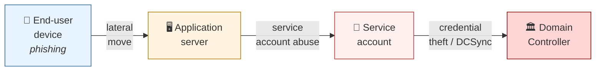
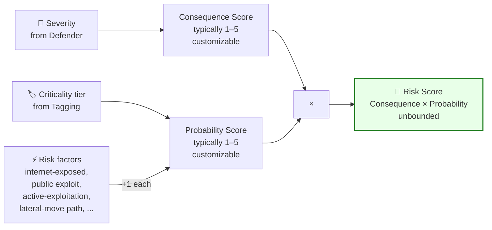
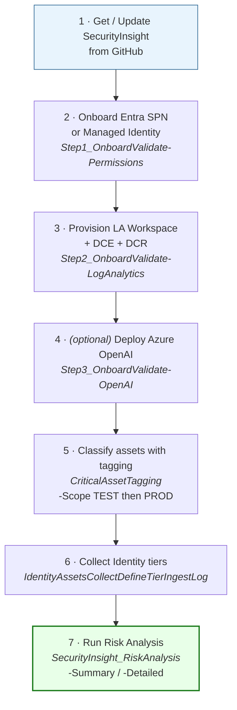
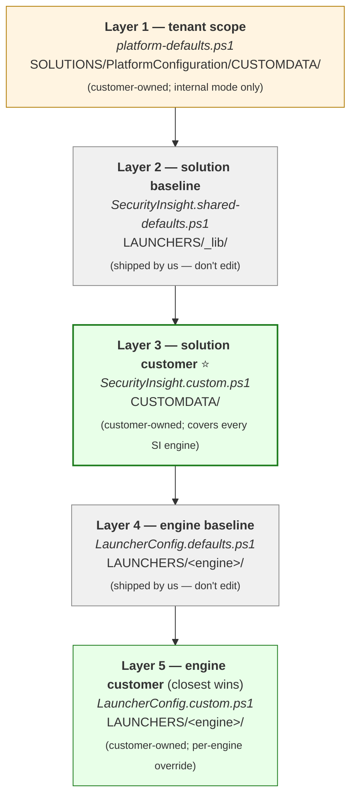
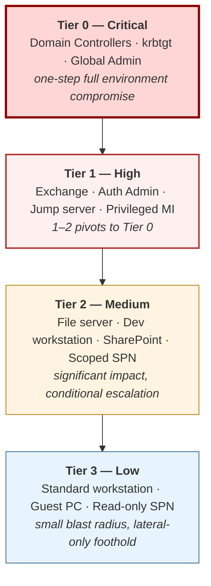
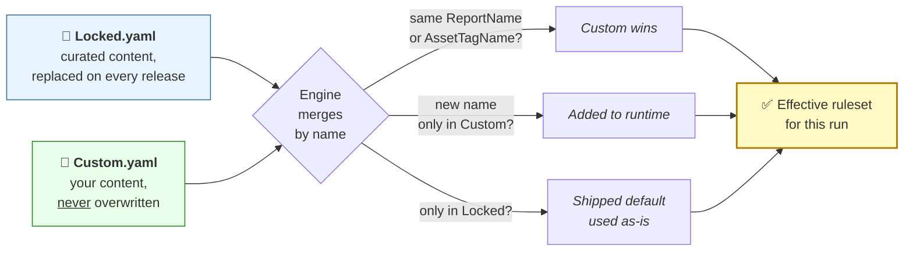
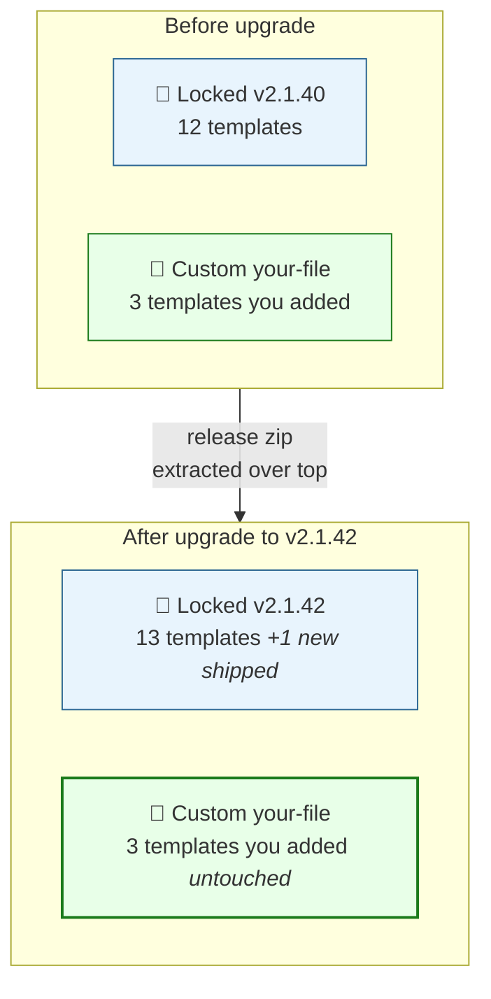
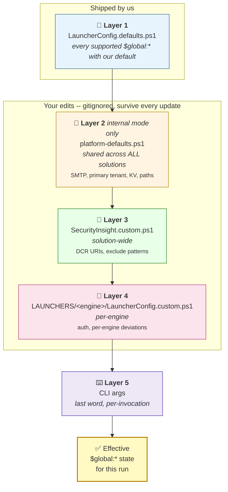
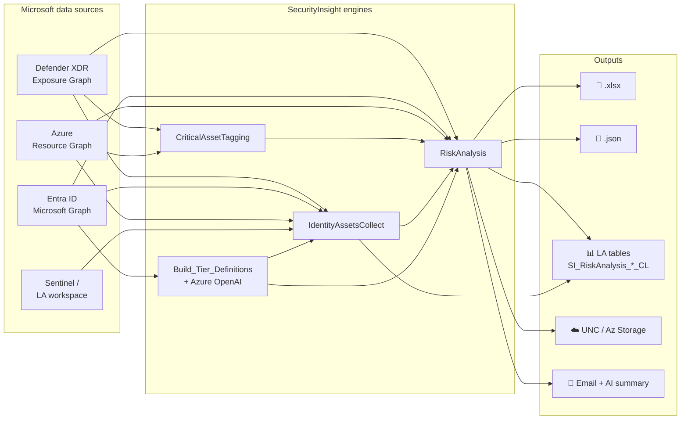

# SecurityInsight

<a id="top"></a>

# 🛡️ SecurityInsight

[](https://github.com/KnudsenMorten/SecurityInsight/releases)
[](https://learn.microsoft.com/powershell/)
[](LICENSE)

**Author**: [Morten Knudsen](https://mortenknudsen.net) — Microsoft MVP (Security · Azure · Security Copilot)
**Support**: [GitHub Issues](https://github.com/KnudsenMorten/SecurityInsight/issues) · [mok@mortenknudsen.net](mailto:mok@mortenknudsen.net)
**Watch**: [Video walkthroughs](#video-walkthroughs)

---

> **Your Defender dashboard and an attacker's target list look very different.** One is sorted by severity; the other is sorted by opportunity. Microsoft Defender surfaces every vulnerability, misconfiguration, and exposure in your environment — but deciding which one to address *first* is where most teams get stuck. Closing that gap is the difference between staying busy and actually reducing risk.
>
> **SecurityInsight** is a free, community-built add-on to Microsoft Defender — created by a Microsoft MVP — that helps you see risk the way a hacker would, and act on it the way a defender must. Every recommendation across Endpoint, Azure, and Identity is scored on four dimensions: **consequence**, **Tier 0–3 asset criticality**, **risk factors** (Internet Exposure, Verified Secret, Lateral Movement, ExploitSignals, and more), and a **customizable Risk Index**.
>
> **ExposureGraph** correlates assets, relationships, and attack paths across endpoints and Azure. SecurityInsight uses that data to classify assets and expose risks. Hundreds of ready-made queries and a built-in classification framework get you tagging servers, clients, and Azure resources from day one. For users, service principals, and managed identities, tiers are derived from **actual assigned permissions** — no static tags — and **AI** categorizes new Entra, Graph, and Azure roles automatically.
>
> 🎯 **Think like the hacker. Act like the defender. Fix what matters — first.**

**Out of the box — shipped as `Locked` content (force-refreshed on every release):**

**📦 Detection queries + tagging rules**

| What | Count |
|---|---:|
| 🎯 **Risk Analysis queries** — attacker-centric KQL across Endpoint, Azure, Identity | **102** |
| 🏷️ **Critical Asset detection rules** — ExposureGraph-powered auto-tagging for Tier-0 infrastructure | **3** |
| 🏷️ *Plus starter samples in `CriticalAssetTagging_Custom.yaml` (all `Mode: Test`, opt-in per rule)* | *177* |

**🤖 AI-classified tier catalog** — every role / permission slotted into Tier 0–3 by the AI classifier; consumed by `IdentityAssetsCollect` when deriving a user / SPN / MI's effective tier from its actual assignments:

| Category | Tier 0 | Tier 1 | Tier 2 | Tier 3 | **Total** |
|---|---:|---:|---:|---:|---:|
| **AD built-in groups** | 10 | 5 | 3 | 51 | **69** |
| **Entra built-in roles** | 3 | 32 | 26 | 81 | **142** |
| **Entra / Graph API permissions** | 4 | 84 | 94 | 1,030 | **1,212** |
| **All categories — grand total** | **17** | **121** | **123** | **1,162** | **1,423** |

> Azure RBAC roles are classified **at run-time** against your actual role assignments (per subscription / RG / resource), not pre-baked in the catalog — so the tier for a given Azure role is only as high as the scope where it's actually bound.

---

<a id="toc"></a>
## 📑 Table of Contents

1. [Introduction](#introduction)
2. [Understanding the Framework](#understanding-the-framework)
   - 2.1 [Why a graph, not a list](#why-a-graph-not-a-list)
   - 2.2 [Risk Score model](#risk-score-model)
   - 2.3 [Risk Factors](#risk-factors)
   - 2.4 [Risk Index (customizable scoring)](#risk-index-customizable-scoring)
   - 2.5 [Outputs at a glance](#outputs-at-a-glance)
3. [How to Implement (Quick Start)](#how-to-implement-quick-start)
   - 3.1 [High-level overview](#high-level-overview)
   - 3.2 [Step 1 — Install SecurityInsight (fresh machine)](#install-fresh-machine)
   - 3.3 [Update an existing install](#update-an-existing-install)
   - 3.4 [Try out a preview release](#try-out-a-preview-release)
   - 3.5 [Pre-requisite configuration](#pre-requisite-configuration)
     - 3.5.1 [Config-file model — `.defaults.` vs `.custom.`](#config-file-model)
     - 3.5.2 [Setup Configurator](#setup-configurator)
     - 3.5.3 [Solution component overview](#solution-component-overview)
   - 3.6 [Step 2 — Connectivity: SPN or Managed Identity](#connectivity-spn-or-managed-identity)
   - 3.7 [Step 3 — Identity infrastructure: Workspace + DCE + DCR](#identity-infrastructure-workspace--dce--dcr)
   - 3.8 [Step 4 — Azure OpenAI](#azure-openai-optional)
   - 3.9 [Understand the LauncherConfig files](#understand-the-launcherconfig-files)
   - 3.10 [Run the Risk Analysis](#run-the-risk-analysis)
   - 3.11 [Step 5a — Endpoint asset tagging](#endpoint-asset-tagging)
   - 3.12 [Step 5b — Azure asset tagging](#azure-asset-tagging)
   - 3.13 [Defender Criticality Level (optional)](#defender-criticality-level-optional)
4. [Severity & Criticality Definitions](#severity--criticality-definitions)
   - 4.1 [Severity definitions](#severity-definitions)
   - 4.2 [Criticality definitions](#criticality-definitions)
     - 4.2.1 [Tier 0–3 at a glance](#tier-0-3-at-a-glance)
   - 4.3 [Asset classification: Identity](#asset-classification-identity)
   - 4.4 [Asset classification: Endpoint](#asset-classification-endpoint)
   - 4.5 [Asset classification: Azure](#asset-classification-azure)
5. [The YAML Concept (Locked + Custom)](#the-yaml-concept-locked--custom)
6. [Appendix](#appendix)
   - 6.1 [Permissions catalog](#permissions-catalog)
   - 6.2 [Files deep-dive](#files-deep-dive)
   - 6.3 [Bucketing — beating the 30k row ceiling](#bucketing--beating-the-30k-row-ceiling)
   - 6.4 [Output destinations](#output-destinations)
   - 6.5 [Per-template mail recipient override (YAML)](#per-template-mail-recipient-override-yaml)
   - 6.6 [Cross-subscription workspace support](#cross-subscription-workspace-support)
   - 6.7 [Layered config flow](#layered-config-flow)
   - 6.8 [End-to-end architecture](#end-to-end-architecture)
7. [Video walkthroughs](#video-walkthroughs)
8. [Support](#support)
9. [What's New](#whats-new)

---

<a id="1-introduction"></a><a id="introduction"></a>
## 📘 1. Introduction

[⤴ Back to top](#top)

Defender will happily tell you about every vulnerability, misconfiguration, and exposure in your environment. What it won't tell you is which one an attacker would reach for first. **That's the prioritization gap — and it's where most security teams lose the battle.**

**SecurityInsight** is a free, community-built add-on to Microsoft Defender that applies a tier-based risk scoring model designed to think like a hacker and act like a defender. Every finding across Endpoint, Azure, and Identity is evaluated on four dimensions:

- the **security consequence** of the missing control,
- the **criticality tier** (0–3) of the affected asset,
- the **risk factors** that amplify exposure (Internet Exposure, Verified Secret, Critical Resource, Lateral Movement, Sensitive Data, LegacyEndOfSupport, ExploitSignals),
- and a **customizable Risk Index** that lets you adapt the model to your organization.

The solution is built on **Microsoft Defender ExposureGraph**, which gives it the contextual view attackers already have: what runs where, what's connected to what, which device hosts a domain controller, which VM has a managed identity with high-privilege access. SecurityInsight uses ExposureGraph to detect roles and relationships across endpoints and Azure resources and tag them automatically — without depending on someone remembering to label them.

On top of that, the solution ships with a detailed classification framework — an initial tier definition library already mapped across identity, endpoint, and cloud — and a large set of ExposureGraph-powered detection and tagging queries for Azure and endpoints that help you classify resources in your own environment quickly. You know your estate better than anyone; the queries give you a running start. Everything is continuously updated and fully customizable, so you can extend or replace any detection with your own as your environment changes.

A core focus is the **Identity collection** — users, service principals, and managed identities. Rather than relying on admins to tag accounts as "privileged" (a process that is always out of date), the model derives tier level automatically from the actual effective permissions each identity holds across AD, Entra ID roles, Microsoft Graph / API application permissions, and Azure RBAC. When Microsoft introduces a new role — as they do constantly — AI evaluates the permissions it grants and slots it into the right tier without human intervention.

#### What you'll get from this document

- Why "sort by severity, fix the biggest pile first" is the wrong instinct
- How consequence, criticality, risk factors, and a customizable Risk Index combine into one score
- How Tier 0–3 prioritization works across Endpoint, Azure, and Identity
- How ExposureGraph drives automatic role and resource detection
- How the built-in classification framework and tagging query library accelerate rollout
- How to classify user, SPN, and managed identity criticality from permissions — not tags
- How AI-driven classification keeps pace with Microsoft's ever-expanding role catalog

What this gives you is a concrete, reproducible framework — free and community-maintained — and a repeatable way to answer *"what should we fix first?"* with confidence.

> **Risk Score = Consequence (severity) × Probability (criticality + risk factors)**

The output is a ranked list — not 4,000 recommendations, but the small set of fixes that meaningfully reduce attacker dwell-time, lateral movement, and tenant takeover risk. Same Defender data, different framing: **attacker-centric instead of tool-centric.**

> [!TIP]
> **Talk track for execs**: SecurityInsight tells your CISO *"if we patch these 12 things this week, we cut the realistic blast radius of a successful phishing attack by 60%."* It does NOT add another portal — it consumes your existing Defender + Entra + Azure data via API.

### Outputs

The same ranked dataset is fan-out to multiple sinks so every stakeholder gets it in their preferred shape — ops in Excel, SOC in KQL, execs in Power BI, automation in JSON.

| Output | Purpose | Status |
|---|---|---|
| **Excel spreadsheet via email** | Operator-friendly XLSX of ranked findings, optionally with an AI-generated exec summary as the first sheet. Sent per run to configurable distribution lists (summary / detailed, per-recipient). | **Available** |
| **Log Analytics custom tables** (`SI_RiskAnalysis_Summary_CL`, `SI_RiskAnalysis_Detailed_CL`, `SI_IdentityAssets_CL`) | Durable time-series store for Kusto queries, Azure Monitor alerts, cross-run trending, compliance diffs. Every row carries a deterministic `TraceID` + `CollectionTime` so findings are stable across runs. | **Available** |
| **JSON upload to UNC share** | Automatic publish of each run's Summary JSON to a `\\server\share\...` path. Drop-in feed for on-prem BI / file-based integrations. | **Available** |
| **JSON upload to Azure Storage blob** | Automatic publish to `https://<acct>.blob.core.windows.net/<container>/`. Container auto-created + RBAC granted; ideal for cross-tenant reporting or Logic Apps / Power Automate pickup. | **Available** |
| **Power BI management dashboard** | `.pbix` pushed into the customer's Power BI tenant via REST API. Trend line, stacked domain chart, top-N, stale findings, velocity. Per-run dataset refresh via `$global:SendToPowerBI`. See [§ 3.5](#pre-requisite-configuration) Step 4 + [`DOCS/PowerBI-Prerequisites.md`](DOCS/PowerBI-Prerequisites.md). | **Beta** |
| **Azure Workbooks** | Native Azure Monitor workbook over `SI_RiskAnalysis_*_CL` + `SI_IdentityAssets_CL` — 8 pills (time range, latest-run toggle, domain, severity, tier, subcategory, search, Top-N) + KPI tiles + trend / domain / tier charts + velocity + Top-N + stale + identity inventory. Import from `TOOLS/AzureWorkbook/SecurityInsight-RiskAnalysis.workbook.json` via Portal → Azure Monitor → Workbooks → Advanced Editor; full guide in [`DOCS/AzureWorkbook-Import.md`](DOCS/AzureWorkbook-Import.md). | **Available** |

### Use-cases

Real-world patterns customers run this against. Every one of them is cheap to light up because the data is already in LA with stable identifiers (`TraceID` + `CollectionTime`):

| Use-case | How |
|---|---|
| **Daily Security Prioritization Meetings — top risks** | Run RiskAnalysis on a 4×/day cron; agenda = the Top-25 tile in Power BI / Workbook / the XLSX email. No more "what do we focus on this week" arguments. |
| **ServiceNow ticket lifecycle (open / close)** | SOC subscribes to `SI_RiskAnalysis_Summary_CL`. `TraceID` (deterministic SHA-256 hash of `TraceName`) is the external correlation key — open on first appearance, auto-close when the `TraceID` disappears from the latest `CollectionTime`. |
| **Alerting on significant changes** | Azure Monitor alerts on Kusto: e.g. *"open critical findings jumped 30% vs last run"* or *"a new Tier-0 asset appeared in the stale list"*. Paged to the on-call channel, not buried in a report. |
| **Management reporting** | Execs open Power BI / Workbook → trend of total risk score, closed tickets, velocity of fix, domain breakdown. The numbers do the talking — no narration required. |
| **Compliance reporting** | Two `CollectionTime` snapshots of `SI_IdentityAssets_CL` diffed in Kusto → *what permissions changed?* Answers audit questions about access drift between two fixed dates. |
| **Baseline new security + Just-In-Time delegations** | First-time scan establishes the baseline tier for every identity + resource. Anything spikier on a later run is JIT-flagged for review. |
| **Disable / clean up legacy identity assets** | `SI_IdentityAssets_CL | where IsStale == true and ObjectType in ('ServicePrincipal','ManagedIdentity')` surfaces orphan / unused SPNs + MIs for bulk deprovisioning. |
| **Detect Shadow IT delegations** | Cross-tenant SPNs, unverified publishers, high-permission grants flagged on first appearance in `SI_IdentityAssets_CL` — catches delegations business units stood up without IT's knowledge. |

### Sample output

| File | Link |
|---|---|
| Sample Summary report (XLSX) | [Sample - RiskAnalysis_Summary_Bucket.xlsx](https://github.com/KnudsenMorten/SecurityInsight/raw/refs/heads/main/data/_samples/Sample%20-%20RiskAnalysis_Summary_Bucket.xlsx) |
| Sample Detailed report (XLSX) | [Sample - RiskAnalysis_Detailed_Bucket.xlsx](https://github.com/KnudsenMorten/SecurityInsight/raw/refs/heads/main/data/_samples/Sample%20-%20RiskAnalysis_Detailed_Bucket.xlsx) |
| Sample Summary email (PDF, with AI exec summary) | [Sample mail - Summary report with AI summary.pdf](https://github.com/KnudsenMorten/SecurityInsight/blob/main/data/_samples/Sample%20mail%20-%20Summary%20report%20with%20AI%20summary.pdf) |
| Sample Detailed email (PDF, with AI exec summary) | [Sample mail - Detailed report with AI summary.pdf](https://github.com/KnudsenMorten/SecurityInsight/blob/main/data/_samples/Sample%20mail%20-%20Detailed%20report%20with%20AI%20summary.pdf) |

---

<a id="2-understanding-the-framework"></a><a id="understanding-the-framework"></a>
## 🧠 2. Understanding the Framework

[⤴ Back to top](#top)

<a id="21-why-a-graph-not-a-list"></a><a id="why-a-graph-not-a-list"></a>
### 2.1 Why a graph, not a list

[⤴ Back to top](#top)

**Defenders typically think in lists** — devices, users, vulnerabilities, recommendations. Lists are good for inventory and reporting. They are useless for prioritization, because they hide *how systems connect to each other.*

**Attackers think in relationships.** A typical compromise rarely targets the most critical system directly:



The path goes through 4 systems. Three of them look *low-risk* in isolation. Their relationships are what makes the path catastrophic. SecurityInsight uses **Microsoft Defender Exposure Graph** + **Azure Resource Graph** to score recommendations the way an attacker would weigh them: *can this finding put me one step closer to a Tier-0 asset?*

> [!NOTE]
> The technical underpinning is `ExposureGraphNodes` + `ExposureGraphEdges` (Defender) and Azure Resource Graph KQL — same data your SOC already has, framed as a graph instead of a flat table.

<a id="22-risk-score-model"></a><a id="risk-score-model"></a>
### 2.2 Risk Score model

[⤴ Back to top](#top)

Two dimensions, one formula:

> **Risk Score = Consequence × Probability**



| Dimension | Where it comes from |
|---|---|
| **Consequence Score** | Defender's `Severity` rating of the recommendation (Very High → Low). Reflects *how bad it is if this gets exploited.* |
| **Probability Score** | The asset's **criticality tier** (Tier 0–3) modulated by **risk factors** (see [§ 2.3](#risk-factors)). Reflects *how likely it is to actually be exploited on THIS asset, in THIS environment.* |

Both scores are positive integers from the **Risk Index CSV** ([§ 2.4](#risk-index-customizable-scoring)) — a fully customizable mapping that organizations tune to their own risk appetite. The shipped CSV uses 1–5 for each dimension (so scores run 1–25), but there's **no hardcoded ceiling** — customers who want finer-grained ranking can bump the scale to 1–10 or beyond and the product `Consequence × Probability` follows directly.

**Worked example**:

```
Finding          : "Endpoint missing critical CVE patch"
Severity         : Very High
Consequence      : 4   (mapped from "Very High" in the Risk Index)
Asset            : An internet-facing web server tagged "Tier 1 (High)"
Criticality base : 3   (Tier 1 base score from the Risk Index)
Risk factor +1   : because the asset has the "InternetExposed" tag → Probability = 4
                                                                  ─────────
Risk Score = 4 × 4 = 16  →  ranks above a Tier-3 internal-only finding
```

<a id="23-risk-factors"></a><a id="risk-factors"></a>
### 2.3 Risk Factors

[⤴ Back to top](#top)

Probability is bumped up by **+1 per matching risk factor**. Each represents a real-world attribute that materially raises the chance of exploitation:

| Risk factor | Why it bumps probability |
|---|---|
| **Active exploitation** | The vulnerability is being weaponized in the wild today. |
| **Public exploit code** | Proof-of-concept is freely available. |
| **Internet exposure** | The asset is reachable from outside your perimeter. |
| **Legacy / unsupported** | No security updates available. |
| **Contains verified secret** | A real credential is sitting in the asset (Defender Secret Scanning hit). |
| **Critical resource** | Defender flags the asset as foundational to your tenant. |
| **Lateral movement** | The asset sits on a known attack path. |
| **Sensitive data** | The asset stores classified, PII, or regulated content. |

Each factor contributes +1 to the Probability score, capped per the Risk Index.

<details>
<summary>📌 <b>Future risk factors under consideration</b></summary>

- **Large attack surface** — many open services / APIs / ports
- **Third-party exposure** — partner / vendor reach
- **Shared infrastructure** — multi-tenant / multi-team blast radius
- **Weak network segmentation** — flat L2 / VLAN sprawl
- **Credential exposure risk** — shared accounts, weak MFA
- **Remote access enabled** — VPN / RDP / SSH / management UIs

PRs welcome to extend the engine with these — the scoring math stays the same, only the bump count changes.
</details>

<a id="24-risk-index-customizable-scoring"></a><a id="risk-index-customizable-scoring"></a>
### 2.4 Risk Index (customizable scoring)

[⤴ Back to top](#top)

The mapping `Severity → Consequence` and `Criticality → Probability` lives in **`SecurityInsight_RiskIndex.csv`** ([download](https://github.com/KnudsenMorten/SecurityInsight/raw/refs/heads/main/SecurityInsight_RiskIndex.csv)). Customers edit this file to reflect their own risk appetite — the engine reads it on every run.

| SecuritySeverity | Consequence | CriticalityTierLevel | Probability | Comments |
|---|---|---|---|---|
| Very High | 4 | Critical (tier 0) | 4 | Top of the matrix |
| Very High | 4 | High (tier 1) | 3 | |
| High | 3 | Critical (tier 0) | 4 | |
| Medium-High | 2 | Critical (tier 0) | 4 | |
| Low | 1 | Low (tier 3) | 1 | Bottom of the matrix |

Want a different scoring matrix for a regulated business unit? Edit the CSV. Want to penalize Tier-0 findings more aggressively? Bump the Probability column for Tier-0 rows. Want certain `ConfigurationId`s to score harder regardless of severity? Add a row with that exact ConfigurationId — it overrides the generic mapping.

<a id="25-outputs-at-a-glance"></a><a id="outputs-at-a-glance"></a>
### 2.5 Outputs at a glance

[⤴ Back to top](#top)

Every Risk Analysis run produces all of these from a single in-memory dataset (no double work):

| Output | Default | Toggle |
|---|---|---|
| 📗 Excel (.xlsx) | always | — |
| 📄 JSON sibling (.json) | on | `$global:WriteJsonOutput` |
| 📊 Log Analytics ingest (2 tables: `SI_RiskAnalysis_Summary_CL` / `_Detailed_CL`) | off | `$global:SendToLogAnalytics` |
| ☁️ Upload to UNC share OR Azure Storage | off | `$global:ExportDestination` |
| 📧 Email with HTML body + .xlsx attachment | off | `$global:SendMail` (community) / `$global:Mail_*_SendMail` (internal) |
| 🤖 Azure OpenAI executive summary embedded in Excel + email | off | `$global:BuildSummaryByAI` |

> [!IMPORTANT]
> Once the data is in Log Analytics it is queryable from Sentinel, Defender XDR, Power BI, Logic Apps, Workbooks, and Security Copilot. That's the long-term home — the .xlsx and email are convenience outputs.

---

<a id="3-how-to-implement-quick-start"></a><a id="how-to-implement-quick-start"></a>
## 🚀 3. How to Implement (Quick Start)

[⤴ Back to top](#top)

<a id="31-high-level-overview"></a><a id="high-level-overview"></a>
### 🗺️ 3.1 High-level overview

[⤴ Back to top](#top)



**Cadence.** Steps 2–4 are once-per-tenant setup (run in order, then forget about them). Step 1 (Get / Update from GitHub) re-runs whenever you want to pull a newer release — the launcher preserves your `CUSTOMDATA/**` and `LauncherConfig.custom.ps1` files. Step 5 (`CriticalAssetTagging`) runs daily or hourly. Step 6 (`IdentityAssetsCollectDefineTierIngestLog`) runs daily. Step 7 (`SecurityInsight_RiskAnalysis`) runs daily / weekly / on-demand — whichever matches your review cadence.

<a id="32-install-fresh-machine"></a><a id="install-fresh-machine"></a>
### 📦 3.2 Step 1 — Install SecurityInsight (fresh machine)

[⤴ Back to top](#top)

One Step 0 script bootstraps the whole solution from GitHub. **Run PowerShell as Administrator**, then copy-paste:

```powershell
$SI_InstallPath = 'C:\SCRIPTS\SecurityInsight'   # change path if you want
$repo      = 'KnudsenMorten/SecurityInsight'
$latestTag = (Invoke-RestMethod "https://api.github.com/repos/$repo/releases/latest").tag_name
$u         = "https://raw.githubusercontent.com/$repo/$latestTag/scripts/Step0_OnboardUpdate_SecurityInsight_from_Github_Repo.ps1"
Invoke-WebRequest -UseBasicParsing -Uri $u -OutFile "$env:TEMP\Step0.ps1"
& "$env:TEMP\Step0.ps1" -DestinationPath $SI_InstallPath
```

Next: [§ 3.5 Pre-requisite configuration](#pre-requisite-configuration).

<details>
<summary><b>Why admin + parameter reference + why the URL is tag-pinned (expand)</b></summary>

> [!IMPORTANT]
> **Open PowerShell as Administrator.** The engines install missing modules to `C:\Program Files\WindowsPowerShell\Modules` (`-Scope AllUsers`) so they're visible to every user on the box — including the `SYSTEM` account the daily scheduled task runs under. A non-elevated session will fail fast with a clear error rather than silently installing a per-user copy.
>
> Press `Win`, type `powershell`, right-click **Windows PowerShell** → **Run as administrator**.

> **Why the bootstrap URL is tag-pinned (vs. `raw/main/...`):** tag-pinned raw URLs are immutable + not CDN-cached, so you ALWAYS get the newest Step 0. `raw/main/...` is GitHub edge-cached for ~5 minutes. `Invoke-WebRequest -OutFile` (NOT `irm | Out-File`) preserves raw bytes: on PowerShell 5.1, `irm` returns a string with UTF-8 BOM embedded, then `Out-File`'s default Unicode encoding writes UTF-16 BOM **plus** the UTF-8 BOM character, and the parser later trips on `[CmdletBinding()]` with "Unexpected attribute".

> [!TIP]
> Prefer to pin the path inside the script itself so re-runs never need `-DestinationPath`? Open `SCRIPTS/Step0_OnboardUpdate_SecurityInsight_from_Github_Repo.ps1` and edit the first line of its param block — the `EDIT-ME DEFAULTS` header marks the spot. CLI `-DestinationPath` still overrides per-run.

**Step 0 parameters** (all optional):

| Parameter | Default | Purpose |
|---|---|---|
| `-DestinationPath` | `C:\SCRIPTS\SecurityInsight` | Where the code lands on this machine. Same path on re-run upgrades in place. |
| `-Channel` | `stable` | `stable` = latest tagged GitHub release (production). `preview` = HEAD of the `preview` branch (bleeding edge). |
| `-Engine` | *(unset)* | Launcher folder to `cd` into after install, e.g. `Step1_OnboardValidate-SecurityInsight-Permissions`. Great for scheduled-run scripts that always run the same engine. |
| `-Repo` | `KnudsenMorten/SecurityInsight` | Change if you fork the solution. |
| `-PreservePatterns` | (see script) | Glob patterns that are never overwritten on update. Default covers customer configs + custom YAML. |

</details>

<a id="33-update-an-existing-install"></a><a id="update-an-existing-install"></a>
### 🔄 3.3 Update an existing install

[⤴ Back to top](#top)

<details>
<summary><b>Show details (expand)</b></summary>

Re-running Step 0 against the same path is idempotent: 🔒 **locked** files (ours) are refreshed; 🧷 **customer** files (`*.custom.ps1`, `*_Custom.yaml`, `CUSTOMDATA/**`) are never touched.

```powershell
$SI_InstallPath = 'C:\SCRIPTS\SecurityInsight'
& (Join-Path $SI_InstallPath 'SCRIPTS\Step0_OnboardUpdate_SecurityInsight_from_Github_Repo.ps1') -DestinationPath $SI_InstallPath
```

<details>
<summary><b>Full update policy + per-file output + file-by-file breakdown (expand)</b></summary>

| Category | Behaviour on update | Examples |
|---|---|---|
| 🔒 **Locked content** (curated by maintainer) | **Always force-refreshed** from the latest release | `data/*_Locked.yaml`, `scripts/*.ps1`, `launchers/*/launcher.*.template.ps1`, `launchers/*/LauncherConfig.defaults.ps1`, `README.md`, `TOOLS/**` |
| 🧷 **Customer content** (your config + overrides) | **Never touched** if a copy already exists on disk | `launchers/*/LauncherConfig.custom.ps1`, `launchers/*/launcher.override.ps1`, `CUSTOMDATA/**`, `data/*_Custom.yaml`, `data/*_Custom.*` |

Same rule applies to both engines: RiskAnalysis (`SecurityInsight_RiskAnalysis_Queries_Custom.yaml` / `_Locked.yaml`) **and** CriticalAssetTagging (`SecurityInsight_CriticalAssetTagging_Custom.yaml` / `_Locked.yaml`).

Step 0 emits per-file visibility:

```
[UPDATE]   data\SecurityInsight_RiskAnalysis_Queries_Locked.yaml  (locked content -- force-refreshed from release)
[UPDATE]   data\SecurityInsight_CriticalAssetTagging_Locked.yaml  (locked content -- force-refreshed from release)
[PRESERVE] data\SecurityInsight_RiskAnalysis_Queries_Custom.yaml
[PRESERVE] launchers\SecurityInsight_RiskAnalysis\LauncherConfig.custom.ps1
[OK]    copied: 245 files  (2 of which are *_Locked.* force-refreshed)  |  preserved: 4 customer file(s)
```

Full file-by-file breakdown: [§ 7.2 Files deep-dive](#files-deep-dive).

</details>

</details>

<a id="331-automate-daily-update"></a><a id="automate-daily-update"></a>
#### ⏰ 3.3.1 Automate it — daily "auto-refresh from GitHub"

<details>
<summary><b>Show details (expand)</b></summary>

Register a Scheduled Task that runs Step 0 once a day as `SYSTEM`:

```powershell
& (Join-Path $SI_InstallPath 'SCRIPTS\Register-SecurityInsightDailyUpdate.ps1')
```

Defaults: 03:00 local, task name `SecurityInsight - Daily update`, install path auto-detected. Safe to run unattended — customer files are never touched.

<details>
<summary><b>Override time / path + verify / unregister / air-gapped caveat (expand)</b></summary>

Override per-box:

```powershell
& (Join-Path $SI_InstallPath 'SCRIPTS\Register-SecurityInsightDailyUpdate.ps1') `
    -InstallPath 'D:\Tools\SecurityInsight' `
    -AtTime      '02:30'
```

What *does* get refreshed every day:

- 📘 **`data/SecurityInsight_RiskAnalysis_Queries_Locked.yaml`** — any new curated queries I ship land automatically, no manual YAML diffing.
- 📘 **`data/SecurityInsight_CriticalAssetTagging_Locked.yaml`** — same story for asset-tagging rules.
- 🧠 **Engine `.ps1` files + launcher templates** — new features and bug fixes propagate on the next run.
- 📊 **`TOOLS/AzureWorkbook/*.json` + `TOOLS/PowerBI/*`** — workbook / dashboard template updates.

Verify / force-run / inspect / unregister:

```powershell
Get-ScheduledTask -TaskName 'SecurityInsight - Daily update' | Select-Object TaskName, State, Triggers
Start-ScheduledTask     -TaskName 'SecurityInsight - Daily update'
Get-ScheduledTaskInfo   -TaskName 'SecurityInsight - Daily update'

# Remove:
& (Join-Path $SI_InstallPath 'SCRIPTS\Register-SecurityInsightDailyUpdate.ps1') -Unregister
```

> [!TIP]
> **Air-gapped / offline boxes**: don't register the daily task — no internet = Step 0 will fail every run. Keep updates manual on a connected staging box, then rsync the install path to the offline box on your own schedule.

After update, the running version is stamped on every launcher banner:

```
========================================================================================
  SecurityInsight -- SecurityInsight_RiskAnalysis    [community-vm]   SecurityInsight-v2.1.81
========================================================================================
```

</details>

</details>

<a id="34-try-out-a-preview-release"></a><a id="try-out-a-preview-release"></a>
### 🧪 3.4 Try out a preview release

[⤴ Back to top](#top)

<details>
<summary><b>Show details (expand)</b></summary>

The `preview` channel tracks the HEAD of the `preview` branch — bleeding-edge features that haven't shipped in a tagged release. Use a **separate folder** from stable.

```powershell
$SI_InstallPath = 'C:\SCRIPTS\SecurityInsight-preview'
& (Join-Path $SI_InstallPath 'SCRIPTS\Step0_OnboardUpdate_SecurityInsight_from_Github_Repo.ps1') -DestinationPath $SI_InstallPath -Channel preview
```

> [!NOTE]
> Preview = uncut, unrewindable. Bugs may exist that don't exist in `stable`. File issues at [KnudsenMorten/SecurityInsight](https://github.com/KnudsenMorten/SecurityInsight/issues). When a preview feature stabilizes it's cut to a new `stable` release — update via § 3.3.

</details>

<a id="35-pre-requisite-configuration"></a><a id="pre-requisite-configuration"></a>
### 🔧 3.5 Pre-requisite configuration

[⤴ Back to top](#top)

Before you can run any launcher, the solution needs to know **your** values — tenant / subscription IDs, SPN credentials, workspace names, mail recipients, OpenAI endpoint. You provide these through PowerShell config files next to each launcher.

<a id="config-file-model"></a>

#### 🧱 3.5.1 Config-file model — `.defaults.ps1` vs `.custom.ps1`

| Filename pattern | Who owns it | Gets overwritten on update? | When to edit |
|---|---|---|---|
| `*.defaults.ps1` | **Us** — shipped with the solution | **Yes** — replaced on every Step 1 update | **Never.** Treat as read-only. |
| `*.custom.ps1` | **You** — created from a `.sample.ps1` | **Never** — gitignored, preserved by Step 1 | **Yes.** This is the only file you ever edit. |

You'll see both names repeated at three scopes (tenant / solution / engine). That's the **5-layer config stack** — the launcher loads them in order, and each layer overrides the previous (closest wins):



**Legend.** Grey = shipped by us (`.defaults.`, never edit). Green = customer files (`.custom.`, edit here). Orange = internal-mode tenant layer (absent in community-vm installs).

⭐ **Layer 3 (`CUSTOMDATA\SecurityInsight.custom.ps1`) is where 90% of customers put everything.** It's solution-wide — every SI engine picks it up automatically. You only drop down to Layer 5 if one specific engine needs a different value (e.g. a different mail recipient for Critical-only reports).

> **Example — community-vm customer configures once, runs 10 engines.**
> 1. Copy `CUSTOMDATA\SecurityInsight.custom.sample.ps1` → `SecurityInsight.custom.ps1` in the same folder.
> 2. Uncomment the SPN block, fill in `$global:SpnTenantId` / `SpnClientId` / `SpnClientSecret`.
> 3. Set `$global:MailTo = @('soc@contoso.com')`.
> 4. Done. RiskAnalysis, CriticalAssetTagging, IdentityAssets, Step 2 / 3 / 4 — all 10 engines inherit these values on their next run.

<a id="setup-configurator"></a>

#### ⭐ 3.5.2 Setup Configurator — GUI that writes your `.custom.ps1` files

The solution ships an **offline, single-file HTML tool** that generates the `SecurityInsight.custom.ps1` + per-engine `LauncherConfig.custom.ps1` files for you. Form fields + live preview + one-click copy-to-clipboard. Zero dependencies; all processing stays in your browser — no data leaves your machine.

```powershell
Start-Process .\TOOLS\SetupConfigurator\index.html
```


Each tab corresponds to one launcher or the solution-wide `SecurityInsight.custom.ps1`. Re-use the 4 auth values (Tenant / ClientId / Secret / Subscription) across every tab and you're done in a minute. Prefer hand-editing? The `.sample.ps1` files next to each launcher are copy-paste templates — see the worked example above.

> [!TIP]
> **Internal (AF) / community-azure flavours don't need a customer config file at all** — they pull auth from the platform bootstrap (`Initialize-PlatformAutomationFramework`) or a Managed Identity + Key Vault. Only the **community-vm** flavour reads credentials from customer files. This whole section (layered config + Setup Configurator) is for community-vm operators.

<a id="solution-component-overview"></a>

#### 🧩 3.5.3 Solution component overview

Every SI component ships as its own launcher folder under `LAUNCHERS/`. Two groups: **Steps** (once per tenant, during onboarding) and **Engines** (on a schedule after onboarding).

**Onboarding Steps — one-time, run in order:**

| Component | Purpose |
|---|---|
| **Step1_OnboardValidate-SecurityInsight-Permissions** | Creates the Entra SPN, grants API permissions + Azure RBAC. Idempotent (re-run = validation pass). |
| **Step2_OnboardValidate-SecurityInsight-LogAnalytics** | Provisions the Workspace + DCE + DCR + custom tables the engines ingest into. |
| **Step3_OnboardValidate-SecurityInsight-OpenAI-PAYG-Instance-Azure** *(opt.)* | Provisions PAYG Azure OpenAI + model deployment for the RiskAnalysis AI summary. |
| **Step4_Deploy-SecurityInsight-PowerBI-Dashboard** *(opt.)* | Publishes the RiskAnalysis `.pbix` dashboard to the customer's Power BI tenant. |
| **Setup-SecurityInsight-CustomSecurityAttributes** | One-time provisioning of the Entra Custom Security Attribute schema used by the tagging pipeline. |
| **Build_Tier_Definitions_JSON_File** | Uses Azure OpenAI to classify Entra roles / Graph permissions / AD groups / Azure built-in roles into Tier 0–3. Re-run only when tier rules change. |

**Ingestion engines — run on a schedule:**

| Component | Purpose |
|---|---|
| **SecurityInsight_RiskAnalysis** | Main analyzer — ranked Excel + JSON + LA ingest + email + AI executive summary. |
| **IdentityAssetsCollectDefineTierIngestLog** | Iterates every Entra user / SPN / MI; ingests into `SI_IdentityAssets_CL`. |
| **CriticalAssetTagging** (+ `CriticalAssetTaggingMaintenance` + `CAT_FixConflictingTags`) | Auto-tags every device / Azure resource with its criticality tier (0–3). |

> [!NOTE]
> **`Build_Tier_Definitions_JSON_File` does not enumerate AD members.** The engine uses Azure OpenAI to tier the hardcoded `$BuiltInADGroups` list (Domain Admins, Enterprise Admins, DnsAdmins, Account Operators, …) **by name alone**, then writes `AD_BuiltInPermissionGroups_Tier0..3` into `data/SecurityInsight_IdentityTiering.json`. Actual group-membership analysis ("does user X have access to Domain Admins?") happens at query time inside `IdentityAssetsCollectDefineTierIngestLog` via the Exposure Graph — no RSAT, no on-prem AD PowerShell module, no domain-joined VM required. Works identically on cloud-only community VMs and hybrid/on-prem VMs.

**Unattended (hands-off) operation** — Steps 2-4 and every engine launcher support the same four auth methods, so a pipeline / scheduled task can run the whole chain with one identity. The launcher picks a method by **priority chain** (first row whose fields are populated wins, regardless of which config layer set them):

| # | Auth method | Set the following globals | Use when |
|---|---|---|---|
| 1 | Managed Identity | `$global:UseManagedIdentity = $true` + `$global:SpnTenantId` | Azure VM / Function / Logic App / Hybrid Runbook Worker |
| 2 | SPN + secret in Key Vault | `$global:SpnKeyVaultName`, `$global:SpnSecretName`, `$global:SpnTenantId`, `$global:SpnClientId` | Production VM with MI that has Key Vault Secrets User |
| 3 | SPN + certificate | `$global:SpnCertificateThumbprint`, `$global:SpnTenantId`, `$global:SpnClientId` | Production VM with cert in local store |
| 4 | SPN + plaintext secret | `$global:SpnClientSecret`, `$global:SpnTenantId`, `$global:SpnClientId` | Lab / testing only |

> [!IMPORTANT]
> **Mixing methods across layers — the higher-priority method wins.** If your tenant-level `platform-defaults.ps1` (Layer 1) defines `$global:SpnCertificateThumbprint` and your `SecurityInsight.custom.ps1` (Layer 3) adds `$global:SpnClientSecret`, **certificate wins** — it's higher in the chain. "Closer layer wins" applies at the *variable* level (Layer 3 overrides TenantId/ClientId/etc. if different), but the *method* is chosen by the priority table above.
> To force a lower-priority method, null out the higher-priority field in the closer layer:
> ```powershell
> # in SecurityInsight.custom.ps1 — force plaintext secret even though platform ships a cert
> $global:UseManagedIdentity       = $false
> $global:SpnKeyVaultName          = $null
> $global:SpnCertificateThumbprint = $null
> $global:SpnClientSecret          = '<your-secret>'
> ```

**Step 0** defaults to `Interactive` (browser sign-in by a human admin). To run it unattended, also set `$global:OnboardValidate_AuthMethod = 'SpnSecret'` (or `'SpnCertificate'` / `'ManagedIdentity'`). The SPN/MI needs **Privileged Role Administrator** (or **Global Administrator**) to create app registrations + grant admin consent.

**Step 4** accepts `-ValidateOnly` — turns it into a hands-off health check. No resources are created, but the engine still reports `CREATED` / `REUSED` / `MISSING` status per resource + exits non-zero if anything is missing. Good for monitoring that your Azure OpenAI deployment hasn't drifted.

---

<a id="351-connectivity-spn-or-managed-identity"></a><a id="connectivity-spn-or-managed-identity"></a>
### 🔐 3.6 Step 2 — Connectivity: SPN or Managed Identity

[⤴ Back to top](#top)

SecurityInsight engines authenticate to Entra (Microsoft Graph) and Azure (Resource Graph + Log Analytics + Storage). **Pick ONE** authentication model:

| # | Method | Best for | Setup |
|---|---|---|---|
| 1 | **Entra SPN + Secret** | Lab / testing | Create app, set client secret |
| 2 | **Entra SPN + Certificate** | Production on a VM where you control the cert store | Create app, upload cert, install private key on the VM |
| 3 | **System-Assigned Managed Identity** | Azure VM / Function App / Logic App / Hybrid Worker | Enable system-assigned MI on the host |
| 4 | **User-Assigned Managed Identity** | Multiple Azure hosts sharing one identity | Create UAMI, assign to host(s) |

**Either way, the identity needs the same permissions.** Use the included one-shot utility:

```powershell
# Interactive (you sign in as a Privileged Role Admin), creates 'sp-securityinsight' if missing,
# grants Graph + Defender + ATP API permissions + Azure Reader + Tag Contributor at tenant-root MG:
.\LAUNCHERS\Step1_OnboardValidate-SecurityInsight-Permissions\launcher.community-vm.template.ps1

# Dry-run preview first:
.\LAUNCHERS\Step1_OnboardValidate-SecurityInsight-Permissions\launcher.community-vm.template.ps1 -WhatIfMode

# Optional: also grant Log Analytics Reader on a Defender workspace + Monitoring Metrics Publisher on a DCR:
.\LAUNCHERS\Step1_OnboardValidate-SecurityInsight-Permissions\launcher.community-vm.template.ps1 `
    -DefenderWorkspaceResourceId '/subscriptions/<sub>/resourceGroups/<rg>/providers/Microsoft.OperationalInsights/workspaces/<defender-ws>' `
    -DcrResourceId               '/subscriptions/<sub>/resourceGroups/<rg>/providers/Microsoft.Insights/dataCollectionRules/<dcr>'
```

The OnboardValidate engine is **idempotent** — re-run it any time as a validation pass. Adding permissions later? Edit the catalog at the top of `SCRIPTS/Step1_OnboardValidate-SecurityInsight-Permissions.ps1` and re-run; only the missing grants are applied.

**End-of-run summary block (v2.1.64+)** prints the App display name, App (client) ID, SPN Object ID, tenant ID, per-category grant counts, a **ready-to-paste `$global:Spn*` block** for your `LauncherConfig.custom.ps1`, and verification KQL for after your first ingest. No scrolling through the log to find the AppId.

> [!IMPORTANT]
> **What OnboardValidate DOES cover (via RBAC grants):**
> - Graph + Defender + ATP API permissions on the SPN
> - Azure `Reader` at tenant-root MG (default — for Azure Resource Graph enumeration across every sub)
> - Azure `Tag Contributor` at tenant-root MG (needed by `CriticalAssetTagging` to write tier tags on subs / RGs / resources)
> - Falls back to per-subscription if the onboarding identity lacks UAA at tenant root (or if you pick `-AzureRbacScope PerSubscription` explicitly)
> - Optional: `Log Analytics Reader` on a Defender workspace (`-DefenderWorkspaceResourceId`)
> - Optional: `Monitoring Metrics Publisher` on a specific DCR (`-DcrResourceId`)
>
> **What OnboardValidate does NOT cover:**
> - Creating the Log Analytics workspace / DCE / DCR — that's either done by the `Step2_OnboardValidate-SecurityInsight-LogAnalytics` launcher (§3.5.2) OR auto-created by the engines themselves on first run (v2.1.54+).
> - Granting the SPN `Owner` or `Contributor + User Access Administrator` — which is what the engines' auto-provisioning needs for **first-run** workspace/DCE creation + container RBAC grants. On `Reader`-only subs, auto-provision will fail cleanly with a `403 AuthorizationFailed` warning and you'll need to provision manually via §3.5.2 or grant higher perms.
>
> **Required permissions** are listed in [§ 7.1](#permissions-catalog).

<a id="352-identity-infrastructure-workspace--dce--dcr"></a><a id="identity-infrastructure-workspace--dce--dcr"></a>
### 🏗️ 3.7 Step 3 — Identity infrastructure: Workspace + DCE + DCR

[⤴ Back to top](#top)

The `IdentityAssetsCollect` and `RiskAnalysis` engines ingest into Log Analytics via a Data Collection Rule (DCR) and Data Collection Endpoint (DCE).

> [!TIP]
> **You have two options** (v2.1.54+). Pick one:
>
> **Option A — let the ingestion engines auto-provision on first run** *(recommended for labs / single-tenant demos)*: the first time `IdentityAssetsCollect` or `RiskAnalysis` runs, they look for the workspace / DCE / DCE RG / DCR RG and **create anything missing** — then grant the SPN `Monitoring Metrics Publisher` on the RGs and `Storage Blob Data Contributor` on an export blob container if one is configured. **Requires `Owner` (or `Contributor + User Access Administrator`) on the target subscription for the first run.** After that, the engines can run with just `Reader` + `Monitoring Metrics Publisher`.
>
> **Option B — provision explicitly up-front** *(recommended for production / locked-down tenants where the ingestion SPN is `Reader`-only)*: run the dedicated onboarding launcher once as a privileged admin, then hand the SPN a read-only role. Details below.

**Option A — zero-touch auto-provision (v2.1.54+)**

Just run `IdentityAssetsCollect` or `RiskAnalysis` directly. You'll see lines like:
```
[OK]   Workspace exists: log-platform-management-securityinsight (rg=rg-securityinsight)
[OK]   DCE exists: dce-securityinsight (rg=rg-dce-securityinsight, location=westeurope)
[INFO] RG exists: rg-dcr-securityinsight (westeurope)
```
…or — if missing — `[STEP] DCE '...' not found -- auto-provisioning` followed by `[OK] Created DCE` and `[OK] Assigned 'Monitoring Metrics Publisher' at ...`. The canonical names live in **Layer 0** (`LAUNCHERS/_lib/SecurityInsight.shared-defaults.ps1`) — see [§ 3.7](#understand-the-launcherconfig-files). Override any of them in your `LauncherConfig.custom.ps1` if you deviate from the defaults.

**Option B — explicit provisioning**

```powershell
.\LAUNCHERS\Step2_OnboardValidate-SecurityInsight-LogAnalytics\launcher.community-vm.template.ps1
```

This creates (or re-uses if they exist):
- Resource Group `rg-securityinsight` (workspace RG — override with `$global:ResourceGroup`)
- Resource Group `rg-dce-securityinsight` (DCE RG — override with `$global:DceResourceGroup`)
- Resource Group `rg-dcr-securityinsight` (DCR RG — override with `$global:DcrResourceGroup`)
- Log Analytics workspace `log-platform-management-securityinsight`
- DCE `dce-securityinsight`
- DCR `dcr-si-identity-assets`
- Custom table `SI_IdentityAssets_CL`
- `Monitoring Metrics Publisher` + `Contributor` RBAC on the DCE RG + DCR RG (granted to the ingestion SPN)
- `Contributor` on the Log Analytics workspace (granted to the ingestion SPN)

At the end of the run, the engine prints a **mode-aware cheat-sheet** with the exact globals to copy into your `LauncherConfig.custom.ps1`. You don't have to memorize the URIs.

> **Which option do I need?** Run `Step1_OnboardValidate-SecurityInsight-Permissions` (§ 3.5.1) first. If it grants `Owner` or `Contributor + UAA` on the target sub, Option A Just Works™. If your SPN ends up with `Reader`-only, use Option B.

<a id="353-azure-openai-optional"></a><a id="azure-openai-optional"></a>
### 🤖 3.8 Step 4 — Azure OpenAI (optional)

[⤴ Back to top](#top)

The AI executive summary is a separate opt-in. Helper script provisions a PAYG Azure OpenAI account + model deployment:

```powershell
.\LAUNCHERS\Step3_OnboardValidate-SecurityInsight-OpenAI-PAYG-Instance-Azure\launcher.community-vm.template.ps1
```

Then enable in any engine's `LauncherConfig.custom.ps1`:

```powershell
$global:BuildSummaryByAI  = $true
$global:OpenAI_endpoint   = 'https://<your-aoai-account>.openai.azure.com'
$global:OpenAI_deployment = 'gpt-4o-mini'
$global:OpenAI_apiKey     = '<your-azure-openai-key>'
```

> [!TIP]
> AI summary is appended both to the **Excel report** (as a 'Summary' worksheet) and the **email body**. Token budget is configurable via `$global:OpenAI_MaxTokensPerRequest` (default 16384).

<a id="37-understand-the-launcherconfig-files"></a><a id="understand-the-launcherconfig-files"></a>
### 📂 3.9 Understand the LauncherConfig files

[⤴ Back to top](#top)

Every engine launcher uses a **layered config** model. You only ever edit `LauncherConfig.custom.ps1`; everything else is shipped by us and replaced safely on every release.

```
LAUNCHERS/<engine>/
├── launcher.*.template.ps1            ← engine wrapper (ours, replaced on update)
├── LauncherConfig.defaults.ps1        ← every supported $global:* with our default (ours, replaced on update)
├── LauncherConfig.sample.ps1          ← copy-paste starter (ours, replaced on update)
├── LauncherConfig.custom.ps1          ← YOUR overrides — gitignored, NEVER overwritten
└── launcher.manifest.json             ← publish metadata (ours)
```

Visual load order (each layer's `$global:*` overrides the previous — a diagram of how the layers merge lives in [§ 7.7](#layered-config-flow)):

| # | File | Owner | Purpose |
|---|---|---|---|
| 0 | `LAUNCHERS/_lib/SecurityInsight.shared-defaults.ps1` | us | **Solution-wide canonical names** — `$global:WorkspaceName`, `$global:DceName`, `$global:DceResourceGroup`, `$global:DcrResourceGroup`, `$global:Location`, `$global:SubscriptionId` (v2.1.55). Shared by every SI engine so you don't have to repeat them. |
| 1 | `LauncherConfig.defaults.ps1` | us | Engine baseline — table names, DCR name, mode flags |
| 2 | `SOLUTIONS/PlatformConfiguration/CUSTOMDATA/platform-defaults.ps1` | you (internal mode only) | Shared across every solution on the platform (SMTP, tenant, KV) |
| 3 | `SOLUTIONS/SecurityInsight/CUSTOMDATA/SecurityInsight.custom.ps1` | you | Solution-wide overrides (DCR / workspace / exclude patterns) |
| 4 | `LAUNCHERS/<engine>/LauncherConfig.custom.ps1` | you | Per-engine overrides (auth, per-engine mail) |
| 5 | CLI args | per-invocation | Last word |

> [!TIP]
> **Auto-provision, auto-resolve (v2.1.54+)**: missing Workspace / DCE / DCE RG / DCR RG are auto-created on first run, and `DceIngestionUri` is resolved from `DceName` at runtime — you don't have to hardcode endpoint URIs any more. See [§ 5](#whats-new-v21x-highlights) for the full v2.1.53–v2.1.64 feature matrix.

**Quickstart**:

```powershell
# 1. Copy the sample to your custom file (gitignored, never overwritten):
Copy-Item LAUNCHERS\SecurityInsight_RiskAnalysis\LauncherConfig.sample.ps1 `
          LAUNCHERS\SecurityInsight_RiskAnalysis\LauncherConfig.custom.ps1

# 2. Edit LauncherConfig.custom.ps1 — uncomment the values you want to set.
#    Bare minimum is the auth method (e.g. SPN + cert thumbprint).

# 3. Run:
.\LAUNCHERS\SecurityInsight_RiskAnalysis\launcher.community-vm.template.ps1 -Summary
```

<details>
<summary>📧 <b>Example: enable email + AI summary</b></summary>

In `LauncherConfig.custom.ps1`:

```powershell
# Auth (pick ONE method; SPN+cert shown)
$global:SpnTenantId              = '<your-tenant-id-guid>'
$global:SpnClientId              = '<your-app-client-id-guid>'
$global:SpnCertificateThumbprint = '<cert thumbprint, hex, no spaces>'

# Mail (community mode short names)
# NOTE: $SMTPFrom must be a VERIFIED sender in your relay (Brevo/SendGrid/Postmark/M365
# all reject mail where From != verified sender). $SMTPUser is just the relay login.
$global:SendMail        = $true
$global:MailTo          = @('soc@yourdomain.com','exec-summary@yourdomain.com')
$global:SmtpServer      = 'smtp.yourdomain.com'
$global:SMTPPort        = 587
$global:SMTP_UseSSL     = $true
$global:SMTPUser        = '<smtp-login-username>'        # relay login (e.g. 'NNNNN@smtp-brevo.com')
$global:SMTPPassword    = '<smtp-password>'
$global:SMTPFrom        = 'noreply@yourdomain.com'       # verified sender -- appears in From header

# AI executive summary
$global:BuildSummaryByAI  = $true
$global:OpenAI_endpoint   = 'https://aoai-securityinsight.openai.azure.com'
$global:OpenAI_deployment = 'gpt-4o-mini'
$global:OpenAI_apiKey     = '<your-azure-openai-key>'
```

That's it. Re-run the launcher.
</details>

<details>
<summary>📊 <b>Example: ingest results into Log Analytics</b></summary>

In `LauncherConfig.custom.ps1`:

```powershell
$global:SendToLogAnalytics               = $true
$global:SI_RiskAnalysis_DcrResourceGroup = 'rg-securityinsight'
# DCE / Workspace / DceName fall back to the IAC values automatically when present
```

The two DCRs (`dcr-si-risk-analysis-summary` + `dcr-si-risk-analysis-detailed`) and the two custom tables (`SI_RiskAnalysis_Summary_CL` + `SI_RiskAnalysis_Detailed_CL`) are auto-created by [AzLogDcrIngestPS](https://www.powershellgallery.com/packages/AzLogDcrIngestPS) on first ingest.
</details>

<details>
<summary>☁️ <b>Example: upload .xlsx + .json to UNC share or Azure Storage</b></summary>

```powershell
# UNC (caller's Windows identity needs share write):
$global:ExportDestination = '\\fileserver\reports\SecurityInsight\'

# OR Azure Storage (SPN needs 'Storage Blob Data Contributor' on the container):
$global:ExportDestination = 'https://mystg.blob.core.windows.net/securityinsight/'
```

Type is auto-detected from the prefix. Existing files are renamed to `<name>.<yyyy-MM-dd_HHmmss>.<ext>.bak` before the new file is written, so the canonical path always holds the latest run with backups next to it. For Azure Storage the container is auto-created if missing and the SPN is granted `Storage Blob Data Contributor` at container scope (best-effort — requires caller Owner / UAA on the storage account for the grant).
</details>

<details>
<summary>🧪 <b>Example: launcher-level Summary/Detailed flip (v2.1.57+)</b></summary>

Leave `$global:ReportTemplate` unset and let the override switches pick the template + mode. Lets testers toggle modes with a single line.

```powershell
# Flip to Detailed for this run (no other changes):
$global:RiskAnalysis_Detailed_Override = $true

# Default template names used when ReportTemplate is not explicit:
$global:RiskAnalysis_ReportTemplate_Default_Summary  = 'RiskAnalysis_Summary_Bucket'
$global:RiskAnalysis_ReportTemplate_Default_Detailed = 'RiskAnalysis_Detailed_Bucket'

# Per-template mail (wins over the flat MailTo below):
$global:RiskAnalysis_Detailed_SendMail = $true
$global:RiskAnalysis_Detailed_To       = @('soc@yourdomain.com')
$global:RiskAnalysis_Summary_SendMail  = $true
$global:RiskAnalysis_Summary_To        = @('exec-summary@yourdomain.com')
```
</details>

<details>
<summary>📄 <b>Full RiskAnalysis LauncherConfig.custom.ps1 (community mode, copy-paste)</b></summary>

Minimal ceremony; all placeholders in `<...>`. Everything past section 1 is optional — defaults come from Layer 0 (`LAUNCHERS/_lib/SecurityInsight.shared-defaults.ps1`).

```powershell
# --- Auth: SPN + plaintext secret (TESTING ONLY) ---
$global:SpnTenantId     = '<your-tenant-id-guid>'
$global:SpnClientId     = '<your-app-client-id-guid>'
$global:SpnClientSecret = '<your-client-secret>'

# --- Infrastructure (overrides Layer 0 shared defaults) ---
$global:DcrResourceGroup = 'rg-dcr-securityinsight-community'
$global:DceResourceGroup = 'rg-dce-securityinsight-community'
$global:DceName          = 'dce-securityinsight-community'
$global:WorkspaceName    = 'log-platform-management-si-community'
$global:SubscriptionId   = '<your-target-subscription-id-guid>'

# --- Ingest + reporting mode ---
$global:SendToLogAnalytics = $true
$global:ReportTemplate     = 'RiskAnalysis_Summary_Bucket'

# --- Mail: flat (fallback) + per-template (preferred) ---
# $SMTPFrom MUST be a verified-sender address in your relay. Common relays
# (Brevo, SendGrid, Postmark, M365) reject mail whose From header is not verified.
$global:SendMail        = $true
$global:MailTo          = @('fallback@yourdomain.com')
$global:SmtpServer      = 'smtp-relay.brevo.com'
$global:SmtpPort        = 587
$global:SMTP_UseSSL     = $true
$global:SMTPUser        = '<smtp-login-username>'       # e.g. 'NNNNN@smtp-brevo.com'
$global:SMTPPassword    = '<smtp-login-password>'
$global:SMTPFrom        = 'noreply@yourdomain.com'      # verified sender in your relay

$global:RiskAnalysis_Detailed_SendMail = $true
$global:RiskAnalysis_Detailed_To       = @('soc@yourdomain.com')
$global:RiskAnalysis_Summary_SendMail  = $true
$global:RiskAnalysis_Summary_To        = @('exec-summary@yourdomain.com')

# --- Output: JSON sibling + upload to blob (container auto-created) ---
$global:WriteJsonOutput    = $true
$global:ExportDestination  = 'https://<your-storacct>.blob.core.windows.net/riskanalysis-summary/'

# --- Launcher mode overrides (flip Summary/Detailed without editing ReportTemplate) ---
$global:RiskAnalysis_Summary_Override                = $null
$global:RiskAnalysis_Detailed_Override               = $true
$global:RiskAnalysis_ReportTemplate_Default_Summary  = 'RiskAnalysis_Summary_Bucket'
$global:RiskAnalysis_ReportTemplate_Default_Detailed = 'RiskAnalysis_Detailed_Bucket'

# --- Behaviour tuning ---
$global:TroubleshootingMode              = $true
$global:CsaAttributeSet                  = 'SecurityInsight'
$global:SubscriptionNameExcludePatterns  = @('*Azure for Students*')

# --- AI executive summary (Azure OpenAI) ---
$global:OpenAI_apiKey              = '<your-azure-openai-key>'
$global:OpenAI_endpoint            = 'https://<your-aoai-account>.openai.azure.com'
$global:OpenAI_deployment          = '<your-deployment-name>'
$global:OpenAI_apiVersion          = '2025-01-01-preview'
$global:OpenAI_MaxTokensPerRequest = 16384
```
</details>

<details>
<summary>📄 <b>Real-world RiskAnalysis LauncherConfig.custom.ps1 (annotated, sensitive values redacted)</b></summary>

A working config as actually deployed on a community box — full ingest to Log Analytics, JSON + XLSX uploaded to Azure Blob, per-template mail routing via a Brevo relay with a verified sender, and AI executive summary via Azure OpenAI. All credentials / GUIDs / keys replaced with `xxxxx` placeholders; substitute your own.

```powershell
# --- Auth: SPN + plaintext secret ---
$global:SpnTenantId     = 'xxxxxxxx-xxxx-xxxx-xxxx-xxxxxxxxxxxx'
$global:SpnClientId     = 'xxxxxxxx-xxxx-xxxx-xxxx-xxxxxxxxxxxx'
$global:SpnClientSecret = 'xxxxxxxxxxxxxxxxxxxxxxxxxxxxxxxxxxxxxxxxx'

# --- Infrastructure (auto-provisioned on first run if missing) ---
$global:DcrResourceGroup = 'rg-dcr-securityinsight-community'
$global:DceResourceGroup = 'rg-dce-securityinsight-community'
$global:DceName          = 'dce-securityinsight-community'
$global:WorkspaceName    = 'log-platform-management-si-community'
$global:SubscriptionId   = 'xxxxxxxx-xxxx-xxxx-xxxx-xxxxxxxxxxxx'

# --- Ingest ---
# $global:ReportTemplate is deliberately unset -- the Override flags below
# drive which template(s) run. This is the cleanest pattern for scheduled runs.
$global:SendToLogAnalytics = $true

# --- Mail: Brevo relay, verified sender, per-template recipients ---
$global:SendMail        = $true
$global:MailTo          = @('fallback@yourdomain.com')
$global:SmtpServer      = 'smtp-relay.brevo.com'
$global:SmtpPort        = 587
$global:SMTP_UseSSL     = $true
$global:SMTPUser        = 'xxxxxxxxx@smtp-brevo.com'       # Brevo relay login
$global:SMTPPassword    = 'xxxxxxxxxxxxxxxx'
$global:SMTPFrom        = 'svc-automation@yourdomain.com'  # verified sender in Brevo console

# --- Output: JSON sibling + upload to Azure Blob (container auto-created) ---
$global:WriteJsonOutput    = $true
$global:ExportDestination  = 'https://<your-storacct>.blob.core.windows.net/riskanalysis-summary/'

# --- Launcher mode overrides (drive mode without setting $ReportTemplate) ---
# Override flags only BUMP a mode flag to $true; they never force it to $false.
# Pattern below: Summary ON, Detailed OFF -- only the Summary template runs
# on scheduled invocations. Flip Detailed to $true to run both.
$global:RiskAnalysis_Summary_Override                = $true
$global:RiskAnalysis_Detailed_Override               = $false
$global:RiskAnalysis_ReportTemplate_Default_Summary  = 'RiskAnalysis_Summary_Bucket'
$global:RiskAnalysis_ReportTemplate_Default_Detailed = 'RiskAnalysis_Detailed_Bucket'

# --- Per-template mail recipients (win over the flat $MailTo above) ---
$global:RiskAnalysis_Detailed_SendMail = $true
$global:RiskAnalysis_Detailed_To       = @('IT-Alerts-Identity@yourdomain.com')
$global:RiskAnalysis_Summary_SendMail  = $true
$global:RiskAnalysis_Summary_To        = @('IT-Alerts-Identity@yourdomain.com')

# --- Behaviour tuning ---
$global:TroubleshootingMode              = $false
$global:CsaAttributeSet                  = 'SecurityInsight'
$global:SubscriptionNameExcludePatterns  = @(
    '*Azure for Students*'
)

# --- AI executive summary (Azure OpenAI) ---
$global:OpenAI_apiKey              = 'xxxxxxxxxxxxxxxxxxxxxxxxxxxxxxxxxxxxxxxxxxxxxxxxxxxxxxxxxxxxxxxxxxxxxxxxxxxxxxxxxx'
$global:OpenAI_endpoint            = 'https://<your-aoai-account>.openai.azure.com'
$global:OpenAI_deployment          = '<your-deployment-name>'
$global:OpenAI_apiVersion          = '2025-01-01-preview'
$global:OpenAI_MaxTokensPerRequest = 16384
```
</details>

<details>
<summary>📄 <b>Full Identity-collection LauncherConfig.custom.ps1 (community mode)</b></summary>

For `LAUNCHERS/IdentityAssetsCollectDefineTierIngestLog/LauncherConfig.custom.ps1`:

```powershell
# --- Auth: SPN + plaintext secret (TESTING ONLY) ---
$global:SpnTenantId     = '<your-tenant-id-guid>'
$global:SpnClientId     = '<your-app-client-id-guid>'
$global:SpnClientSecret = '<your-client-secret>'

# --- Infrastructure (overrides Layer 0 shared defaults) ---
$global:DcrResourceGroup = 'rg-dcr-securityinsight-community'
$global:DceResourceGroup = 'rg-dce-securityinsight-community'
$global:DceName          = 'dce-securityinsight-community'
$global:WorkspaceName    = 'log-platform-management-si-community'
$global:SubscriptionId   = '<your-target-subscription-id-guid>'

# --- Behaviour tuning ---
$global:BatchSize                        = 200
$global:TroubleshootingMode              = $true
$global:CsaAttributeSet                  = 'SecurityInsight'
$global:SubscriptionNameExcludePatterns  = @('*Azure for Students*')

# --- Cross-workspace Defender/Sentinel IdentityInfo reads ---
# Set when IdentityInfo lives in a DIFFERENT workspace than the identity-assets
# ingestion workspace. Accepts three names: $global:Defender_WorkspaceNameResourceId
# (canonical), $global:DefenderWorkspaceResourceId, $global:SecurityInsight_Defender_WorkspaceResourceId.
$global:DefenderWorkspaceResourceId = '/subscriptions/<defender-sub-guid>/resourcegroups/<rg>/providers/microsoft.operationalinsights/workspaces/<defender-ws>'

# --- Output: JSON sibling (.jsonl -> .json array) + upload ---
$global:WriteJsonOutput    = $true
$global:ExportDestination  = 'https://<your-storacct>.blob.core.windows.net/identityassets/'
```
</details>

<details>
<summary>📄 <b>Real-world Identity-collection LauncherConfig.custom.ps1 (annotated, sensitive values redacted)</b></summary>

Minimal real-world `LAUNCHERS/IdentityAssetsCollectDefineTierIngestLog/LauncherConfig.custom.ps1` as actually deployed on a community box. Ingests identities into the local platform workspace (`$WorkspaceName`) but reads `IdentityInfo` rows from a **different** workspace via `$DefenderWorkspaceResourceId` — common split between a customer-managed SecurityInsight workspace and a platform-owned Defender-for-Identity workspace.

```powershell
# --- Auth: SPN + plaintext secret ---
$global:SpnTenantId     = 'xxxxxxxx-xxxx-xxxx-xxxx-xxxxxxxxxxxx'
$global:SpnClientId     = 'xxxxxxxx-xxxx-xxxx-xxxx-xxxxxxxxxxxx'
$global:SpnClientSecret = 'xxxxxxxxxxxxxxxxxxxxxxxxxxxxxxxxxxxxxxxxx'

# --- Infrastructure (auto-provisioned on first run if missing) ---
$global:DcrResourceGroup = 'rg-dcr-securityinsight-community'
$global:DceResourceGroup = 'rg-dce-securityinsight-community'
$global:DceName          = 'dce-securityinsight-community'
$global:WorkspaceName    = 'log-platform-management-si-community'
$global:SubscriptionId   = 'xxxxxxxx-xxxx-xxxx-xxxx-xxxxxxxxxxxx'

# --- Behaviour tuning ---
$global:BatchSize                       = 200
$global:TroubleshootingMode             = $false
$global:SubscriptionNameExcludePatterns = @( '*Azure for Students*' )

# --- Cross-workspace Defender IdentityInfo reads ---
# When the 'IdentityInfo' table lives in a SEPARATE Log Analytics workspace
# from the ingestion workspace above -- e.g. a platform-owned Defender-for-
# Identity workspace -- point the engine at it with a full resource ID.
# The SPN needs Log Analytics Reader on that workspace too.
$global:DefenderWorkspaceResourceId = '/subscriptions/xxxxxxxx-xxxx-xxxx-xxxx-xxxxxxxxxxxx/resourcegroups/rg-log-platform-management-security-p/providers/microsoft.operationalinsights/workspaces/log-platform-management-security-p'
```
</details>

<details>
<summary>📄 <b>Real-world Build_Tier_Definitions_JSON_File LauncherConfig.custom.ps1 (annotated, sensitive values redacted)</b></summary>

For `LAUNCHERS/Build_Tier_Definitions_JSON_File/LauncherConfig.custom.ps1` — only auth + Azure OpenAI are required; nothing else needs to be set. The engine tiers the hardcoded `$BuiltInADGroups` list via AI and writes `data/SecurityInsight_IdentityTiering.json`. Run this once per tenant (or whenever you want a fresh AI verdict); the shipped release already contains a curated catalog so most customers don't need to run it at all.

```powershell
# --- Auth: SPN + plaintext secret ---
$global:SpnTenantId     = 'xxxxxxxx-xxxx-xxxx-xxxx-xxxxxxxxxxxx'
$global:SpnClientId     = 'xxxxxxxx-xxxx-xxxx-xxxx-xxxxxxxxxxxx'
$global:SpnClientSecret = 'xxxxxxxxxxxxxxxxxxxxxxxxxxxxxxxxxxxxxxxxx'

# --- Azure OpenAI (required; engine tiers every role/permission/group via AI) ---
$global:OpenAI_apiKey              = 'xxxxxxxxxxxxxxxxxxxxxxxxxxxxxxxxxxxxxxxxxxxxxxxxxxxxxxxxxxxxxxxxxxxxxxxxxxxxxxxxxx'
$global:OpenAI_endpoint            = 'https://<your-aoai-account>.openai.azure.com'
$global:OpenAI_deployment          = '<your-deployment-name>'
$global:OpenAI_apiVersion          = '2025-01-01-preview'
$global:OpenAI_MaxTokensPerRequest = 16384
```

> [!NOTE]
> No `$SubscriptionId` / `$WorkspaceName` / `$DcrResourceGroup` needed — this engine doesn't ingest to Log Analytics or touch Azure resources beyond reading Entra role definitions + Azure built-in roles. Graph reads use the SPN above; Azure role reads use `Get-AzRoleDefinition` which is read-only and works against any subscription the SPN has `Reader`.
</details>

<a id="36-run-the-risk-analysis"></a><a id="run-the-risk-analysis"></a>
### ▶️ 3.10 Run the Risk Analysis

[⤴ Back to top](#top)

Two report templates ship out of the box:

| Template | Audience | What it has |
|---|---|---|
| `RiskAnalysis_Summary_Bucket` | Executives, weekly cadence | Aggregated findings per tier, overall risk rollups |
| `RiskAnalysis_Detailed_Bucket` | Vulnerability / remediation team | Per-asset rows with CVE IDs and remediation guidance |

**Run as Summary**:

```powershell
.\LAUNCHERS\SecurityInsight_RiskAnalysis\launcher.community-vm.template.ps1 -Summary
```

**Run as Detailed**:

```powershell
.\LAUNCHERS\SecurityInsight_RiskAnalysis\launcher.community-vm.template.ps1 -Detailed
```

**Run a custom report template**:

```powershell
.\LAUNCHERS\SecurityInsight_RiskAnalysis\launcher.community-vm.template.ps1 `
    -ReportTemplate 'RiskAnalysis_Detailed_Bucket_Test'
```

**Dry-run (no Excel / mail / LA writes)**:

```powershell
.\LAUNCHERS\SecurityInsight_RiskAnalysis\launcher.community-vm.template.ps1 -Summary -WhatIfMode
```

<details>
<summary>🎛️ <b>Full CLI parameter list</b></summary>

| Switch | Purpose |
|---|---|
| `-Summary` / `-Detailed` | Pick the report template (mutually exclusive). |
| `-ReportTemplate '<name>'` | Force a specific template (overrides Summary/Detailed). |
| `-BuildSummaryByAI` | Generate AI executive summary (requires OpenAI globals). |
| `-AutoBucketCount` / `-AutoBucketCache` / `-AutoBucketMax <n>` | Adaptive bucketing controls (see [§ 7.3](#bucketing--beating-the-30k-row-ceiling)). |
| `-ResetCache` | Wipe the AutoBucket cache before this run. |
| `-DebugQueryHash` | Log the hash + cache key per KQL query (debugging). |
| `-ShowConfig` | Dump the resolved config and exit. |
| `-WhatIfMode` | Dry run — no Excel / mail / LA / upload writes. |
| `-LauncherConfigPath '<path>'` | Override the customer config file location (default sibling). |

</details>

<a id="38-endpoint-asset-tagging"></a><a id="endpoint-asset-tagging"></a>
### 🖥️ 3.11 Step 5a — Endpoint asset tagging

[⤴ Back to top](#top)

`CriticalAssetTagging` walks every Defender device and Azure resource and applies a **tier tag** based on rules in YAML. The tags drive the Criticality dimension of the risk score. The YAML model is a central concept worth its own section — see [§ 6](#the-yaml-concept-locked--custom).

**Run in TEST mode first** (only your custom rules, no production writes — dry-run-friendly via `WhatIfMode`):

```powershell
.\LAUNCHERS\CriticalAssetTagging\launcher.community-vm.template.ps1 -Scope TEST -WhatIfMode
```

**Run in PROD mode** (Locked + Custom rules, applies tags):

```powershell
.\LAUNCHERS\CriticalAssetTagging\launcher.community-vm.template.ps1 -Scope PROD
```

<details>
<summary>📐 <b>YAML tagging schema (what each field means)</b></summary>

```yaml
- AssetTagName: DomainControllerDNS--tier0--SI    # final tag value applied to the asset
  Mode: Prod                                       # Prod | Test
  QueryEngine: DefenderGraph                       # DefenderGraph | AzureResourceGraph
  Query:
    - |
      ExposureGraphNodes
      | where NodeLabel has "device"
      | extend rawData = todynamic(NodeProperties).rawData
      | where tostring(rawData.deviceType) == "Server"
      | extend DetectedRoles = todynamic(rawData.detectedRoles)
      | where DetectedRoles has "DomainController" or DetectedRoles has "Dns"
      | extend AssetTagType   = "AssetTier--SI"
      | extend AssetTag       = "DomainControllerDNS"
      | extend AssetTierLevel = 0
      | extend AssetTagName   = strcat(AssetTag, "--tier", tostring(AssetTierLevel), "--SI")
```

| Field | Purpose |
|---|---|
| `AssetTagName` | The final tag value written to the asset. Convention: `<Name>--tier<N>--SI`. |
| `Mode` | `Prod` (in scope for tagging job) or `Test` (validation only). |
| `QueryEngine` | `DefenderGraph` (Exposure Graph) or `AzureResourceGraph` (Azure RG). |
| `Query` | KQL block. Must produce columns: `AssetTagType`, `AssetTag`, `AssetTierLevel`, `AssetTagName`. |
| `AssetTagType = "AssetTier--SI"` | Asset is in scope, gets a tier tag. |
| `AssetTagType = "Asset--Excluded--SI"` | Asset must be excluded from tagging. |
| `AssetTierLevel` | `0` (Critical), `1` (High), `2` (Standard), `3` (Low). |

</details>

<details>
<summary>📺 <b>Video: Tagging walkthrough</b></summary>

- [Tagging Custom YAML](https://youtu.be/_WzIVRe0YxU)
- [Tagging Locked YAML](https://youtu.be/ndTiLZzcl58)
- [Run Tagging](https://youtu.be/erIS68DaaB8)

</details>

<a id="39-azure-asset-tagging"></a><a id="azure-asset-tagging"></a>
### ☁️ 3.12 Step 5b — Azure asset tagging

[⤴ Back to top](#top)

Same engine, same YAML — just use `QueryEngine: AzureResourceGraph` for rules that target Azure resources. Example:

```yaml
- AssetTagName: AzPlatformManagementSub--tier0--SI
  Mode: Prod
  QueryEngine: AzureResourceGraph
  Query:
    - |
      resources
      | where subscriptionId == 'YOUR-PLATFORM-SUB-GUID'
      | extend AssetTagType   = "AssetTier--SI"
      | extend AssetTag       = "AzPlatformManagementResources"
      | extend AssetTierLevel = 0
      | extend AssetTagName   = strcat(AssetTag, "--tier", tostring(AssetTierLevel), "--SI")
```

The KQL is yours — query for the resources you consider critical and emit the four required columns. Inspiration lives in `DATA/_samples/SecurityInsight_CriticalAssetTagging_Custom.yaml`.

<a id="310-defender-criticality-level-optional"></a><a id="defender-criticality-level-optional"></a>
### 🎯 3.13 Defender Criticality Level (optional)

[⤴ Back to top](#top)

Microsoft Defender for Cloud has its own **Criticality Level** asset attribute (Very High → Low). SecurityInsight can read this **in addition to** the SI tier tags — useful when your team has already invested in MDC's classification.

When both signals are present, the engine takes the **lower (more privileged) tier** as the effective criticality. This is intentional: if either system says "this is Tier 0", treat it as Tier 0.

Toggle and tune via the Risk Index CSV — add a row mapping the MDC term you want to honor.

---

<a id="4-severity--criticality-definitions"></a><a id="severity--criticality-definitions"></a>
## 4. Severity & Criticality Definitions

[⤴ Back to top](#top)

<a id="41-severity-definitions"></a><a id="severity-definitions"></a>
### 4.1 Severity definitions

[⤴ Back to top](#top)

<details>
<summary><b>Show details (expand)</b></summary>

**Severity** comes from Defender / vendor scoring. SecurityInsight maps the canonical bands to the Consequence score:

| Defender score | SI label | Attack impact |
|---|---|---|
| **10** | **Very High** | Absence of this control gives attackers an immediate and decisive advantage. Either a critical attack path is left fully exposed, or a single exploitation leads directly to full environment compromise with no further steps required. |
| **9** | **High** | This control addresses weaknesses that are actively weaponized in the wild by ransomware operators, credential theft campaigns, and advanced persistent threat actors. Exploitation is well-documented, tooling is widely available, and remediation should be treated as urgent. |
| **8** | **Medium-High** | This control is a foundational hardening measure that meaningfully shrinks the attack surface and disrupts common lateral movement techniques. While not immediately catastrophic if missing, its absence creates conditions that attackers routinely chain together to escalate privileges or move laterally. |
| **5–7** | **Medium** | This control reflects established security best practice and reduces exposure to known attack patterns. Exploitation is possible but less consistent, typically requiring specific environmental conditions or attacker patience. Prioritize after higher-severity items are addressed. |
| **1–4** | **Low** | This control contributes to security hygiene and long-term posture improvement. Missing controls in this range are unlikely to be directly targeted but may marginally increase the cost or noise for an attacker operating in the environment. |

<a id="42-criticality-definitions"></a><a id="criticality-definitions"></a>

</details>
### 4.2 Criticality definitions

[⤴ Back to top](#top)

<details>
<summary><b>Show details (expand)</b></summary>

**Criticality** is set per-asset by `CriticalAssetTagging` and reflects "how bad it is if THIS asset is compromised":

| Tier | Label | Attack impact | Defender Portal | API value |
|---|---|---|---|---|
| **0** | **Critical** | **Immediate full environment compromise if taken.** Compromise of a Domain Controller, krbtgt account, or Global Administrator yields unrestricted control over every identity, credential, and resource in the environment. An attacker can forge Kerberos tickets, replicate the entire AD database, assign any Entra role, and persist indefinitely without detection. Recovery requires full forest rebuild. | Very High - tier 0 | 0 |
| **1** | **High** | **High impact, one or two pivots to full compromise.** Compromise of an Exchange server, Authentication Administrator, or jump server provides credential material, token abuse opportunities, or lateral movement paths that lead to tier 0 within one or two steps. An attacker can reset MFA, intercept authentication flows, abuse unconstrained delegation, or exploit ADCS misconfigurations to escalate without direct access to tier 0 assets. | High - tier 1 | 1 |
| **2** | **Medium** | **Significant workload impact, conditional path to escalation.** Compromise of a file server, developer workstation, or SharePoint environment enables mass data exfiltration, credential harvesting from application configs, and abuse of scoped service accounts. Escalation to tier 0 is possible but requires chaining multiple weaknesses such as finding reused credentials, misconfigured delegation, or an over-permissioned service principal. | Medium - tier 2 | 2 |
| **3** | **Low** | **Low blast radius, limited lateral movement potential.** Compromise of a standard employee workstation, guest PC, or read-only service account yields limited immediate value. An attacker gains a foothold for phishing, internal reconnaissance, or credential capture via keylogging, but cannot directly access sensitive systems or escalate without exploiting additional misconfigurations elsewhere in the environment. | Low - tier 3 | 3 |

<a id="tier-0-3-at-a-glance"></a>

</details>

#### 4.2.1 Tier 0–3 at a glance



Tier 0 sits at the top because one compromise there is a full-environment compromise — the blast radius shrinks rapidly as you go down. The tables in §§ 4.3 – 4.5 show how these tiers map concretely to **Identity**, **Endpoint**, and **Azure** assets.

<a id="43-asset-classification-identity"></a><a id="asset-classification-identity"></a>
### 4.3 Asset classification: Identity

[⤴ Back to top](#top)


<details>
<summary><b>Show details (expand)</b></summary>

**Disclaimer:** The asset criticality classifications and attacker-centric tiering presented here are based on my own professional judgment and experience working with identity, endpoint, and cloud security environments. Actual tier assignments may vary depending on each organization's specific architecture, hybrid connectivity model, existing compensating controls, risk tolerance, regulatory requirements, and operational priorities. Classifications should be used as a strategic prioritization framework, not as a definitive or exhaustive measure of asset risk. List is not complete.

| Criticality Level | Typical Assets |
| ------------------------------------------------------------ | ------------------------------------------------------------ |
| **Critical<br />(Tier-0)**<br /><br />Immediate Domain Takeover | **Entra ID Roles (built-in) – users/managed identities:** Global Administrator, Privileged Role Administrator, Privileged Authentication Administrator, Partner / GDAP Delegated Admin, Directory Synchronization Accounts, Hybrid Identity Administrator (when Entra Connect is in password hash sync mode)<br /><br />**Application Permissions (Graph / API):** RoleManagement.ReadWrite.Directory, Directory.ReadWrite.All, AppRoleAssignment.ReadWrite.All, Policy.ReadWrite.AuthenticationMethod, PrivilegedAccess.ReadWrite.AzureAD, RoleManagement.ReadWrite.CloudPC, Organization.ReadWrite.All, Domain.ReadWrite.All, CrossTenantUserProfileSharing.ReadWrite.All, OnPremDirectorySynchronization.ReadWrite.All<br /><br />**Azure Built-in Roles:** Owner (root management group), User Access Administrator (root management group), Owner (tenant root subscription)<br /><br />**Azure Permissions:** Contributor + blueprint assign (root MG), Managed Identity Contributor (root scope), Entra ID joined device with Global Admin token cache, Subscription Owner with Az AD write federation<br/><br/>**AD Built-in Groups:** Domain Admins, Enterprise Admins, Schema Admins, Administrators (builtin), Group Policy Creator Owners, Cert Publishers, Domain Controllers group<br/><br/>**AD Permissions:** Replication rights (DCSync), DnsAdmins (with DC write), SYSTEM on any DC<br /><br />**Accounts (list not complete):** krbtgt account, SYSTEM on DC, Entra Connect sync account (MSOL_), ADConnect service account, Break-glass emergency access accounts, Service accounts with DCSync rights, Accounts with AdminSDHolder propagated ACLs |
| **High<br />(Tier-1)**<br /><br />Fast-Track Takeover (Abusable Privileges) | **Entra ID Roles (built-in) – users/managed identities:** Authentication Administrator, Hybrid Identity Administrator, Exchange Administrator, Cloud App Administrator, Application Administrator, Security Administrator, Intune Administrator, Identity Governance Administrator, External Identity Provider Administrator, B2C IEF Policy Administrator, Domain Name Administrator, Password Administrator (when targeting admins), Helpdesk Administrator (when targeting admins), Billing Administrator, Azure DevOps Administrator, Windows 365 Administrator<br/><br/>**Application Permissions (Graph / API):** Application.ReadWrite.All, Mail.ReadWrite (app all users), User.ReadWrite.All, Group.ReadWrite.All, Sites.FullControl.All, DeviceManagementServiceConfig.ReadWrite.All, DeviceManagementApps.ReadWrite.All, DeviceManagementManagedDevices.ReadWrite.All, ServicePrincipalEndpoint.ReadWrite.All, Policy.ReadWrite.ConditionalAccess, Policy.ReadWrite.PermissionGrant, EntitlementManagement.ReadWrite.All, PrivilegedEligibilitySchedule.ReadWrite.AzureADGroup, AuthenticationContext.ReadWrite.All, TrustFrameworkKeySet.ReadWrite.All, UserAuthenticationMethod.ReadWrite.All, IdentityProvider.ReadWrite.All, Organization.ReadWrite.All, Domain.ReadWrite.All, AccessReview.ReadWrite.All, Agreement.ReadWrite.All, RoleEligibilitySchedule.ReadWrite.Directory, RoleAssignmentSchedule.ReadWrite.Directory<br /><br />**Azure Built-in Roles (list not complete):** Owner (subscription or resource group), User Access Administrator (subscription scope), Key Vault Administrator, Azure Kubernetes Service Cluster Admin, Managed Identity Operator (on high-privilege MIs), Virtual Machine Contributor, Automation Account Contributor, Logic App Contributor<br/><br/>**Azure Permissions (list not complete):** Contributor on Key Vault (with access policy model), Azure Arc onboarding with connected machine agent, Storage Account Contributor (with Entra-integrated storage), Azure DevOps project admin (with service connection to high-priv MI), Defender for Cloud admin, IMDS token theft via VM access, Runbook execution as managed identity<br /><br />**AD Built-in Groups:** Account Operators, Backup Operators, Server Operators, Print Operators<br/><br/>**AD Permissions (list not complete):** GPO edit rights on tier 0 OUs, AdminSDHolder write access, msDS-KeyCredentialLink write, WriteOwner on domain root, WriteDACL on domain root, GenericAll on tier 0 groups, GenericWrite on Domain Controllers OU, AllExtendedRights on domain root, ForceChangePassword on admin accounts, Manage CA (AD CS), Certificate enrollment agents, ESC1–ESC8 vulnerable certificate templates, SeBackupPrivilege holders, SeRestorePrivilege holders, SeTakeOwnershipPrivilege holders, SeDebugPrivilege on DC, SeImpersonatePrivilege on DC, Unconstrained delegation computers, Unconstrained delegation service accounts, Shadow Credentials write on admin accounts, SID History injection rights, Trust account manipulation rights, GPO link rights on tier 0 OUs, OU owner on Domain Controllers OU<br /><br />**Accounts (list not complete):** Entra Connect service account, High-privilege service principals with T0 Graph permissions, Admin-consented OAuth apps with T1 permissions, AD CS enrollment agent accounts, Service accounts with unconstrained delegation, Accounts with GenericAll on tier 0 objects, Federated identity credentials on high-privilege app registrations, Managed identities with Owner or UAA at subscription scope, Workload identities bound to high-privilege Azure RBAC roles, Azure Automation Run As accounts, Service principals with client secrets stored in Key Vault accessible to lower-trust identities |
| **Medium<br />(Tier-2)**<br /><br />Conditional Takeover (Needs Chaining / Misconfig) | **Entra ID Roles (built-in) – users/managed identities (list not complete):** User Administrator, Groups Administrator, Conditional Access Administrator, SharePoint Administrator, Teams Administrator, Lifecycle Workflows Administrator<br/><br/>**Application Permissions (Graph / API) (list not complete):** Mail.Read (app all users), Calendars.ReadWrite, Files.ReadWrite.All, AuditLog.Read.All, IdentityRiskyUser.ReadWrite.All, DeviceManagementConfiguration.ReadWrite.All<br/><br/>**Azure Built-in Roles (list not complete):** Network Contributor, Log Analytics Contributor, Automation Operator, Azure DevOps stakeholder, Azure Kubernetes Service Cluster User<br /><br />**Azure Permissions (list not complete):** Contributor (single non-sensitive resource group), Storage Blob Data Reader (scoped to non-sensitive storage), Log Analytics Reader, Monitoring Reader, Security Reader (Defender for Cloud), Managed Identity on low-privilege workload, Service principal scoped to single resource group<br/><br />**AD Built-in Groups:** DNS Admins<br/><br />**AD Permissions (list not complete):** OU-scoped write ACLs, LAPS read rights, Constrained delegation (msDS-AllowedToDelegateTo), RBCD write rights, Kerberoastable high-priv SAs<br/><br />**Accounts (list not complete):** High-privilege service principals scoped to workload, Admin-consented OAuth apps with scoped permissions, Automation accounts with limited RBAC, Azure DevOps service connections scoped to single subscription |
| **Low<br />(Tier-3)**<br /><br />Low blast radius, limited lateral movement potential | **Entra ID Roles (built-in) – users/managed identities:** Global Reader, Security Reader, Reports Reader, Message Center Reader, Usage Summary Reports Reader, Directory Readers, Guest User (default)<br/><br/>**Application Permissions (Graph / API) (list not complete):** User.Read (delegated), Mail.Read (delegated self), Calendars.Read (delegated), Directory.Read.All, AuditLog.Read.All (delegated), IdentityRiskEvent.Read.All<br/><br/>**Azure Built-in Roles (list not complete):** Reader (subscription or resource group), Billing Reader, Cost Management Reader, Tag Contributor, Azure DevOps Basic user (no pipeline access)<br /><br />**Azure Permissions (list not complete):** Storage Blob Data Reader (scoped, non-sensitive), Managed Identity with Reader only, Service principal with Reader on isolated resource group<br/><br/>**AD Built-in Groups:** Domain Users (default), Read-only DC (RODC)<br/><br/>**AD Permissions (list not complete):** Scoped helpdesk OU read, GenericRead on non-priv objects<br /><br />**Accounts (list not complete):** Standard user accounts, Guest accounts, Read-only service accounts, Managed identities with no RBAC assignments, Expired or disabled service principals |

<a id="44-asset-classification-endpoint"></a><a id="asset-classification-endpoint"></a>

</details>
### 4.4 Asset classification: Endpoint

[⤴ Back to top](#top)


<details>
<summary><b>Show details (expand)</b></summary>

**Disclaimer:** The asset criticality classifications and attacker-centric tiering presented here are based on my own professional judgment and experience working with identity, endpoint, and cloud security environments. Actual tier assignments may vary depending on each organization's specific architecture, hybrid connectivity model, existing compensating controls, risk tolerance, regulatory requirements, and operational priorities. Classifications should be used as a strategic prioritization framework, not as a definitive or exhaustive measure of asset risk. List is not complete.

| Criticality Level | Typical Assets |
| ------------------------------------------------------------ | ------------------------------------------------------------ |
| **Critical<br />(Tier-0)**<br /><br />Immediate full environment compromise if taken | **Server Roles:** Domain Controllers (Primary/Additional), Read-Only Domain Controllers (RODC), AD CS servers (Certificate Authority — root and subordinate), Entra Connect / AD Connect servers, Federation servers (AD FS primary)<br/><br/>**Management:** Privileged Access Workstations (PAW) used by tier 0 admins, Backup servers with DC/CA backup data, Monitoring servers with domain-level agent credentials, Key Management Services (KMS) servers with domain-joined credential store<br/><br/>**Infrastructure:** HSM-attached servers (storing root CA private keys), SAN / storage controllers backing tier 0 VMs<br/><br/>**Hypervisor:** Hypervisor hosts running tier 0 guest VMs (VMware ESXi, Hyper-V, KVM), vCenter / SCVMM management servers (managing tier 0 hypervisors)<br/><br/>**Network Equipment:** Core routers (BGP, MPLS backbone), Core switches (spanning all VLANs), Firewall clusters (perimeter and internal segmentation), Out-of-band management network devices (iDRAC, iLO, IPMI), Network management servers (Cisco DNA, SolarWinds — full network write access), SD-WAN controllers, Load balancers (handling auth traffic)<br/><br/>**IoT / OT:** Building management systems (BMS) controllers with domain integration, Physical security controllers (badge access, CCTV management) with domain integration, OT / ICS controllers with direct network adjacency to tier 0 systems |
| **High<br />(Tier-1)**<br /><br />High impact, one or two pivots to full compromise | **Server Roles:** Exchange servers, MFA / RADIUS servers, PKI subordinate CA servers, DNS servers (non-DC hosted), Active Directory Federation Services (AD FS) proxy servers<br/><br/>**Management:** Privileged Access Workstations (PAW) used by tier 1 admins, Jump servers / bastion hosts, SIEM servers, Endpoint Detection and Response (EDR) management servers, SCCM / MECM primary site servers, Privileged Identity Management (PIM) approval workflow servers, Secret management servers (HashiCorp Vault, Azure Key Vault private endpoints), Password managers with admin credential stores, Patch management servers (WSUS), Admin workstations used by tier 1 staff without PAW controls<br/><br/>**Infrastructure:** Network Access Control (NAC) servers, VPN concentrators / remote access servers, Azure Arc-connected servers with high-privilege managed identity, Privileged developer machines with production secrets or pipeline credentials<br/><br/>**Hypervisor:** Hypervisor hosts running tier 1 guest VMs, vCenter / SCVMM management servers (managing tier 1 hypervisors)<br/><br/>**Network Equipment:** Distribution switches, Wireless LAN controllers (WLC), Proxy servers (SSL inspection — credential visibility), RADIUS / TACACS+ network authentication servers, Network packet brokers / TAP aggregators, Remote access concentrators (Citrix ADC, F5 BIG-IP), DNS resolvers (internal recursive), DHCP servers (domain-integrated), Network time protocol (NTP) primary servers<br/><br/>**IoT / OT:** SCADA / ICS servers (non-tier 0 adjacent), Industrial IoT gateways with network bridging, UPS management controllers (power disruption potential), HVAC controllers (data center environment impact), Building automation system (BAS) servers, Medical device management servers, Surveillance / CCTV management servers (non-domain integrated)<br/><br/>**Client Devices:** IT staff personal workstations (helpdesk, sysadmin, network engineers — cached credentials, admin tools, RDP session history), IT management laptops (used for remote administration without formal PAW controls), Security operations workstations (SOC analyst machines with SIEM and EDR console access), Senior IT personal workstations (IT managers, architects — broad access scope) |
| **Medium<br />(Tier-2)**<br /><br />Significant workload impact, conditional path to escalation | **Server Roles:** File servers, SharePoint servers, SQL servers hosting sensitive databases, Citrix / RDS session hosts, Web application servers with Entra integrated auth, API gateway servers, Collaboration servers (Teams on-prem, Skype for Business), HR and identity lifecycle management servers, Internal certificate registration authority (RA) servers, IT service management servers (ServiceNow, Jira)<br/><br/>**Management:** Log aggregation servers, DevOps / CI-CD build agents, Container orchestration nodes (Kubernetes worker nodes)<br/><br />**Hypervisor:** Hypervisor hosts running tier 2 guest VMs<br/><br/>**Network Equipment:** Access layer switches (user-facing VLANs), Wireless access points (managed), Network monitoring appliances (read-only), Standalone DHCP servers (non-domain integrated), Content filtering / web proxy appliances, VoIP / SIP gateways<br/><br/>**IoT / OT:** Smart meeting room devices (displays, conferencing systems), Environmental sensors (temperature, humidity — data center), Badge readers (non-domain integrated, isolated), Laboratory equipment with network interfaces, IP cameras (isolated VLAN, no domain integration), Industrial sensors (read-only, no control plane access), Retail / POS terminals (isolated network segment)<br/><br/>**Client Devices:** Production workstations, Lab workstations, Shared devices, Developer workstations, Power user workstations (finance, legal, HR) |
| **Low<br />(Tier-3)**<br /><br />Low blast radius, limited lateral movement potential | **Server Roles:** Print servers, DHCP servers, Time servers (NTP), VoIP servers, Internal wiki / intranet servers, Archival / cold storage servers, Physical access control servers, Test / sandbox servers<br/><br/>**Management:** Network monitoring probes<br/><br/>**Network Equipment:** Unmanaged access switches, Consumer-grade wireless access points, Out-of-band console servers (isolated, read-only access), Standalone print servers (network-connected, no domain join)<br/><br/>**IoT / OT:** Smart lighting controllers (isolated network), Consumer IoT devices (isolated guest VLAN), Non-networked or air-gapped sensors, Vending machines / coffee machines with network connectivity, Digital signage players (isolated, read-only content), Wearables / smart badges (no domain integration), USB-only peripheral devices with firmware update capability<br/><br/>**Client Devices:** Standard employee workstations, Student workstations, Kiosk machines, Guest PCs, Shared classroom / library computers, Development workstations (non-privileged, isolated, no production access), Personally-owned BYOD devices, Retired / decommissioned machines |

<a id="45-asset-classification-azure"></a><a id="asset-classification-azure"></a>

</details>
### 4.5 Asset classification: Azure

[⤴ Back to top](#top)


<details>
<summary><b>Show details (expand)</b></summary>

**Disclaimer:** The asset criticality classifications and attacker-centric tiering presented here are based on my own professional judgment and experience working with identity, endpoint, and cloud security environments. Actual tier assignments may vary depending on each organization's specific architecture, hybrid connectivity model, existing compensating controls, risk tolerance, regulatory requirements, and operational priorities. Classifications should be used as a strategic prioritization framework, not as a definitive or exhaustive measure of asset risk. List is not complete.

| Criticality Level | Typical Assets |
| ------------------------------------------------------------ | ------------------------------------------------------------ |
| **Critical<br />(Tier-0)**<br /><br />Immediate full environment compromise if taken | **Compute:** Virtual Machines hosting tier 0 workloads (DC, ADCS, Entra Connect), Virtual Machines with privileged tokens or highly privileged managed identities assigned, VM Scale Sets running privileged workloads, Azure Bastion hosts (gateway to tier 0 VMs), Confidential compute instances handling key material<br/><br/>**Storage:** Storage accounts containing DC/CA backup data, Storage accounts containing Entra Connect configuration, Azure Blob Storage backing tier 0 audit and log pipelines, Storage accounts with Entra-integrated RBAC and tier 0 data, Immutable and locked Azure Storage holding identity bootstrap data<br/><br/>**Identity & Access:** Entra ID tenant root, Management group root (tenant root group), Subscriptions containing tier 0 workloads, Azure Key Vault storing root CA private keys, Azure Key Vault storing tenant-wide secrets and certificates, Azure Key Vaults storing tenant root keys or certificate authorities, Managed Identity with Owner or User Access Administrator at subscription or MG scope, App registrations with RoleManagement.ReadWrite.Directory or Directory.ReadWrite.All, Service principals with tenant-wide privileged Graph API permissions<br/><br/>**Networking:** Virtual Networks hosting tier 0 VMs, Network Security Groups governing tier 0 subnet traffic, Azure Firewall (central hub — controls all east-west and north-south traffic), ExpressRoute circuits (direct on-prem to cloud bridge), Azure Private DNS zones (name resolution for tier 0 services), VPN Gateways (site-to-site tunnels into on-prem tier 0 networks), Azure DDoS Protection plans, Azure Network and Security Policy control plane resources<br/><br/>**Management & Governance:** Azure Management Groups with root tenant-level access, Azure Subscription Owner roles over security-critical subscriptions, Azure Policy assignments at root MG scope, Azure Blueprints assigned at root MG scope, Microsoft Defender for Cloud, Azure Monitor (Log Analytics workspaces ingesting tier 0 signals), Microsoft Sentinel workspace, Azure Automation accounts running as high-privilege managed identity, Azure Automation / Runbook accounts with privileged role assignments, Azure DevOps organizations with service connections to tier 0 subscriptions, Azure Arc control plane (manages on-prem servers as Azure resources), Azure Arc / Hybrid management orchestrators<br/><br/>**Hypervisor / Fabric:** Azure Dedicated Hosts running tier 0 VMs, Azure VMware Solution (AVS) management clusters, Azure Stack HCI clusters running tier 0 guest VMs |
| **High<br />(Tier-1)**<br /><br />High impact, one or two pivots to full compromise | **Compute:** Virtual Machines hosting Exchange, ADFS, MFA, or SIEM workloads, Virtual Machines with scoped privileged tokens or identities, Azure Kubernetes Service (AKS) clusters with privileged workloads, Azure Container Apps running privileged services, Azure Batch accounts with high-privilege managed identity<br/><br/>**Storage:** Storage accounts backing SIEM and log aggregation, Storage accounts containing application secrets or config, Azure File shares mounted by privileged VMs, Azure Data Lake storing sensitive identity or security telemetry, Highly active Azure Key Vaults with large number of operations<br/><br/>**Identity & Access:** App registrations with Application.ReadWrite.All or User.ReadWrite.All, Service principals with Exchange, Intune, or Security Administrator equivalent permissions, Managed Identities with Contributor or Key Vault Administrator at subscription scope, Azure AD B2C tenants federated to production tenant, Federated identity credentials on privileged app registrations<br/><br/>**Networking:** Hub Virtual Networks (peered to tier 0 VNets), Azure Application Gateway (WAF — handles auth traffic), Azure Front Door (global entry point — SSL termination), Azure Load Balancer (fronting tier 1 workloads), Network Virtual Appliances (NVA — routing and inspection), Azure Private Endpoints for tier 1 services, Azure DNS resolvers (recursive — name resolution for all workloads)<br/><br/>**Management & Governance:** Azure Automation accounts with scoped privileged runbooks, Azure Automation / Runbook accounts with scoped role assignments, Log Analytics workspaces ingesting tier 1 signals, Azure DevOps pipelines deploying to tier 1 environments, Azure Key Vault storing tier 1 application secrets, Microsoft Defender for Endpoint, Azure Update Manager, Azure Lighthouse delegations with privileged access, Azure Arc / Hybrid management orchestrators (scoped to tier 1 systems)<br/><br/>**Hypervisor / Fabric:** Azure Dedicated Hosts running tier 1 VMs, Azure Stack HCI clusters running tier 1 guest VMs, Azure VMware Solution (AVS) workload clusters |
| **Medium<br />(Tier-2)**<br /><br />Significant workload impact, conditional path to escalation | **Compute:** Virtual Machines hosting file, SharePoint, SQL, or collaboration workloads, Azure Kubernetes Service (AKS) worker nodes (non-privileged workloads), Azure App Service plans hosting internal applications, Azure Functions with scoped managed identity, Azure Logic Apps with limited connector scope, Azure Virtual Desktop (AVD) / Windows 365 for non-admin users, Dev/Test virtual machines without production data<br/><br/>**Storage:** Storage accounts hosting application data (non-sensitive), Azure SQL databases (non-sensitive schemas), Azure Cosmos DB instances (application data), Azure File shares mounted by standard workload VMs, Azure Blob Storage for application asset delivery<br/><br/>**Identity & Access:** App registrations with scoped delegated permissions, Service principals scoped to single resource group, Managed Identities with Contributor on isolated resource group, App registrations with Mail.Read or Files.ReadWrite.All<br/><br/>**Networking:** Spoke Virtual Networks (workload-specific, peered to hub), Azure Application Gateway (non-auth workloads), Network Security Groups on workload subnets, Azure Traffic Manager profiles, Azure Content Delivery Network (CDN) endpoints<br/><br/>**Management & Governance:** Dev/Test subscriptions and resource groups, Non-production workloads (dev, test, QA, staging) without production data, Azure DevOps pipelines deploying to tier 2 environments, Log Analytics workspaces (workload-scoped), Azure Key Vault storing tier 2 application secrets, Azure Monitor alert rules (workload-scoped), Azure Backup vaults (tier 2 workload data)<br/><br/>**Hypervisor / Fabric:** Azure Dedicated Hosts running tier 2 VMs, Azure Stack HCI clusters running tier 2 guest VMs |
| **Low<br />(Tier-3)**<br /><br />Low blast radius, limited lateral movement potential | **Compute:** Virtual Machines hosting non-sensitive workloads (print, NTP, intranet), Azure App Service (public-facing, no internal integration), Azure Static Web Apps, Azure Container Instances (isolated, ephemeral), Sandbox subscriptions designed for experimentation, Proof-of-concept / pilot workloads with no sensitive data, Lab resource groups intended to be wiped/reset<br/><br/>**Storage:** Storage accounts hosting public or non-sensitive content, Azure Blob Storage for static asset delivery, Azure Archive storage (cold, no active credentials)<br/><br/>**Identity & Access:** App registrations with User.Read delegated only, Service principals with Reader on isolated resource group, Managed Identities with no RBAC assignments, Expired or disabled service principals, Guest user accounts with default permissions, Personal / sandbox resources with no privileged role assignments<br/><br/>**Networking:** Azure CDN endpoints (public content delivery), Azure DNS public zones (external name resolution only), Network Security Groups on isolated low-trust subnets, Azure Virtual WAN branches (read-only monitoring)<br/><br/>**Management & Governance:** Azure Cost Management (read-only), Azure Policy (read-only assignments), Azure Monitor (read-only, non-sensitive workloads), Azure Advisor (recommendations only), Azure Service Health alerts (read-only), Sandbox subscriptions for experimentation, Proof-of-concept and pilot resource groups with no sensitive data<br/><br/>**Hypervisor / Fabric:** Azure Sandbox / dev-test dedicated hosts, Non-production Azure Stack HCI clusters |

---

<a id="6-the-yaml-concept-locked--custom"></a><a id="the-yaml-concept-locked--custom"></a>

</details>
## 📜 5. The YAML Concept (Locked + Custom)

[⤴ Back to top](#top)

SecurityInsight is **data-driven**. Two engines — `SecurityInsight_RiskAnalysis` and `CriticalAssetTagging` — read their behaviour from YAML at run time. This means:

- You can add a new report template, a new tagging rule, or a new KQL query **without touching PowerShell**.
- Releases update the curated "Locked" content in-place, while your environment-specific content lives alongside it in a sibling "Custom" file that a release **never overwrites**.

### 5.1 Two files per topic

For every engine that reads YAML, there are exactly two files:

| Topic | Locked (ours) | Custom (yours) |
|---|---|---|
| Risk Analysis queries | `DATA/SecurityInsight_RiskAnalysis_Queries_Locked.yaml` | `DATA/SecurityInsight_RiskAnalysis_Queries_Custom.yaml` |
| Asset Tagging rules | `DATA/SecurityInsight_CriticalAssetTagging_Locked.yaml` | `DATA/SecurityInsight_CriticalAssetTagging_Custom.yaml` |

### 5.2 Merge flow



Precedence rule (same for every topic): **Custom entries with the same `ReportName` / `AssetTagName` as a Locked entry OVERRIDE the Locked entry. New entries in Custom are ADDED.**

### 5.3 Three things you do in Custom

| What | Example | Why |
|---|---|---|
| **Add** new entries | A new tagging rule for your org's `PAWDevices` | Most common. Your environment has things ours doesn't. |
| **Override** a Locked entry | Redefine `RiskAnalysis_Detailed_Bucket` with your own `ReportQuery` | Rare. Customize the shipped behaviour without editing a tracked file. |
| **Disable** a Locked entry | Re-declare the name with `Mode: Disabled` in Custom | Rare. Skip a shipped template that doesn't apply to your environment. |

### 5.4 Concrete example

<details>
<summary>📋 <b>Asset tagging — adding a custom rule</b></summary>

**`DATA/SecurityInsight_CriticalAssetTagging_Custom.yaml`** (your file):

```yaml
AssetTagging:
  # Your environment-specific Tier-0 endpoints
  - AssetTagName: PAWDevices--tier0--SI
    Mode: Prod
    QueryEngine: DefenderGraph
    Query:
      - |
        ExposureGraphNodes
        | where NodeLabel has "device"
        | extend rawData = todynamic(NodeProperties).rawData
        | where tostring(rawData.deviceName) startswith "paw-"
        | extend AssetTagType   = "AssetTier--SI"
        | extend AssetTag       = "PAWDevices"
        | extend AssetTierLevel = 0
        | extend AssetTagName   = strcat(AssetTag, "--tier", tostring(AssetTierLevel), "--SI")

  # Exclude guest workstations from tagging
  - AssetTagName: GuestDevices--excluded--SI
    Mode: Prod
    QueryEngine: DefenderGraph
    Query:
      - |
        ExposureGraphNodes
        | where NodeLabel has "device"
        | extend rawData = todynamic(NodeProperties).rawData
        | where tostring(rawData.deviceName) contains "-guest"
        | extend AssetTagType   = "Asset--Excluded--SI"
        | extend AssetTag       = "GuestDevices"
        | extend AssetTagName   = strcat(AssetTag, "--excluded--SI")
```

On the next run, `CriticalAssetTagging` will:

1. Read both Locked + Custom, merge them.
2. Execute your KQL in Defender Exposure Graph.
3. Apply `PAWDevices--tier0--SI` to every device starting with `paw-`.
4. Apply `GuestDevices--excluded--SI` to every device containing `-guest`.
5. Skip any device without an in-scope tag.

No PowerShell touched. Add more rules the same way.
</details>

<details>
<summary>📋 <b>Risk Analysis — per-template mail override</b></summary>

**`DATA/SecurityInsight_RiskAnalysis_Queries_Custom.yaml`** (your file):

```yaml
ReportTemplates:
  # Override the Locked Detailed_Bucket template to route to the vuln team
  - ReportName: RiskAnalysis_Detailed_Bucket
    Mail_To:
      - vuln-team@yourdomain.com
      - audit@yourdomain.com
    Mail_SendMail: true
    # When Mail_To / Mail_SendMail are set on a template, they win over the
    # global mail recipients for that template's run only.
```

Running `-Detailed` now sends the email to `vuln-team@` and `audit@` regardless of what `$global:MailTo` says.
</details>

### 5.5 What a release upgrade does to your YAML



**Locked is replaced; Custom is sacred.** Your edits survive every upgrade. The only time you touch Custom during an upgrade is if the RELEASE NOTES point out that a template you overrode has an updated schema — then you re-apply your override against the new Locked definition.

<a id="66-critical-asset-tagging-mode-and-scope"></a><a id="critical-asset-tagging-mode-and-scope"></a>
### 5.6 CriticalAssetTagging — `Mode:` (rule) + `$global:Scope` (launcher)

[⤴ Back to top](#top)

The **CriticalAssetTagging** engine has a two-stage "test before prod" workflow baked in, so you can develop new tagging rules against production data without tagging production assets until you're happy.

> [!IMPORTANT]
> **`SecurityInsight_CriticalAssetTagging_Custom.yaml` ships with ~177 curated sample rules — all in `Mode: Test`.** They cover common environment patterns: Azure landing-zone subscriptions (hub platform / security / datacenter), AD / Entra identity rules, network infrastructure (backbone, distribution, access switches), workstation tiers, IoT / OT, Azure PaaS resources (AKS, APIM, App Service, Functions, storage, backup, KeyVault, etc.), and identity classifications (GA, break-glass, managed identities by scope). They are **starting points, not production rules** — every environment is different, and a rule that reads correctly for tenant A may match the wrong assets in tenant B.
>
> **Customer workflow:**
> 1. Open `DATA/SecurityInsight_CriticalAssetTagging_Custom.yaml`, scan the 177 samples.
> 2. For each rule you want to adopt: run it with `$global:Scope = @('TEST')` to preview which assets would be tagged.
> 3. Tweak the KQL in Custom.yaml to fit your naming / resource patterns.
> 4. When a rule matches the right asset set, flip its `Mode:` from `Test` to `Prod` in Custom.yaml.
> 5. Rules you never want (e.g. a sample for an on-prem network stack your cloud-only tenant doesn't have) can stay on `Mode: Test` forever — the Prod scheduled run will skip them with a `[INFO] Skipping rule '<name>' (Mode=TEST) due to Scope filter` line.
>
> Step 0 updates **never touch** Custom.yaml, so your Prod-flipped overrides survive every upgrade.

**Stage 1 — tag each rule with a `Mode:`** in the YAML:

```yaml
# DATA/SecurityInsight_CriticalAssetTagging_Custom.yaml
AssetTagging:
  - AssetTagName: MyNewRule--tier1--SI
    Mode: Test                     # <-- 'Test' while you iterate
    QueryEngine: DefenderGraph
    Query:
      - |
        ExposureGraphNodes
        | where <your experimental KQL>
        ...
```

Every rule in the shipped `..._Locked.yaml` is `Mode: Prod`. When you add a rule to `..._Custom.yaml`, set `Mode: Test` until you've validated the query output on real data.

**Stage 2 — choose `$global:Scope` in the launcher:** the engine only runs rules whose `Mode:` is in the launcher's `$global:Scope` array:

| `$global:Scope` | Runs rules with `Mode:` | Use when |
|---|---|---|
| `@('PROD')` *(default)* | `Prod` only | Scheduled production runs. Test rules are skipped with a `Skipping rule '<name>' (Mode=TEST) due to Scope filter` info line. |
| `@('TEST')` | `Test` only | Dry-running a new rule before committing it. No existing production tags are touched. |
| `@('PROD','TEST')` | Both — runs **everything** from Locked (Prod) *and* Custom's new Test rules | Once you've validated a Test rule, run with both scopes to apply it alongside production rules. When you're fully confident, flip the YAML `Mode:` from `Test` to `Prod` and drop back to `@('PROD')` on the launcher. |

Set it in your launcher or `.custom.ps1`:

```powershell
$global:Scope = @('PROD','TEST')    # array, not a single string
```

**Engine output confirms the active scope(s):**

```
[STEP] execution scope initialized
[INFO] Active Scope(s): PROD, TEST
[STEP] loading Locked YAML: SecurityInsight_CriticalAssetTagging_Locked.yaml
[STEP] loading Custom YAML: SecurityInsight_CriticalAssetTagging_Custom.yaml
[INFO] AssetTagging rules loaded: Locked=24, Custom=2, Effective=26
[STEP] starting asset tag enforcement
[INFO] Processing: DomainControllerDNS--tier0--SI  (Mode=PROD, Engine=DEFENDERGRAPH)
...
[INFO] Processing: MyNewRule--tier1--SI  (Mode=TEST, Engine=DEFENDERGRAPH)
...
```

**Typical iteration loop for a new tagging rule:**

1. Add rule to `Custom.yaml` with `Mode: Test`.
2. Run launcher with `$global:Scope = @('TEST')` — only your new rule fires; production tags are untouched.
3. Inspect the output; tweak the KQL in Custom.yaml; repeat step 2.
4. Once the rule produces the expected asset set, run with `$global:Scope = @('PROD','TEST')` to apply alongside Prod rules without yet committing to flipping the YAML.
5. When fully confident, change the rule's `Mode:` from `Test` to `Prod` in Custom.yaml and revert `$global:Scope = @('PROD')` in the launcher.

> [!TIP]
> **Overriding a shipped Prod rule in Test first.** To experiment with modifications to an existing Locked rule (e.g. tightening the filter for `DomainControllerDNS--tier0--SI`), copy the rule into Custom.yaml **with the same `AssetTagName` stem** and set `Mode: Test`. Run `$global:Scope = @('TEST')`. When the tweaked KQL looks right, flip to `Mode: Prod` — Custom wins on same-stem, so your override replaces the Locked version on subsequent `$global:Scope = @('PROD')` runs. Step 0 upgrades still never touch Custom.

<a id="67-asset-tag-name-convention-and-stem-based-merge"></a><a id="asset-tag-name-convention-and-stem-based-merge"></a>
### 5.7 `AssetTagName` naming convention — `<stem>--tier<N>--SI` + stem-based merge

[⤴ Back to top](#top)

Every `AssetTagName` in both Locked and Custom YAML **must** match the convention:

```
<stem>--tier<N>--SI
```

Examples: `DomainControllerDNS--tier0--SI`, `BackupOperators--tier1--SI`, `AzHubPlatformManagementSub--tier0--SI`.

- **`<stem>`** — a short, human-readable asset-class name (no spaces, no `--tier` / `--SI` inside).
- **`<N>`** — integer 0..3, the CriticalityTierLevel the rule tags the asset with.
- **`--SI`** — mandatory suffix identifying the tag as produced by this SecurityInsight solution. Downstream consumers (Defender queries, Power BI, aggregators) filter by `--SI` to isolate SI-produced tags from other tagging sources.

**Merge semantics — identity = stem + `--SI`, tier = overridable data.**

The engine normalises every `AssetTagName` to its stem+suffix (upper-cased) and uses THAT as the merge key. The tier integer between is a value the customer can change without disturbing the identity:

```
  Locked.yaml : 'BackupOperators--tier1--SI'   merge key -> BACKUPOPERATORS--SI
  Custom.yaml : 'BackupOperators--tier0--SI'   merge key -> BACKUPOPERATORS--SI   (same!)
  -> Custom wins. Backup Operators is tagged at tier 0 on the next run.
```

This means a customer can re-tier a shipped rule by dropping ONE Custom entry, without having to copy or re-author the Locked query. The Custom record replaces the Locked one wholesale (query included), so the customer can also change the KQL in the same drop-in.

**Malformed `AssetTagName` throws.** A name that doesn't match `<stem>--tier<N>--SI` (e.g. missing `--SI` suffix, or missing tier segment) stops the engine at YAML merge time with:

```
AssetTagName 'MyBadName' in Custom.yaml does not match the required
'<stem>--tier<N>--SI' convention. Fix the YAML entry -- malformed tag
names cannot participate in the Locked/Custom merge.
```

No silent fallback to full-string matching — that path was intentionally rejected because it made collision behaviour hard to predict.

<details>
<summary>📖 <b>Use case 1 — promote an asset class from Tier 1 to Tier 0</b></summary>

Shipped Locked entry:

```yaml
- AssetTagName: BackupOperators--tier1--SI
  Mode: Prod
  QueryEngine: DefenderGraph
  Query:
    - |
      IdentityInfo
      | where GroupMembership has "Backup Operators"
      ...
```

Customer Custom.yaml override — **same stem, different tier**, query can be unchanged or modified:

```yaml
- AssetTagName: BackupOperators--tier0--SI    # tier bumped from 1 to 0
  Mode: Prod
  QueryEngine: DefenderGraph
  Query:
    - |
      IdentityInfo
      | where GroupMembership has "Backup Operators"
      ...
```

Effective on next run: the Backup Operators asset class tags at tier 0. Step 0 upgrades never touch Custom.yaml, so the override persists.

</details>

<details>
<summary>📖 <b>Use case 2 — force a full re-tag (drop the delta filter)</b></summary>

Many shipped Locked queries end with a delta filter like:

```kql
| where isempty(Tag_AssetTier)
    or (Tag_AssetTier != AssetTagName
        and (isnull(ExistingTierNumber) or ExistingTierNumber > AssetTierLevel))
```

…so the rule only fires on assets whose current tag is missing / wrong / lower-tier. When you've changed the `AssetTierLevel` (or want to force every in-scope asset to be re-tagged once), drop the trailing `| where ...` from your Custom.yaml copy:

```yaml
- AssetTagName: AzHubPlatformManagementSub--tier0--SI
  Mode: Prod
  QueryEngine: AzureResourceGraph
  Query:
    - |
      resourcecontainers
      | where type == "microsoft.resources/subscriptions"
      | where properties.managementGroupAncestorsChain has "mg-platform-management"
      | extend AssetTagType = "AssetTier--SI",
               AssetTag     = "AzHubPlatformManagementSub",
               AssetTierLevel = 0
      | extend AssetTagName = strcat(AssetTag, "--tier", tostring(AssetTierLevel), "--SI")
      | project subscriptionId, subscriptionName = name, AssetTagType, AssetTag, AssetTierLevel, AssetTagName, id
      | order by subscriptionId asc
      # NO trailing '| where isempty(Tag_AssetTier) or ...' -- every in-scope asset is re-tagged this run.
```

Run with `$global:Scope = @('TEST')` first to confirm the row set, then flip to `$global:Scope = @('PROD')` for the real write. After a successful force re-tag, you can remove the Custom entry (next run picks Locked's delta-filtered query again, which is a no-op on already-correctly-tagged assets).

</details>

---

<a id="7-appendix"></a><a id="appendix"></a>
## 📎 6. Appendix

[⤴ Back to top](#top)

<a id="71-permissions-catalog"></a><a id="permissions-catalog"></a>
### 6.1 Permissions catalog

[⤴ Back to top](#top)

<details>
<summary><b>Show details (expand)</b></summary>

The exact set the `Step1_OnboardValidate-SecurityInsight-Permissions.ps1` utility grants (and validates on re-run):

<details open>
<summary><b>Microsoft Graph (Application permissions, admin consent required)</b></summary>

| Permission | Used by |
|---|---|
| `User.Read.All` | IdentityAssetsCollect (user inventory) |
| `Group.Read.All` | IdentityAssetsCollect (group memberships) |
| `Directory.Read.All` | All engines (directory metadata) |
| `Application.Read.All` | IdentityAssetsCollect (SPN + MI inventory) |
| `AuditLog.Read.All` | IdentityAssetsCollect (sign-in logs) |
| `Policy.Read.All` | Risk Analysis (CA policy enumeration) |
| `RoleManagement.Read.All` | All engines (role assignments) |
| `RoleManagement.Read.Directory` | All engines (role definitions) |
| `RoleManagementPolicy.Read.Directory` | All engines (PIM policies) |
| `RoleEligibilitySchedule.Read.Directory` | All engines (PIM eligible) |
| `RoleAssignmentSchedule.Read.Directory` | All engines (PIM active) |
| `IdentityRiskyUser.Read.All` | Risk Analysis (risky user signal) |
| `IdentityRiskEvent.Read.All` | Risk Analysis (risk event signal) |
| `IdentityRiskyServicePrincipal.Read.All` | Risk Analysis (risky SPN signal) |
| `ThreatHunting.Read.All` | IdentityAssetsCollect + Risk Analysis (Exposure Graph) |

</details>

<details>
<summary><b>Microsoft Threat Protection</b></summary>

| Permission | Used by |
|---|---|
| `AdvancedHunting.Read.All` | Risk Analysis (Defender Advanced Hunting KQL) |

</details>

<details>
<summary><b>Microsoft Defender for Endpoint (WindowsDefenderATP)</b></summary>

| Permission | Used by |
|---|---|
| `Machine.ReadWrite.All` | CriticalAssetTagging (set tags on devices) |

</details>

<details>
<summary><b>Azure RBAC</b></summary>

| Role | Scope | Used by |
|---|---|---|
| `Reader` | every subscription you want analyzed | All engines (sub enumeration, Resource Graph) |
| `Log Analytics Reader` | Defender / Sentinel workspace | Risk Analysis + IAC (cross-workspace IdentityInfo) |
| `Monitoring Metrics Publisher` | each DCR (`dcr-si-identity-assets`, `dcr-si-risk-analysis-summary`, `dcr-si-risk-analysis-detailed`) | IAC + Risk Analysis (LA ingest) |
| `Storage Blob Data Contributor` | Azure Storage container if `$global:ExportDestination` points to one | Risk Analysis (export upload) |
| `Tag Contributor` | tenant root MG | CriticalAssetTagging |

</details>

<a id="72-files-deep-dive"></a><a id="files-deep-dive"></a>

</details>
### 6.2 Files deep-dive

[⤴ Back to top](#top)

<details>
<summary><b>Show details (expand)</b></summary>

<details>
<summary><b>Folder layout (per solution)</b></summary>

```
SecurityInsight/
├── README.md                                  ← this file (ours)
├── SCRIPTS/                                   ← engines (ours, replaced on update)
│   ├── SecurityInsight_RiskAnalysis.ps1
│   ├── IdentityAssetsCollectDefineTierIngestLog.ps1
│   ├── CriticalAssetTagging.ps1
│   ├── Build_Tier_Definitions_JSON_File.ps1
│   ├── Step2_OnboardValidate-SecurityInsight-LogAnalytics.ps1
│   ├── Step1_OnboardValidate-SecurityInsight-Permissions.ps1
│   └── ...
├── LAUNCHERS/                                 ← launcher templates (ours, replaced on update)
│   ├── _lib/
│   │   ├── Initialize-LauncherConfig.ps1      ← layered config helper
│   │   └── Get-PublishedVersion.ps1           ← banner version stamp
│   ├── SecurityInsight_RiskAnalysis/
│   │   ├── launcher.community-vm.template.ps1
│   │   ├── launcher.community-azure.template.ps1
│   │   ├── launcher.internal-vm.template.ps1
│   │   ├── launcher.internal-azure.template.ps1
│   │   ├── launcher.manifest.json
│   │   ├── LauncherConfig.defaults.ps1        ← ours, replaced
│   │   ├── LauncherConfig.sample.ps1          ← ours, replaced
│   │   └── LauncherConfig.custom.ps1          ← YOURS, gitignored
│   └── ...
├── DATA/                                      ← shipped data (ours, replaced on update)
│   ├── SecurityInsight_RiskAnalysis_Queries_Locked.yaml
│   ├── SecurityInsight_RiskAnalysis_Queries_Custom.yaml         ← starter, you extend
│   ├── SecurityInsight_CriticalAssetTagging_Locked.yaml
│   ├── SecurityInsight_CriticalAssetTagging_Custom.yaml         ← starter, you extend
│   ├── SecurityInsight_RiskIndex.csv
│   ├── SecurityInsight_IdentityTiering.json   ← built by Build_Tier engine
│   └── _samples/                              ← sample reports + emails
└── CUSTOMDATA/                                ← YOUR per-tenant scratch (gitignored)
    └── SecurityInsight.custom.ps1             ← solution-wide overrides (optional)
```

</details>

<details>
<summary><b>What gets updated vs preserved on a release upgrade</b></summary>

| Path | Owner | Replaced on update? |
|---|---|---|
| `SCRIPTS/*.ps1` | us | **yes** |
| `LAUNCHERS/<engine>/launcher.*.template.ps1` | us | **yes** |
| `LAUNCHERS/<engine>/LauncherConfig.defaults.ps1` | us | **yes** |
| `LAUNCHERS/<engine>/LauncherConfig.sample.ps1` | us | **yes** |
| `LAUNCHERS/<engine>/launcher.manifest.json` | us | **yes** |
| `LAUNCHERS/_lib/*.ps1` | us | **yes** |
| `DATA/*_Locked.yaml` | us | **yes** |
| `DATA/SecurityInsight_RiskIndex.csv` | us | **yes** (rare — only when scoring math changes) |
| `README.md`, `LICENSE`, `CHANGELOG.md` | us | **yes** |
| **`LAUNCHERS/<engine>/LauncherConfig.custom.ps1`** | **you** | **never** (gitignored) |
| **`DATA/*_Custom.yaml`** | **you** | **never** (gitignored) |
| **`CUSTOMDATA/`** | **you** | **never** (gitignored) |
| **`SOLUTIONS/PlatformConfiguration/CUSTOMDATA/platform-defaults.ps1`** (internal mode) | **you** | **never** (gitignored) |

> [!TIP]
> Safe-to-overwrite is the design goal. Re-extracting the release zip over an existing install will pull in new engine code and bug fixes WITHOUT touching anything you've configured.

</details>

<a id="73-bucketing--beating-the-30k-row-ceiling"></a><a id="bucketing--beating-the-30k-row-ceiling"></a>

</details>
### 6.3 Bucketing — beating the 30k row ceiling

[⤴ Back to top](#top)

<details>
<summary><b>Show details (expand)</b></summary>

<details>
<summary><b>The problem</b></summary>

Azure Resource Graph and Defender Exposure Graph both cap query results at **30,000 rows per call**. Some Risk Analysis queries (especially wide exposure joins across large estates) legitimately return more than that. If a query overflows, Kusto / ARG returns one of a small family of errors (`exceeded the allowed result size`, `exceeded the allowed limits`, `preempted`, etc.). Without intervention, the engine would lose rows silently and skew the risk scoring.

</details>

<details>
<summary><b>The bucketing pattern</b></summary>

The bucketing pattern solves this by splitting the query into **N deterministic partitions** that each stay under the row cap. The engine then unions the N partial results back into one logical dataset before scoring.

**1. Placeholder in the KQL.** Each bucketable query has a single placeholder string (default `__BUCKET_FILTER__`) where the bucketing predicate will be injected at runtime:

```kql
ExposureGraphNodes
| where NodeLabel has "device"
__BUCKET_FILTER__
| ...rest of the query...
```

**2. Bucket predicate generation.** At query-prep time the engine substitutes `__BUCKET_FILTER__` with a deterministic hash-based filter:

```kql
| extend __bucket_key = coalesce(NodeId, NodeName, ...)
| where isnotempty(__bucket_key)
| extend __bucket = abs(hash(__bucket_key)) % <BucketCount>
| where __bucket == <BucketIndex>
```

With `BucketCount = 8`, one query becomes eight queries — each processing roughly an eighth of the dataset, all well under 30,000 rows.

**3. Union & dedupe.** Results from all N buckets are concatenated into one array; the scoring pipeline runs unchanged on the unioned dataset.

</details>

<details>
<summary><b>Auto-bucketing — the engine picks the bucket count itself</b></summary>

Manually guessing the right `BucketCount` for every query is brittle. The engine includes an **adaptive probe** that:

1. **Probes.** Runs the query with `BucketCount = 1` (unbucketed). If Kusto returns an overflow error, retries with `2`, `4`, `8`, ... up to `$global:AutoBucketMax` (default 64).
2. **Caches the winning bucket count.** Once a bucket size succeeds, the engine caches the discovered value in `OUTPUT/AutoBucketCache.json` keyed by a **checksum of the query body**. The checksum guarantees the cache is invalidated automatically if the query is edited.
3. **Reuses on the next run.** Subsequent runs of the same query read the cache first and skip probing entirely.

| Variable | Default | Purpose |
|---|---|---|
| `$global:UseQueryBucketing` | `$false` | Master switch (per-query value in YAML overrides). |
| `$global:DefaultBucketCount` | `2` | Starting bucket count if not overridden per-query. |
| `$global:BucketPlaceholderToken` | `__BUCKET_FILTER__` | Token in the KQL that gets replaced. |
| `$global:AutoBucketCount` | `$false` | Enable adaptive probing. |
| `$global:AutoBucketMax` | `64` | Safety cap on probe size. |
| `$global:AutoBucketCache` | `$true` | Persist discovered bucket counts to disk. |

</details>

<a id="74-output-destinations"></a><a id="output-destinations"></a>

</details>
### 6.4 Output destinations

[⤴ Back to top](#top)

<details>
<summary><b>Show details (expand)</b></summary>

<details>
<summary><b>Local files (always)</b></summary>

```
DATA/OUTPUT/<ReportTemplate>.xlsx           ← Excel report
DATA/OUTPUT/<ReportTemplate>.json           ← JSON sibling (Phase 1, on by default)
```

Filename mirrors the report template — running `-Summary` produces `RiskAnalysis_Summary_Bucket.xlsx` + `.json`; `-Detailed` produces `RiskAnalysis_Detailed_Bucket.xlsx` + `.json`.

</details>

<details>
<summary><b>Log Analytics (opt-in)</b></summary>

When `$global:SendToLogAnalytics = $true`, the engine POSTs the in-memory dataset to one of two custom tables via DCRs auto-created by [AzLogDcrIngestPS](https://www.powershellgallery.com/packages/AzLogDcrIngestPS):

| Run mode | DCR (hardcoded) | LA table |
|---|---|---|
| `-Summary` | `dcr-si-risk-analysis-summary` | `SI_RiskAnalysis_Summary_CL` |
| `-Detailed` | `dcr-si-risk-analysis-detailed` | `SI_RiskAnalysis_Detailed_CL` |

Customer only configures the **Resource Group** that holds the DCRs (everything else falls back to the IAC engine's settings). DCR / table provisioning is automatic on first ingest.

</details>

<details>
<summary><b>UNC share OR Azure Storage (opt-in)</b></summary>

When `$global:ExportDestination` is set, the engine uploads BOTH `.xlsx` and `.json` after the local writes finish. **Type is auto-detected from the prefix:**

| Value pattern | Backend | Auth |
|---|---|---|
| `\\server\share\path\` | UNC (`Copy-Item`) | caller's Windows identity needs share write |
| `https://<acct>.blob.core.windows.net/<container>/` | Azure Storage (`Set-AzStorageBlobContent`) | SPN needs `Storage Blob Data Contributor` on the container |

**Backup-then-overwrite**: if a file with the same name already exists at the destination, it is RENAMED to `<name>.<yyyy-MM-dd_HHmmss>.<ext>.bak` BEFORE the new file is written. So the canonical path always holds the latest run; older copies are timestamped backups next to it. No data loss on re-runs.

</details>

<details>
<summary><b>Email (opt-in)</b></summary>

HTML email with .xlsx attachment + AI summary in the body. Routing differs by mode:

| Mode | Recipient globals |
|---|---|
| **Community** | `$global:SendMail`, `$global:MailTo` (one list, used regardless of Summary/Detailed) |
| **Internal (Automation Framework)** | `$global:Mail_SecurityInsight_Summary_SendMail` / `_To` and `_Detailed_SendMail` / `_To` (per-mode routing) |

Per-template override: see [§ 7.5](#per-template-mail-recipient-override-yaml).

</details>

<a id="75-per-template-mail-recipient-override-yaml"></a><a id="per-template-mail-recipient-override-yaml"></a>

</details>
### 6.5 Per-template mail recipient override (YAML)

[⤴ Back to top](#top)

<details>
<summary><b>Show details (expand)</b></summary>

In `SecurityInsight_RiskAnalysis_Queries_Custom.yaml` you can override mail recipients **per template**, independent of the global mail config. Useful for routing a specific report to specific stakeholders.

```yaml
ReportTemplates:
  - ReportName: RiskAnalysis_Detailed_Bucket
    Mail_To:
      - vuln-team@yourdomain.com
      - audit@yourdomain.com
    Mail_SendMail: true                 # optional; overrides the global toggle
    # ...rest of the template definition
```

When present on the chosen template, `Mail_To` overrides `$global:Report_To` and `Mail_SendMail` overrides `$global:Report_SendMail` for that template's run. Logged on stdout:

```
[INFO] Mail recipients overridden by template 'RiskAnalysis_Detailed_Bucket': vuln-team@..., audit@...
```

<a id="76-cross-subscription-workspace-support"></a><a id="cross-subscription-workspace-support"></a>

</details>
### 6.6 Cross-subscription workspace support

[⤴ Back to top](#top)

<details>
<summary><b>Show details (expand)</b></summary>

If your Defender / Sentinel workspace lives in a **different Azure subscription** than the one your SPN is currently authenticated against (typical when a Sentinel team owns its own sub), the engine handles it transparently. Set `$global:DefenderWorkspaceResourceId` to the full resource ID of the workspace; the engine uses ARM REST directly so the call works regardless of the SPN's current `Set-AzContext`.

The SPN still needs `Log Analytics Reader` on the cross-sub workspace — granted automatically by `OnboardValidate-Permissions` when you pass `-DefenderWorkspaceResourceId`.

<a id="77-layered-config-flow"></a><a id="layered-config-flow"></a>

</details>
### 6.7 Layered config flow

[⤴ Back to top](#top)

<details>
<summary><b>Show details (expand)</b></summary>

How the 5 layers merge at engine startup:



Each layer only writes the values it cares about. If you don't set anything at Layer 4, Layer 3 values pass through. If you don't have Layer 3 either, Layer 1 defaults apply. This is why a working community install can be as small as a 3-line `LauncherConfig.custom.ps1` containing only the SPN auth.

<a id="78-end-to-end-architecture"></a><a id="end-to-end-architecture"></a>

</details>
### 6.8 End-to-end architecture

[⤴ Back to top](#top)

<details>
<summary><b>Show details (expand)</b></summary>



---

<a id="video-walkthroughs"></a>

</details>
## 📺 7. Video walkthroughs

[⤴ Back to top](#top)

| Topic | Link |
|---|---|
| Summary Excel output | [▶ Watch](https://youtu.be/Txno9r2pJj4) |
| Summary AI output mail | [▶ Watch](https://youtu.be/kFhrkB0KHvg) |
| Detailed Excel output | [▶ Watch](https://youtu.be/kDrWDzOuWos) |
| Collect / Build Risk Analytics (Summary) | [▶ Watch](https://youtu.be/taW7k4uY9Qo) |
| RiskAnalytics Risk Index | [▶ Watch](https://youtu.be/YzPIUqU9vJU) |
| Risk Analytics Queries Locked YAML | [▶ Watch](https://youtu.be/OImndAACTy0) |
| Run Tagging | [▶ Watch](https://youtu.be/erIS68DaaB8) |
| Tagging Custom YAML | [▶ Watch](https://youtu.be/_WzIVRe0YxU) |
| Tagging Locked YAML | [▶ Watch](https://youtu.be/ndTiLZzcl58) |

---

<a id="9-support"></a><a id="support"></a>
## 💬 8. Support

[⤴ Back to top](#top)

| Channel | When |
|---|---|
| **🐛 Bugs / incidents** | [Open a GitHub Issue](https://github.com/KnudsenMorten/SecurityInsight/issues/new) — include the launcher banner (so we know your version), the failing command, and the [STEP] / [ERROR] lines from stdout. |
| **🔧 Pull requests** | Welcome — especially Custom YAML rules from your environment that could promote to Locked, or new risk factors. Fork → branch → PR. |
| **💬 Direct contact** | [mok@mortenknudsen.net](mailto:mok@mortenknudsen.net) — for sensitive reports or commercial engagement. |
| **📰 Blog / announcements** | [mortenknudsen.net](https://mortenknudsen.net) (alias [aka.ms/morten](https://aka.ms/morten)) |
| **📺 YouTube** | [@KnudsenMorten](https://www.youtube.com/@KnudsenMorten) |

---

---

<a id="5-whats-new-v21x-highlights"></a><a id="whats-new-v21x-highlights"></a><a id="whats-new"></a>
## 🆕 9. What's New

[⤴ Back to top](#top)

| Area | Capability | Tag |
|---|---|---|
| 🎯 **Outputs** | JSON sibling of every XLSX (default ON) | v2.1.40 |
| 📊 **Outputs** | Direct ingest to two Log Analytics tables (`SI_RiskAnalysis_Summary_CL` + `_Detailed_CL`) via auto-created DCRs (no manual table provisioning) | v2.1.41 |
| ☁️ **Outputs** | Optional upload of `.xlsx` + `.json` to UNC share OR Azure Storage, type auto-detected, **backup-then-overwrite** semantics so re-runs never lose data | v2.1.42 / v2.1.44 |
| 📧 **Mail routing** | Per-template recipient override in YAML (`Mail_To` / `Mail_SendMail` per `ReportName`) | v2.1.38 |
| 🔐 **Permissions** | New `Step1_OnboardValidate-SecurityInsight-Permissions` admin utility — idempotent, data-driven catalog, supports interactive / SPN+secret / SPN+cert / MI auth | v2.1.32 / v2.1.33 |
| 🧱 **Layered config** | Defaults vs. customer overrides cleanly separated. Customer file is gitignored, never overwritten by an upgrade | v2.1.24 / v2.1.26 |
| 🩹 **Resilience** | MSAL token cache auto-recovery in `Build_Tier_Definitions_JSON_File` — no more silently empty Section B/C tier files | v2.1.34 |
| 🌍 **Multi-sub** | Cross-subscription Defender / Sentinel workspace queries (resource ID embeds the sub — no Set-AzContext required) | v2.1.28 |
| 🚫 **Scope filter** | `$global:SubscriptionNameExcludePatterns` wildcard filter for Azure-side enumeration | v2.1.21 |
| 🏷️ **Banner** | Version-stamped banner across all 40 launcher templates — easy to confirm what's running | v2.1.31 / v2.1.36 |
| 🤖 **Auth log** | `[INFO] Auth method (Graph) : SPN + Secret (clientId=..., tenant=...)` printed on every connect | v2.1.34 |
| 📧 **SMTP fallback** | `$global:SecureCredentialsSMTP` can now be assembled from 9 global-name variants (`SMTPUser/SMTPPassword`, `Mail_SmtpUser/Password`, legacy `Mail_SecurityInsight_Username/Password`, …). Refuses interactive prompt under unattended runs. | v2.1.53 / v2.1.56 |
| 🏗️ **Auto-provision infra** | Ingestion engines self-heal: if Log Analytics workspace / DCE / DCE RG / DCR RG is missing, create it and assign the SecurityInsight SPN the roles it needs. `DceIngestionUri` is auto-resolved from the DCE name (no longer required in the custom file). | v2.1.54 / v2.1.62 |
| 🔀 **Layered defaults** | New **Layer 0** shared-defaults file (`LAUNCHERS/_lib/SecurityInsight.shared-defaults.ps1`) holds the canonical `$global:WorkspaceName`, `$global:DceName`, `$global:DceResourceGroup`, `$global:DcrResourceGroup`, `$global:Location`, and `$global:SubscriptionId`. Shared by every SI engine; customer overrides on top. | v2.1.55 |
| 🧪 **Launcher mode override** | `$global:RiskAnalysis_Detailed_Override` / `_Summary_Override` lets a launcher flip Summary vs Detailed runs without touching `$global:ReportTemplate`. | v2.1.57 |
| 📬 **Per-template mail (community)** | Community-mode mail now supports the same `RiskAnalysis_Detailed_To` / `_Summary_To` splits as AF mode — falls back to flat `$global:MailTo` when per-template vars aren't set. | v2.1.57 |
| 📦 **IAC JSON + upload** | Identity collection engine now writes a `.json` array sibling of its `.jsonl` stream and optionally uploads both to UNC / Azure Storage (same pattern RiskAnalysis uses). Four unified behaviour globals (`TroubleshootingMode`, `CsaAttributeSet`, `Defender_WorkspaceNameResourceId`, `SubscriptionNameExcludePatterns`) work in both AF and community mode. | v2.1.58 |
| 📁 **Auto-create container** | When `$global:ExportDestination` points at an Azure Storage URL and the container doesn't exist, the upload helper creates it and (best-effort) grants the SPN `Storage Blob Data Contributor` at the container scope. | v2.1.60 |
| 🎯 **Sub-scoped DCE/DCR cache** | `$global:AzDceDetails` / `$global:AzDcrDetails` now filtered to the target subscription, so duplicate-named DCRs in other tenant subs can't poison `Post-AzLogAnalyticsLogIngestCustomLogDcrDce-Output` (fixes spurious 403 "DCE FQDN not associated with DCR immutable Id"). | v2.1.61 / v2.1.62 |
| 🔑 **SubscriptionId honored** | Both IAC and RiskAnalysis self-heal blocks now read `$global:SubscriptionId` first, parsed from `$WorkspaceResourceId` second, Az context last. Ends the silent "wrong subscription" behaviour when only `$global:WorkspaceName` + `$global:SubscriptionId` are set. | v2.1.59 / v2.1.63 |
| 📋 **OnboardValidate summary** | `Step1_OnboardValidate-SecurityInsight-Permissions` now emits a final copy-paste-ready summary block (App (client) ID, SPN ObjectId, Tenant ID, counts, ready-to-paste `$global:Spn*` block, verification KQL). | v2.1.64 |
| 🎯 **Deterministic TraceID / TraceName** | Every RiskAnalysis row carries a `TraceName` (e.g. `Update vulnerable software--Very High--Critical - tier 0`) + a SHA-256-derived `TraceID` that stays stable across runs. Group-by TraceID in KQL to track the same finding across time. Separator bumped to `--` so severities containing a hyphen don't collide. | v2.1.88 / v2.1.93 |
| ⏱️ **CollectionTime stamping** | RiskAnalysis ingest pipeline now mirrors the identity engine: `Add-CollectionTimeToAllEntriesInArray` → `Add-ColumnDataToAllEntriesInArray` → `ValidateFix-AzLogAnalyticsTableSchemaColumnNames` → `Build-DataArrayToAlignWithSchema` → `Post-AzLogAnalyticsLogIngestCustomLogDcrDce-Output`. One `CollectionTime` per run, so `\| where CollectionTime == toscalar(...max(CollectionTime))` gives the latest slice. | v2.1.92 |
| 🧮 **`$global:SolutionVersion` on every row** | VERSION.txt walk-up from `$PSScriptRoot`; stamped as a column on both `SI_RiskAnalysis_*_CL` and `SI_IdentityAssets_CL`. Tells you which engine version wrote which batch of rows. Surfaced in the Workbook "Data powered by" footer tile. | v2.1.96 |
| 📊 **Azure Monitor Workbook** | Drop-in workbook template `TOOLS/AzureWorkbook/SecurityInsight-RiskAnalysis.workbook.json` with workspace pill (ARG-backed), time-range, multi-select filters (SecurityDomain / SecuritySeverity / CriticalityTier / Subcategory), trends, velocity (new vs resolved), Top-N, stale findings, identity inventory, Data-powered-by footer. Version badge visible in the GUI. | v2.1.99 / v2.1.106 |
| 📤 **Power BI dataset refresh (community)** | New `$global:SendToPowerBI` toggle in the RiskAnalysis engine; when `$true`, acquires an OAuth2 token via SPN client-credentials and POSTs to the dataset's `/refreshes` endpoint so the customer's Power BI workspace picks up the latest KQL-ingested data on each scheduled run. Paired with a new Step4 one-time deploy engine for fully-automated `.pbix` upload + parameter rebind. | v2.1.98 / v2.1.102 |
| 🗂️ **Step folders renumbered 0–4** | Bootstrap is now `Step0` (install / update from GitHub); engines are `Step1` Permissions → `Step2` Log Analytics → `Step3` Azure OpenAI → `Step4` Power BI (BETA). Setup Configurator tabs + launcher folder names + docs all aligned. | v2.1.103 |
| 🧰 **Workbook multi-select fix** | Dropdowns now preselect `*` as a synthetic first option (`union (print Col='*'), (<query>)`); KQL guard is `'*' in ({Param}) or Col in ({Param})` so an empty pill never produces `Col in ()` and parse errors on fresh import. | v2.1.107 |
| 📧 **`$global:SMTPFrom` (verified sender)** | Separate the SMTP login username from the `From` header. Brevo / SendGrid / Postmark / M365 all reject mail whose `From` isn't a verified sender — the relay login is NOT a valid `From`. Engine resolves `$SMTPFrom` → `$MailFrom` → `$SMTPUser` (legacy fallback) and throws if all three are empty. Configurator, sample, defaults, and README updated in lock-step. | v2.1.108 |
| 🩹 **Step0 bootstrap: `iwr -OutFile`, not `irm \| Out-File`** | `Invoke-RestMethod` on PS 5.1 returns a string that includes the UTF-8 BOM as a content character, then `Out-File`'s default Unicode encoding writes a UTF-16 BOM + that stray FEFF — the parser then trips on `[CmdletBinding()]` with "Unexpected attribute". Switch to `Invoke-WebRequest -OutFile` (raw bytes). | v2.1.108 |
| 📦 **One canonical PowerShell module set auto-installed on first run** | `Ensure-SecurityInsightModules` in `_shared/Ensure-Module.ps1` installs `Az`, `Az.ResourceGraph`, `Microsoft.Graph`, `Microsoft.Graph.Beta`, `AzLogDcrIngestPS`, `MicrosoftGraphPS`, `ImportExcel`, `powershell-yaml` — the superset any SI engine could need. Default `-Scope AllUsers` with fail-fast elevation check so installs land machine-wide and are visible to the daily scheduled task SYSTEM account. Directory-first module probe keeps warm-VM checks under 1 second even with 70+ Az.* submodules installed. | v2.1.113 / v2.1.114 / v2.1.122 / v2.1.125 |
| 🗓️ **Daily auto-refresh scheduled task** | New `SCRIPTS/Register-SecurityInsightDailyUpdate.ps1` helper registers a Windows Scheduled Task that runs Step 0 every day at 03:00 as SYSTEM. New Locked YAML + engine code + launcher templates + workbook JSON land automatically while `LauncherConfig.custom.ps1` + `*_Custom.yaml` stay untouched. One-time admin setup, idempotent, `-Unregister` for clean removal. See [§ 3.3.1](#automate-daily-update). | v2.1.116 |
| 🧰 **DCE/DCR cache filter: sub + RG** | `Ensure-SecurityInsightAzDceDcrCache` filters `$global:AzDcrDetails` / `$global:AzDceDetails` by both `-SubscriptionId` and `-DcrResourceGroup` / `-DceResourceGroup`. Stops the module's name-only lookup picking a neighbour DCR in a different RG (manifested as the cryptic `"Data collection rule with immutable Id 'westeurope' not found"` 404 on customer VMs with duplicate-named DCRs across RGs). | v2.1.129 |

---


<sub>Developed by **Morten Knudsen** — Microsoft MVP (Security · Azure · Security Copilot). Licensed under MIT. PRs welcome.</sub>

[⤴ Back to top](#top)
