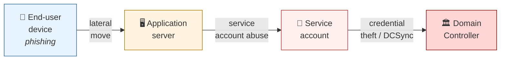
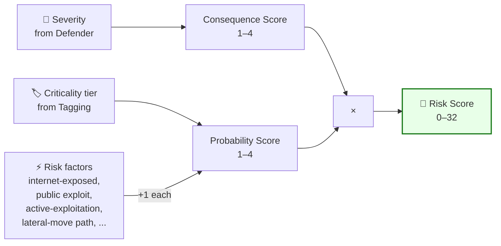
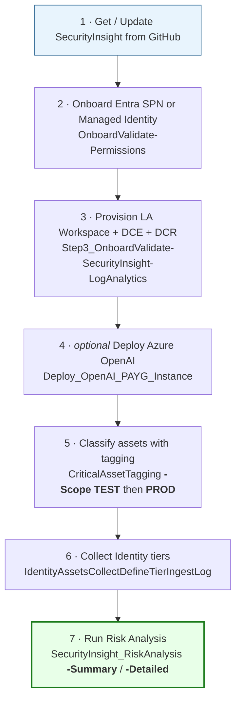
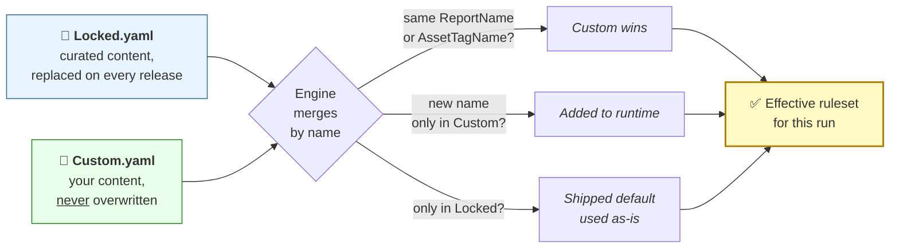
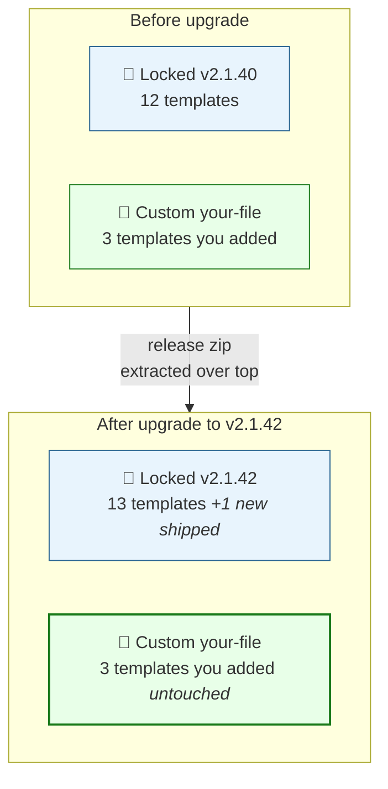
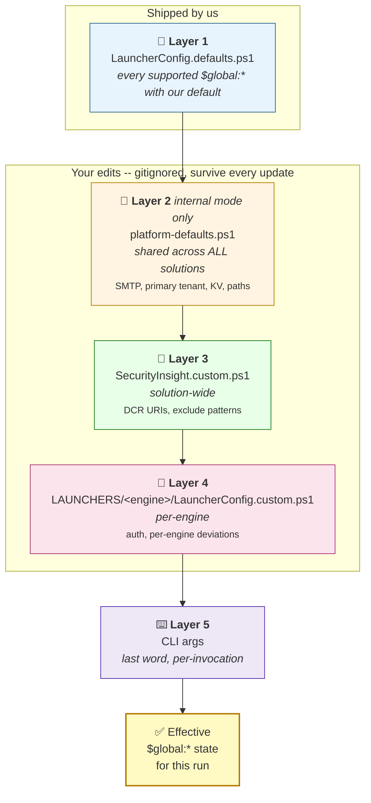
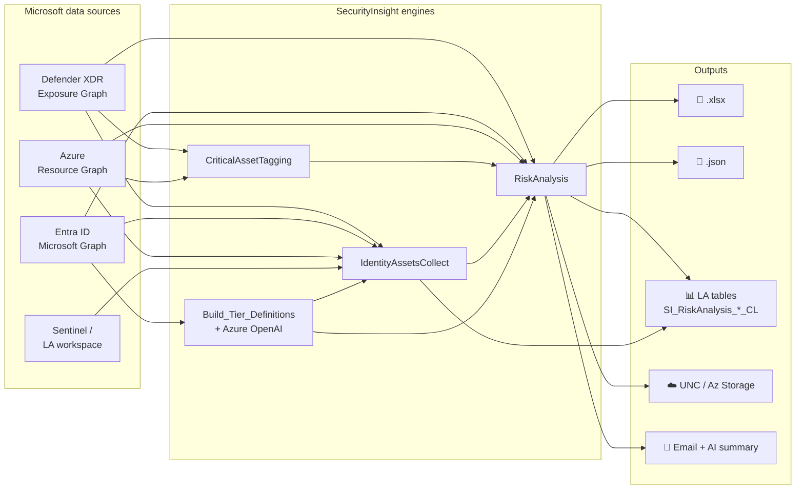

# SecurityInsight

<a id="top"></a>

# 🛡️ SecurityInsight

> **Risk-based security exposure prioritization for Microsoft 365, Entra ID, Defender, and Azure.**
> Replace "we have 4,000 recommendations" with "here are the 12 things that actually matter, ranked."

[](https://github.com/KnudsenMorten/SecurityInsight/releases)
[](https://learn.microsoft.com/powershell/)
[](LICENSE)

**Author**: [Morten Knudsen](https://mortenknudsen.net) — Microsoft MVP (Security · Azure · Security Copilot)
**Support**: [GitHub Issues](https://github.com/KnudsenMorten/SecurityInsight/issues) · [mok@mortenknudsen.net](mailto:mok@mortenknudsen.net)
**Watch**: [Video walkthroughs](#video-walkthroughs)

---

<a id="toc"></a>
## 📑 Table of Contents

1. [Introduction](#1-introduction)
2. [Understanding the Framework](#2-understanding-the-framework)
   - 2.1 [Why a graph, not a list](#21-why-a-graph-not-a-list)
   - 2.2 [Risk Score model](#22-risk-score-model)
   - 2.3 [Risk Factors](#23-risk-factors)
   - 2.4 [Risk Index (customizable scoring)](#24-risk-index-customizable-scoring)
   - 2.5 [Outputs at a glance](#25-outputs-at-a-glance)
3. [How to Implement (Quick Start)](#3-how-to-implement-quick-start)
   - 3.1 [High-level overview](#31-high-level-overview)
   - 3.2 [Install (fresh machine)](#32-install-fresh-machine)
   - 3.3 [Update an existing install](#33-update-an-existing-install)
   - 3.4 [Try out a preview release](#34-try-out-a-preview-release)
   - 3.5 [Pre-requisite configuration](#35-pre-requisite-configuration)
     - 3.5.1 [Connectivity: SPN or Managed Identity](#351-connectivity-spn-or-managed-identity)
     - 3.5.2 [Identity infrastructure: Workspace + DCE + DCR](#352-identity-infrastructure-workspace--dce--dcr)
     - 3.5.3 [Azure OpenAI](#353-azure-openai-optional)
   - 3.6 [Run the Risk Analysis](#36-run-the-risk-analysis)
   - 3.7 [Understand the LauncherConfig files](#37-understand-the-launcherconfig-files)
   - 3.8 [Endpoint asset tagging](#38-endpoint-asset-tagging)
   - 3.9 [Azure asset tagging](#39-azure-asset-tagging)
   - 3.10 [Defender Criticality Level (optional)](#310-defender-criticality-level-optional)
4. [Severity & Criticality Definitions](#4-severity--criticality-definitions)
   - 4.1 [Severity definitions](#41-severity-definitions)
   - 4.2 [Criticality definitions](#42-criticality-definitions)
   - 4.3 [Asset classification: Identity](#43-asset-classification-identity)
   - 4.4 [Asset classification: Endpoint](#44-asset-classification-endpoint)
   - 4.5 [Asset classification: Azure](#45-asset-classification-azure)
5. [What's New (v2.1.x highlights)](#5-whats-new-v21x-highlights)
6. [The YAML Concept (Locked + Custom)](#6-the-yaml-concept-locked--custom)
7. [Appendix](#7-appendix)
   - 7.1 [Permissions catalog](#71-permissions-catalog)
   - 7.2 [Files deep-dive](#72-files-deep-dive)
   - 7.3 [Bucketing — beating the 30k row ceiling](#73-bucketing--beating-the-30k-row-ceiling)
   - 7.4 [Output destinations](#74-output-destinations)
   - 7.5 [Per-template mail recipient override (YAML)](#75-per-template-mail-recipient-override-yaml)
   - 7.6 [Cross-subscription workspace support](#76-cross-subscription-workspace-support)
   - 7.7 [Layered config flow](#77-layered-config-flow)
   - 7.8 [End-to-end architecture](#78-end-to-end-architecture)
8. [Video walkthroughs](#video-walkthroughs)
9. [Support](#9-support)

---

<a id="1-introduction"></a>
## 1. Introduction

[⤴ Back to top](#top)

Security teams are drowning. A typical Microsoft tenant surfaces **3,000–10,000 security recommendations** across Defender, Entra ID, Azure, Intune, and Purview — and every vendor's portal speaks its own language. *Which fix actually reduces breach risk this week?* is a question almost no one can answer from the raw data.

**SecurityInsight** is a PowerShell solution that takes the same Defender / Entra / Azure data you already have and rebuilds it into one coherent **risk-based prioritization model**:

> **Risk Score = Consequence (severity) × Probability (criticality + risk factors)**

The output is a ranked list — not 4,000 recommendations, but the small set of fixes that meaningfully reduce attacker dwell-time, lateral movement, and tenant takeover risk. Same Defender data, different framing: **attacker-centric instead of tool-centric.**

> [!TIP]
> **Talk track for execs**: SecurityInsight tells your CISO *"if we patch these 12 things this week, we cut the realistic blast radius of a successful phishing attack by 60%."* It does NOT add another portal — it consumes your existing Defender + Entra + Azure data via API.

### What's in the box

| Engine | Purpose |
|---|---|
| **SecurityInsight_RiskAnalysis** | The main analyzer. Pulls Defender vulnerabilities, exposure paths, configuration recommendations + Azure RBAC, scores them per the risk model, and produces ranked Excel + JSON + Log Analytics ingestion + email + AI executive summary. |
| **CriticalAssetTagging** | Auto-tags every device / Azure resource with its **criticality tier** (0=critical, 1=high, 2=standard, 3=low). Drives the Criticality dimension of the risk score. |
| **IdentityAssetsCollectDefineTierIngestLog** | Iterates every Entra user, SPN, MI; classifies their effective privilege tier; ingests into Log Analytics as `SI_IdentityAssets_CL`. |
| **Step3_OnboardValidate-SecurityInsight-LogAnalytics** | One-shot setup. Provisions the Workspace + DCE + DCR + custom table the Identity engine ingests into. |
| **Build_Tier_Definitions_JSON_File** | Uses Azure OpenAI to attacker-centrically classify Entra roles, Graph permissions, AD groups, and Azure built-in roles into Tier 0/1/2/3. Output is the catalog the rest of the engines consume. |
| **Step2_OnboardValidate-SecurityInsight-Permissions** | Idempotent admin utility. Creates the Entra SPN, grants the API permissions and Azure RBAC the platform needs. Re-run = validation pass. |
| **Setup-SecurityInsight-CustomSecurityAttributes** | One-time provisioning of the Custom Security Attribute schema used by the tagging pipeline. |
| **Step4_OnboardValidate-SecurityInsight-OpenAI-PAYG-Instance-Azure** | Optional helper to provision a PAYG Azure OpenAI account + model deployment for the AI summary feature. |

### Sample output

| File | Link |
|---|---|
| Sample Summary report (XLSX) | [Sample - RiskAnalysis_Summary_Bucket.xlsx](https://github.com/KnudsenMorten/SecurityInsight/raw/refs/heads/main/data/_samples/Sample%20-%20RiskAnalysis_Summary_Bucket.xlsx) |
| Sample Detailed report (XLSX) | [Sample - RiskAnalysis_Detailed_Bucket.xlsx](https://github.com/KnudsenMorten/SecurityInsight/raw/refs/heads/main/data/_samples/Sample%20-%20RiskAnalysis_Detailed_Bucket.xlsx) |
| Sample Summary email (PDF, with AI exec summary) | [Sample mail - Summary report with AI summary.pdf](https://github.com/KnudsenMorten/SecurityInsight/blob/main/data/_samples/Sample%20mail%20-%20Summary%20report%20with%20AI%20summary.pdf) |
| Sample Detailed email (PDF, with AI exec summary) | [Sample mail - Detailed report with AI summary.pdf](https://github.com/KnudsenMorten/SecurityInsight/blob/main/data/_samples/Sample%20mail%20-%20Detailed%20report%20with%20AI%20summary.pdf) |

---

<a id="2-understanding-the-framework"></a>
## 2. Understanding the Framework

[⤴ Back to top](#top)

<a id="21-why-a-graph-not-a-list"></a>
### 2.1 Why a graph, not a list

[⤴ Back to top](#top)

**Defenders typically think in lists** — devices, users, vulnerabilities, recommendations. Lists are good for inventory and reporting. They are useless for prioritization, because they hide *how systems connect to each other.*

**Attackers think in relationships.** A typical compromise rarely targets the most critical system directly:



The path goes through 4 systems. Three of them look *low-risk* in isolation. Their relationships are what makes the path catastrophic. SecurityInsight uses **Microsoft Defender Exposure Graph** + **Azure Resource Graph** to score recommendations the way an attacker would weigh them: *can this finding put me one step closer to a Tier-0 asset?*

> [!NOTE]
> The technical underpinning is `ExposureGraphNodes` + `ExposureGraphEdges` (Defender) and Azure Resource Graph KQL — same data your SOC already has, framed as a graph instead of a flat table.

<a id="22-risk-score-model"></a>
### 2.2 Risk Score model

[⤴ Back to top](#top)

Two dimensions, one formula:

> **Risk Score = Consequence × Probability**



| Dimension | Where it comes from |
|---|---|
| **Consequence Score** | Defender's `Severity` rating of the recommendation (Very High → Low). Reflects *how bad it is if this gets exploited.* |
| **Probability Score** | The asset's **criticality tier** (Tier 0–3) modulated by **risk factors** (see [§ 2.3](#23-risk-factors)). Reflects *how likely it is to actually be exploited on THIS asset, in THIS environment.* |

Both scores are integers from the **Risk Index CSV** ([§ 2.4](#24-risk-index-customizable-scoring)) — a fully customizable mapping that organizations tune to their own risk appetite.

**Worked example**:

```
Finding          : "Endpoint missing critical CVE patch"
Severity         : Very High
Consequence      : 4   (mapped from "Very High" in the Risk Index)
Asset            : An internet-facing web server tagged "Tier 1 (High)"
Criticality base : 3   (Tier 1 base score from the Risk Index)
Risk factor +1   : because the asset has the "InternetExposed" tag → Probability = 4
                                                                  ─────────
Risk Score = 4 × 4 = 16  →  ranks above a Tier-3 internal-only finding
```

<a id="23-risk-factors"></a>
### 2.3 Risk Factors

[⤴ Back to top](#top)

Probability is bumped up by **+1 per matching risk factor**. Each represents a real-world attribute that materially raises the chance of exploitation:

| Risk factor | Why it bumps probability |
|---|---|
| **Active exploitation** | The vulnerability is being weaponized in the wild today. |
| **Public exploit code** | Proof-of-concept is freely available. |
| **Internet exposure** | The asset is reachable from outside your perimeter. |
| **Legacy / unsupported** | No security updates available. |
| **Contains verified secret** | A real credential is sitting in the asset (Defender Secret Scanning hit). |
| **Critical resource** | Defender flags the asset as foundational to your tenant. |
| **Lateral movement** | The asset sits on a known attack path. |
| **Sensitive data** | The asset stores classified, PII, or regulated content. |

Each factor contributes +1 to the Probability score, capped per the Risk Index.

<details>
<summary>📌 <b>Future risk factors under consideration</b></summary>

- **Large attack surface** — many open services / APIs / ports
- **Third-party exposure** — partner / vendor reach
- **Shared infrastructure** — multi-tenant / multi-team blast radius
- **Weak network segmentation** — flat L2 / VLAN sprawl
- **Credential exposure risk** — shared accounts, weak MFA
- **Remote access enabled** — VPN / RDP / SSH / management UIs

PRs welcome to extend the engine with these — the scoring math stays the same, only the bump count changes.
</details>

<a id="24-risk-index-customizable-scoring"></a>
### 2.4 Risk Index (customizable scoring)

[⤴ Back to top](#top)

The mapping `Severity → Consequence` and `Criticality → Probability` lives in **`SecurityInsight_RiskIndex.csv`** ([download](https://github.com/KnudsenMorten/SecurityInsight/raw/refs/heads/main/SecurityInsight_RiskIndex.csv)). Customers edit this file to reflect their own risk appetite — the engine reads it on every run.

| SecuritySeverity | Consequence | CriticalityTierLevel | Probability | Comments |
|---|---|---|---|---|
| Very High | 4 | Critical (tier 0) | 4 | Top of the matrix |
| Very High | 4 | High (tier 1) | 3 | |
| High | 3 | Critical (tier 0) | 4 | |
| Medium-High | 2 | Critical (tier 0) | 4 | |
| Low | 1 | Low (tier 3) | 1 | Bottom of the matrix |

Want a different scoring matrix for a regulated business unit? Edit the CSV. Want to penalize Tier-0 findings more aggressively? Bump the Probability column for Tier-0 rows. Want certain `ConfigurationId`s to score harder regardless of severity? Add a row with that exact ConfigurationId — it overrides the generic mapping.

<a id="25-outputs-at-a-glance"></a>
### 2.5 Outputs at a glance

[⤴ Back to top](#top)

Every Risk Analysis run produces all of these from a single in-memory dataset (no double work):

| Output | Default | Toggle |
|---|---|---|
| 📗 Excel (.xlsx) | always | — |
| 📄 JSON sibling (.json) | on | `$global:WriteJsonOutput` |
| 📊 Log Analytics ingest (2 tables: `SI_RiskAnalysis_Summary_CL` / `_Detailed_CL`) | off | `$global:SendToLogAnalytics` |
| ☁️ Upload to UNC share OR Azure Storage | off | `$global:ExportDestination` |
| 📧 Email with HTML body + .xlsx attachment | off | `$global:SendMail` (community) / `$global:Mail_*_SendMail` (internal) |
| 🤖 Azure OpenAI executive summary embedded in Excel + email | off | `$global:BuildSummaryByAI` |

> [!IMPORTANT]
> Once the data is in Log Analytics it is queryable from Sentinel, Defender XDR, Power BI, Logic Apps, Workbooks, and Security Copilot. That's the long-term home — the .xlsx and email are convenience outputs.

---

<a id="3-how-to-implement-quick-start"></a>
## 3. How to Implement (Quick Start)

[⤴ Back to top](#top)

<a id="31-high-level-overview"></a>
### 3.1 High-level overview

[⤴ Back to top](#top)



Steps 1–4 are once-per-tenant. Step 5 runs daily/hourly. Step 6 runs daily. Step 7 runs daily/weekly/on-demand.

<a id="32-install-fresh-machine"></a>
### 3.2 Install (fresh machine)

[⤴ Back to top](#top)

One **Step 1** script bootstraps the whole solution from GitHub. Copy-paste:

```powershell
# Pick your install path ONCE, re-use for every re-run -- default is C:\SCRIPTS\SecurityInsight.
$SI_InstallPath = 'C:\SCRIPTS\SecurityInsight'   # <-- change to 'D:\Tools\SecurityInsight' etc. if you want

# Fresh bootstrap (no local checkout yet):
$u = 'https://raw.githubusercontent.com/KnudsenMorten/SecurityInsight/main/scripts/Step1_OnboardUpdate_SecurityInsight_from_Github_Repo.ps1'
irm $u | Out-File $env:TEMP\Step1.ps1
& $env:TEMP\Step1.ps1 -DestinationPath $SI_InstallPath
```

> [!TIP]
> Prefer to pin the path inside the script itself so re-runs never need `-DestinationPath`? Open `SCRIPTS/Step1_OnboardUpdate_SecurityInsight_from_Github_Repo.ps1` and edit the first line of its param block — the `EDIT-ME DEFAULTS` header marks the spot. CLI `-DestinationPath` still overrides per-run.

**Step 1 parameters** (all optional):

| Parameter | Default | Purpose |
|---|---|---|
| `-DestinationPath` | `C:\SCRIPTS\SecurityInsight` | Where the code lands on this machine. Same path on re-run upgrades in place. |
| `-Channel` | `stable` | `stable` = latest tagged GitHub release (production). `preview` = HEAD of the `preview` branch (bleeding edge). |
| `-Engine` | *(unset)* | Launcher folder to `cd` into after install, e.g. `Step2_OnboardValidate-SecurityInsight-Permissions`. Great for scheduled-run scripts that always run the same engine. |
| `-Repo` | `KnudsenMorten/SecurityInsight` | Change if you fork the solution. |
| `-PreservePatterns` | (see script) | Glob patterns that are never overwritten on update. Default covers customer configs + custom YAML. |

Next stop: [§ 3.5 Pre-requisite configuration](#35-pre-requisite-configuration) for the Steps 2 / 3 / 4 onboarding runbook.

<a id="33-update-an-existing-install"></a>
### 3.3 Update an existing install

[⤴ Back to top](#top)

Re-running **Step 1** against the same path is idempotent and preserves every customer-owned file (`LauncherConfig.custom.ps1`, `launcher.override.ps1`, `CUSTOMDATA/*`, `*_Custom.yaml`):

```powershell
# Same $SI_InstallPath as when you first installed:
$SI_InstallPath = 'C:\SCRIPTS\SecurityInsight'

# Update in place -- customer files preserved, platform files refreshed from the latest stable release:
& (Join-Path $SI_InstallPath 'SCRIPTS\Step1_OnboardUpdate_SecurityInsight_from_Github_Repo.ps1') -DestinationPath $SI_InstallPath
```

What gets updated vs preserved is documented in [§ 7.2 Files deep-dive](#72-files-deep-dive).

After update, the running version is stamped on every launcher banner:

```
========================================================================================
  SecurityInsight -- SecurityInsight_RiskAnalysis    [community-vm]   SecurityInsight-v2.1.81
========================================================================================
```

<a id="34-try-out-a-preview-release"></a>
### 3.4 Try out a preview release

[⤴ Back to top](#top)

The `preview` channel tracks the HEAD of the `preview` branch on the public GitHub repo — bleeding-edge features that haven't shipped in a tagged release yet. Good for a dev box or for giving early feedback.

```powershell
# Same $SI_InstallPath you already use (ideally a SEPARATE folder from stable to avoid mixing channels):
$SI_InstallPath = 'C:\SCRIPTS\SecurityInsight-preview'

# Pull preview channel:
& (Join-Path $SI_InstallPath 'SCRIPTS\Step1_OnboardUpdate_SecurityInsight_from_Github_Repo.ps1') -DestinationPath $SI_InstallPath -Channel preview
```

> [!NOTE]
> Preview = uncut, unrewindable. Bugs may exist that don't exist in `stable`. File issues at [KnudsenMorten/SecurityInsight](https://github.com/KnudsenMorten/SecurityInsight/issues). When a preview feature stabilizes it's cut to a new `stable` release — update via § 3.3.

<a id="35-pre-requisite-configuration"></a>
### 3.5 Pre-requisite configuration

[⤴ Back to top](#top)

The solution ships four **Step** launchers that set a tenant up from zero, plus several **engines** that produce the actual reports / ingests. Run the Steps once per tenant (in order), then run the engines as often as you like.

**Onboarding Steps** (run once per tenant, in order):

| # | Purpose | Config needed? |
|---|---|---|
| **Step 1** | Download / update SecurityInsight from GitHub. Preserves customer files. Supports `stable` (default) + `preview` channels.<br/>`SCRIPTS/Step1_OnboardUpdate_SecurityInsight_from_Github_Repo.ps1` | **None** — it's a script, use `-DestinationPath` / `-Channel` args or edit the inline defaults at the top of the file. |
| **Step 2** | Create the SecurityInsight SPN. Grants Graph / Defender / ATP API permissions + Azure `Reader` + `Tag Contributor` at tenant-root MG (default). Idempotent.<br/>`LAUNCHERS/Step2_OnboardValidate-SecurityInsight-Permissions/` | **None** — community-vm falls back to interactive Graph sign-in. Fill in `LauncherConfig.custom.ps1` only to run unattended. |
| **Step 3** | Provision Log Analytics workspace + DCE + DCR + `SI_IdentityAssets_CL` table + RBAC for the SPN.<br/>`LAUNCHERS/Step3_OnboardValidate-SecurityInsight-LogAnalytics/` | **Yes** — 4 lines (auth + subscription). Copy `LauncherConfig.sample.ps1` → `LauncherConfig.custom.ps1`. |
| **Step 4** *(opt.)* | Provision pay-as-you-go Azure OpenAI account + model deployment. Only needed for RiskAnalysis AI summaries (`-BuildSummaryByAI`).<br/>`LAUNCHERS/Step4_OnboardValidate-SecurityInsight-OpenAI-PAYG-Instance-Azure/` | **Yes** — 8 lines (auth + placement + account/deployment names). |

**Ingestion engines** (run on a schedule after the Steps):

| Engine | What it does | Config needed? |
|---|---|---|
| `IdentityAssetsCollectDefineTierIngestLog` | Collect identities + tier them → `SI_IdentityAssets_CL` | **Yes** — re-uses Step 3's 4 auth lines |
| `SecurityInsight_RiskAnalysis` | Risk reports → `.xlsx` + `.json` + `SI_RiskAnalysis_*_CL` | **Yes** — re-uses Step 3's 4 auth lines, plus report options |
| `CriticalAssetTagging` (+ 3 siblings) | Apply tier tags to Defender devices + Azure resources | **Yes** — re-uses Step 3's 4 auth lines |
| `Build_Tier_Definitions_JSON_File` | Rebuild tier catalog JSON (run before `IdentityAssets…` if you customize tier rules) | **Yes** — re-uses Step 3's 4 auth lines |

> [!TIP]
> **Internal (AF) / community-azure flavours don't need `LauncherConfig.custom.ps1`** — they pull auth from the platform bootstrap (`Initialize-PlatformAutomationFramework`) or a Managed Identity + Key Vault. Only the **community-vm** flavour reads credentials from the customer file.

> [!NOTE]
> **Where does `LauncherConfig.custom.ps1` come from?** There's no template created for you. **Copy `LauncherConfig.sample.ps1` → `LauncherConfig.custom.ps1`** in the same folder, then edit. The `.custom.ps1` name is gitignored so the populated copy stays local.
> Some older solutions use the filename `LauncherConfig.ps1` (without `.custom.`) — both are recognized by the launcher; new work should prefer `.custom.ps1`.

**Unattended (hands-off) operation** — Steps 2-4 and every engine launcher support the same four auth methods, so a pipeline / scheduled task can run the whole chain with one identity:

| Auth method | Set in `LauncherConfig.custom.ps1` | Use when |
|---|---|---|
| Managed Identity | `$global:UseManagedIdentity = $true` + `$global:SpnTenantId` | Azure VM / Function / Logic App / Hybrid Runbook Worker |
| SPN + secret in Key Vault | `$global:SpnKeyVaultName`, `$global:SpnSecretName`, `$global:SpnTenantId`, `$global:SpnClientId` | Production VM with MI that has Key Vault Secrets User |
| SPN + certificate | `$global:SpnCertificateThumbprint`, `$global:SpnTenantId`, `$global:SpnClientId` | Production VM with cert in local store |
| SPN + plaintext secret | `$global:SpnClientSecret`, `$global:SpnTenantId`, `$global:SpnClientId` | Lab / testing only |

**Step 2** defaults to `Interactive` (browser sign-in by a human admin). To run it unattended, also set `$global:OnboardValidate_AuthMethod = 'SpnSecret'` (or `'SpnCertificate'` / `'ManagedIdentity'`). The SPN/MI needs **Privileged Role Administrator** (or **Global Administrator**) to create app registrations + grant admin consent.

**Step 4** accepts `-ValidateOnly` — turns it into a hands-off health check. No resources are created, but the engine still reports `CREATED` / `REUSED` / `MISSING` status per resource + exits non-zero if anything is missing. Good for monitoring that your Azure OpenAI deployment hasn't drifted.

---

### 🚀 30-second onboarding (absolute minimum)

**Step 1 — install / update from GitHub.** Already covered in [§ 3.2 Install + update](#32-install--update) — copy the `$SI_InstallPath` block from there, it handles bootstrap, re-install, and `preview` channel in one snippet.

---

##### ⭐ Right after Step 1 — open the Setup Configurator

> [!TIP]
> **⭐ Recommended: Setup Configurator (GUI).**
> Open the included **Setup Configurator** in your browser *before* you run Step 2 — it writes every `LauncherConfig.custom.ps1` for Steps 2 / 3 / 4 + the ingestion engines in one sitting, with form fields + live preview + copy-to-clipboard:
> ```powershell
> Start-Process .\TOOLS\SetupConfigurator\index.html
> ```
> Single offline HTML file, zero dependencies. Tabs for Step 2 / Step 3 / Step 4 / ingestion engines. All processing stays in your browser — no data leaves your machine. Re-use the 4 auth values (Tenant / ClientId / Secret / Subscription) across every tab and you're done.

Or — **configure manually** if you prefer editing `.ps1` files directly (expand the block at the end of § 3.5).

---

##### Step 2 — do nothing

Just run the launcher:
```powershell
.\LAUNCHERS\Step2_OnboardValidate-SecurityInsight-Permissions\launcher.community-vm.template.ps1
```
Browser sign-in as a Privileged Role Admin **with Azure UAA at tenant root** (Entra admin center → Properties → *Access management for Azure resources* toggle ON). The engine creates `sp-securityinsight`, grants all the API permissions, and assigns Azure `Reader` + `Tag Contributor` at the tenant-root MG — one grant cascades to every sub. Prints the AppId + secret-creation hint at the end — copy the AppId. Falls back to per-subscription if tenant-root fails.

---

##### Steps 3 + 4 + ingestion engines

Use the Setup Configurator tabs (one per Step / engine) to generate each `LauncherConfig.custom.ps1`, then run the launcher. Prefer hand-editing? Expand the block below for minimum copy-paste examples.

<details>
<summary><b>Manual configuration (click to expand)</b></summary>

**Step 3 — 4 lines in `LauncherConfig.custom.ps1`:**
```powershell
# LAUNCHERS/Step3_OnboardValidate-SecurityInsight-LogAnalytics/LauncherConfig.custom.ps1
$global:SpnTenantId     = '<your-tenant-id-guid>'
$global:SpnClientId     = '<appid-from-Step2>'
$global:SpnClientSecret = '<client-secret-you-created-for-that-app>'
$global:SubscriptionId  = '<your-target-subscription-id-guid>'
```
Run it:
```powershell
.\LAUNCHERS\Step3_OnboardValidate-SecurityInsight-LogAnalytics\launcher.community-vm.template.ps1
```
Workspace / DCE / DCR all land in their standard RGs (`rg-securityinsight`, `rg-dce-securityinsight`, `rg-dcr-securityinsight` in West Europe) — override in the same file only if you deviate. Step 3's end-of-run cheat-sheet prints the exact globals to paste into the ingestion engines' config files.

**Step 4 — only if you want `-BuildSummaryByAI` on RiskAnalysis. 7 lines:**
```powershell
# LAUNCHERS/Step4_OnboardValidate-SecurityInsight-OpenAI-PAYG-Instance-Azure/LauncherConfig.custom.ps1
$global:SpnTenantId      = '<your-tenant-id-guid>'
$global:SpnClientId      = '<appid-from-Step2>'
$global:SpnClientSecret  = '<client-secret>'
$global:SubscriptionId   = '<your-target-subscription-id-guid>'
$global:ResourceGroupName = 'rg-securityinsight-openai'
$global:Location          = 'swedencentral'
$global:AccountName       = 'oai-securityinsight-<unique-suffix>'
$global:DeploymentName    = 'gpt-4o-mini'
```
Re-run `-ValidateOnly` any time to confirm the deployment is still healthy.

**Ingestion engines** (`IdentityAssetsCollect`, `RiskAnalysis`) pick up the resources Step 3 created automatically — you only need to set `$global:SpnTenantId` + `$global:SpnClientId` + `$global:SpnClientSecret` + `$global:SubscriptionId` in *their* custom files to use the same SPN.

</details>

---

<a id="351-connectivity-spn-or-managed-identity"></a>
#### 3.5.1 Connectivity: SPN or Managed Identity

[⤴ Back to top](#top)

SecurityInsight engines authenticate to Entra (Microsoft Graph) and Azure (Resource Graph + Log Analytics + Storage). **Pick ONE** authentication model:

| # | Method | Best for | Setup |
|---|---|---|---|
| 1 | **Entra SPN + Secret** | Lab / testing | Create app, set client secret |
| 2 | **Entra SPN + Certificate** | Production on a VM where you control the cert store | Create app, upload cert, install private key on the VM |
| 3 | **System-Assigned Managed Identity** | Azure VM / Function App / Logic App / Hybrid Worker | Enable system-assigned MI on the host |
| 4 | **User-Assigned Managed Identity** | Multiple Azure hosts sharing one identity | Create UAMI, assign to host(s) |

**Either way, the identity needs the same permissions.** Use the included one-shot utility:

```powershell
# Interactive (you sign in as a Privileged Role Admin), creates 'sp-securityinsight' if missing,
# grants Graph + Defender + ATP API permissions + Azure Reader + Tag Contributor at tenant-root MG:
.\LAUNCHERS\Step2_OnboardValidate-SecurityInsight-Permissions\launcher.community-vm.template.ps1

# Dry-run preview first:
.\LAUNCHERS\Step2_OnboardValidate-SecurityInsight-Permissions\launcher.community-vm.template.ps1 -WhatIfMode

# Optional: also grant Log Analytics Reader on a Defender workspace + Monitoring Metrics Publisher on a DCR:
.\LAUNCHERS\Step2_OnboardValidate-SecurityInsight-Permissions\launcher.community-vm.template.ps1 `
    -DefenderWorkspaceResourceId '/subscriptions/<sub>/resourceGroups/<rg>/providers/Microsoft.OperationalInsights/workspaces/<defender-ws>' `
    -DcrResourceId               '/subscriptions/<sub>/resourceGroups/<rg>/providers/Microsoft.Insights/dataCollectionRules/<dcr>'
```

The OnboardValidate engine is **idempotent** — re-run it any time as a validation pass. Adding permissions later? Edit the catalog at the top of `SCRIPTS/Step2_OnboardValidate-SecurityInsight-Permissions.ps1` and re-run; only the missing grants are applied.

**End-of-run summary block (v2.1.64+)** prints the App display name, App (client) ID, SPN Object ID, tenant ID, per-category grant counts, a **ready-to-paste `$global:Spn*` block** for your `LauncherConfig.custom.ps1`, and verification KQL for after your first ingest. No scrolling through the log to find the AppId.

> [!IMPORTANT]
> **What OnboardValidate DOES cover (via RBAC grants):**
> - Graph + Defender + ATP API permissions on the SPN
> - Azure `Reader` at tenant-root MG (default — for Azure Resource Graph enumeration across every sub)
> - Azure `Tag Contributor` at tenant-root MG (needed by `CriticalAssetTagging` to write tier tags on subs / RGs / resources)
> - Falls back to per-subscription if the onboarding identity lacks UAA at tenant root (or if you pick `-AzureRbacScope PerSubscription` explicitly)
> - Optional: `Log Analytics Reader` on a Defender workspace (`-DefenderWorkspaceResourceId`)
> - Optional: `Monitoring Metrics Publisher` on a specific DCR (`-DcrResourceId`)
>
> **What OnboardValidate does NOT cover:**
> - Creating the Log Analytics workspace / DCE / DCR — that's either done by the `Step3_OnboardValidate-SecurityInsight-LogAnalytics` launcher (§3.5.2) OR auto-created by the engines themselves on first run (v2.1.54+).
> - Granting the SPN `Owner` or `Contributor + User Access Administrator` — which is what the engines' auto-provisioning needs for **first-run** workspace/DCE creation + container RBAC grants. On `Reader`-only subs, auto-provision will fail cleanly with a `403 AuthorizationFailed` warning and you'll need to provision manually via §3.5.2 or grant higher perms.
>
> **Required permissions** are listed in [§ 7.1](#71-permissions-catalog).

<a id="352-identity-infrastructure-workspace--dce--dcr"></a>
#### 3.5.2 Identity infrastructure: Workspace + DCE + DCR

[⤴ Back to top](#top)

The `IdentityAssetsCollect` and `RiskAnalysis` engines ingest into Log Analytics via a Data Collection Rule (DCR) and Data Collection Endpoint (DCE).

> [!TIP]
> **You have two options** (v2.1.54+). Pick one:
>
> **Option A — let the ingestion engines auto-provision on first run** *(recommended for labs / single-tenant demos)*: the first time `IdentityAssetsCollect` or `RiskAnalysis` runs, they look for the workspace / DCE / DCE RG / DCR RG and **create anything missing** — then grant the SPN `Monitoring Metrics Publisher` on the RGs and `Storage Blob Data Contributor` on an export blob container if one is configured. **Requires `Owner` (or `Contributor + User Access Administrator`) on the target subscription for the first run.** After that, the engines can run with just `Reader` + `Monitoring Metrics Publisher`.
>
> **Option B — provision explicitly up-front** *(recommended for production / locked-down tenants where the ingestion SPN is `Reader`-only)*: run the dedicated onboarding launcher once as a privileged admin, then hand the SPN a read-only role. Details below.

**Option A — zero-touch auto-provision (v2.1.54+)**

Just run `IdentityAssetsCollect` or `RiskAnalysis` directly. You'll see lines like:
```
[OK]   Workspace exists: log-platform-management-securityinsight (rg=rg-securityinsight)
[OK]   DCE exists: dce-securityinsight (rg=rg-dce-securityinsight, location=westeurope)
[INFO] RG exists: rg-dcr-securityinsight (westeurope)
```
…or — if missing — `[STEP] DCE '...' not found -- auto-provisioning` followed by `[OK] Created DCE` and `[OK] Assigned 'Monitoring Metrics Publisher' at ...`. The canonical names live in **Layer 0** (`LAUNCHERS/_lib/SecurityInsight.shared-defaults.ps1`) — see [§ 3.7](#37-understand-the-launcherconfig-files). Override any of them in your `LauncherConfig.custom.ps1` if you deviate from the defaults.

**Option B — explicit provisioning**

```powershell
.\LAUNCHERS\Step3_OnboardValidate-SecurityInsight-LogAnalytics\launcher.community-vm.template.ps1
```

This creates (or re-uses if they exist):
- Resource Group `rg-securityinsight` (workspace RG — override with `$global:ResourceGroup`)
- Resource Group `rg-dce-securityinsight` (DCE RG — override with `$global:DceResourceGroup`)
- Resource Group `rg-dcr-securityinsight` (DCR RG — override with `$global:DcrResourceGroup`)
- Log Analytics workspace `log-platform-management-securityinsight`
- DCE `dce-securityinsight`
- DCR `dcr-si-identity-assets`
- Custom table `SI_IdentityAssets_CL`
- `Monitoring Metrics Publisher` + `Contributor` RBAC on the DCE RG + DCR RG (granted to the ingestion SPN)
- `Contributor` on the Log Analytics workspace (granted to the ingestion SPN)

At the end of the run, the engine prints a **mode-aware cheat-sheet** with the exact globals to copy into your `LauncherConfig.custom.ps1`. You don't have to memorize the URIs.

> **Which option do I need?** Run `Step2_OnboardValidate-SecurityInsight-Permissions` (§ 3.5.1) first. If it grants `Owner` or `Contributor + UAA` on the target sub, Option A Just Works™. If your SPN ends up with `Reader`-only, use Option B.

<a id="353-azure-openai-optional"></a>
#### 3.5.3 Azure OpenAI (optional)

[⤴ Back to top](#top)

The AI executive summary is a separate opt-in. Helper script provisions a PAYG Azure OpenAI account + model deployment:

```powershell
.\LAUNCHERS\Step4_OnboardValidate-SecurityInsight-OpenAI-PAYG-Instance-Azure\launcher.community-vm.template.ps1
```

Then enable in any engine's `LauncherConfig.custom.ps1`:

```powershell
$global:BuildSummaryByAI  = $true
$global:OpenAI_endpoint   = 'https://<your-aoai-account>.openai.azure.com'
$global:OpenAI_deployment = 'gpt-4o-mini'
$global:OpenAI_apiKey     = '<your-azure-openai-key>'
```

> [!TIP]
> AI summary is appended both to the **Excel report** (as a 'Summary' worksheet) and the **email body**. Token budget is configurable via `$global:OpenAI_MaxTokensPerRequest` (default 16384).

<a id="36-run-the-risk-analysis"></a>
### 3.6 Run the Risk Analysis

[⤴ Back to top](#top)

Two report templates ship out of the box:

| Template | Audience | What it has |
|---|---|---|
| `RiskAnalysis_Summary_Bucket` | Executives, weekly cadence | Aggregated findings per tier, overall risk rollups |
| `RiskAnalysis_Detailed_Bucket` | Vulnerability / remediation team | Per-asset rows with CVE IDs and remediation guidance |

**Run as Summary**:

```powershell
.\LAUNCHERS\SecurityInsight_RiskAnalysis\launcher.community-vm.template.ps1 -Summary
```

**Run as Detailed**:

```powershell
.\LAUNCHERS\SecurityInsight_RiskAnalysis\launcher.community-vm.template.ps1 -Detailed
```

**Run a custom report template**:

```powershell
.\LAUNCHERS\SecurityInsight_RiskAnalysis\launcher.community-vm.template.ps1 `
    -ReportTemplate 'RiskAnalysis_Detailed_Bucket_Test'
```

**Dry-run (no Excel / mail / LA writes)**:

```powershell
.\LAUNCHERS\SecurityInsight_RiskAnalysis\launcher.community-vm.template.ps1 -Summary -WhatIfMode
```

<details>
<summary>🎛️ <b>Full CLI parameter list</b></summary>

| Switch | Purpose |
|---|---|
| `-Summary` / `-Detailed` | Pick the report template (mutually exclusive). |
| `-ReportTemplate '<name>'` | Force a specific template (overrides Summary/Detailed). |
| `-BuildSummaryByAI` | Generate AI executive summary (requires OpenAI globals). |
| `-AutoBucketCount` / `-AutoBucketCache` / `-AutoBucketMax <n>` | Adaptive bucketing controls (see [§ 7.3](#73-bucketing--beating-the-30k-row-ceiling)). |
| `-ResetCache` | Wipe the AutoBucket cache before this run. |
| `-DebugQueryHash` | Log the hash + cache key per KQL query (debugging). |
| `-ShowConfig` | Dump the resolved config and exit. |
| `-WhatIfMode` | Dry run — no Excel / mail / LA / upload writes. |
| `-LauncherConfigPath '<path>'` | Override the customer config file location (default sibling). |

</details>

<a id="37-understand-the-launcherconfig-files"></a>
### 3.7 Understand the LauncherConfig files

[⤴ Back to top](#top)

Every engine launcher uses a **layered config** model. You only ever edit `LauncherConfig.custom.ps1`; everything else is shipped by us and replaced safely on every release.

```
LAUNCHERS/<engine>/
├── launcher.*.template.ps1            ← engine wrapper (ours, replaced on update)
├── LauncherConfig.defaults.ps1        ← every supported $global:* with our default (ours, replaced on update)
├── LauncherConfig.sample.ps1          ← copy-paste starter (ours, replaced on update)
├── LauncherConfig.custom.ps1          ← YOUR overrides — gitignored, NEVER overwritten
└── launcher.manifest.json             ← publish metadata (ours)
```

Visual load order (each layer's `$global:*` overrides the previous — a diagram of how the layers merge lives in [§ 7.7](#77-layered-config-flow)):

| # | File | Owner | Purpose |
|---|---|---|---|
| 0 | `LAUNCHERS/_lib/SecurityInsight.shared-defaults.ps1` | us | **Solution-wide canonical names** — `$global:WorkspaceName`, `$global:DceName`, `$global:DceResourceGroup`, `$global:DcrResourceGroup`, `$global:Location`, `$global:SubscriptionId` (v2.1.55). Shared by every SI engine so you don't have to repeat them. |
| 1 | `LauncherConfig.defaults.ps1` | us | Engine baseline — table names, DCR name, mode flags |
| 2 | `SOLUTIONS/PlatformConfiguration/CUSTOMDATA/platform-defaults.ps1` | you (internal mode only) | Shared across every solution on the platform (SMTP, tenant, KV) |
| 3 | `SOLUTIONS/SecurityInsight/CUSTOMDATA/SecurityInsight.custom.ps1` | you | Solution-wide overrides (DCR / workspace / exclude patterns) |
| 4 | `LAUNCHERS/<engine>/LauncherConfig.custom.ps1` | you | Per-engine overrides (auth, per-engine mail) |
| 5 | CLI args | per-invocation | Last word |

> [!TIP]
> **Auto-provision, auto-resolve (v2.1.54+)**: missing Workspace / DCE / DCE RG / DCR RG are auto-created on first run, and `DceIngestionUri` is resolved from `DceName` at runtime — you don't have to hardcode endpoint URIs any more. See [§ 5](#5-whats-new-v21x-highlights) for the full v2.1.53–v2.1.64 feature matrix.

**Quickstart**:

```powershell
# 1. Copy the sample to your custom file (gitignored, never overwritten):
Copy-Item LAUNCHERS\SecurityInsight_RiskAnalysis\LauncherConfig.sample.ps1 `
          LAUNCHERS\SecurityInsight_RiskAnalysis\LauncherConfig.custom.ps1

# 2. Edit LauncherConfig.custom.ps1 — uncomment the values you want to set.
#    Bare minimum is the auth method (e.g. SPN + cert thumbprint).

# 3. Run:
.\LAUNCHERS\SecurityInsight_RiskAnalysis\launcher.community-vm.template.ps1 -Summary
```

<details>
<summary>📧 <b>Example: enable email + AI summary</b></summary>

In `LauncherConfig.custom.ps1`:

```powershell
# Auth (pick ONE method; SPN+cert shown)
$global:SpnTenantId              = '<your-tenant-id-guid>'
$global:SpnClientId              = '<your-app-client-id-guid>'
$global:SpnCertificateThumbprint = '<cert thumbprint, hex, no spaces>'

# Mail (community mode short names)
$global:SendMail        = $true
$global:MailTo          = @('soc@yourdomain.com','exec-summary@yourdomain.com')
$global:SmtpServer      = 'smtp.yourdomain.com'
$global:SMTPPort        = 587
$global:SMTP_UseSSL     = $true
$global:SMTPUser        = 'no-reply@yourdomain.com'
$global:SMTPPassword    = '<smtp-password>'

# AI executive summary
$global:BuildSummaryByAI  = $true
$global:OpenAI_endpoint   = 'https://aoai-securityinsight.openai.azure.com'
$global:OpenAI_deployment = 'gpt-4o-mini'
$global:OpenAI_apiKey     = '<your-azure-openai-key>'
```

That's it. Re-run the launcher.
</details>

<details>
<summary>📊 <b>Example: ingest results into Log Analytics</b></summary>

In `LauncherConfig.custom.ps1`:

```powershell
$global:SendToLogAnalytics               = $true
$global:SI_RiskAnalysis_DcrResourceGroup = 'rg-securityinsight'
# DCE / Workspace / DceName fall back to the IAC values automatically when present
```

The two DCRs (`dcr-si-risk-analysis-summary` + `dcr-si-risk-analysis-detailed`) and the two custom tables (`SI_RiskAnalysis_Summary_CL` + `SI_RiskAnalysis_Detailed_CL`) are auto-created by [AzLogDcrIngestPS](https://www.powershellgallery.com/packages/AzLogDcrIngestPS) on first ingest.
</details>

<details>
<summary>☁️ <b>Example: upload .xlsx + .json to UNC share or Azure Storage</b></summary>

```powershell
# UNC (caller's Windows identity needs share write):
$global:ExportDestination = '\\fileserver\reports\SecurityInsight\'

# OR Azure Storage (SPN needs 'Storage Blob Data Contributor' on the container):
$global:ExportDestination = 'https://mystg.blob.core.windows.net/securityinsight/'
```

Type is auto-detected from the prefix. Existing files are renamed to `<name>.<yyyy-MM-dd_HHmmss>.<ext>.bak` before the new file is written, so the canonical path always holds the latest run with backups next to it. For Azure Storage the container is auto-created if missing and the SPN is granted `Storage Blob Data Contributor` at container scope (best-effort — requires caller Owner / UAA on the storage account for the grant).
</details>

<details>
<summary>🧪 <b>Example: launcher-level Summary/Detailed flip (v2.1.57+)</b></summary>

Leave `$global:ReportTemplate` unset and let the override switches pick the template + mode. Lets testers toggle modes with a single line.

```powershell
# Flip to Detailed for this run (no other changes):
$global:RiskAnalysis_Detailed_Override = $true

# Default template names used when ReportTemplate is not explicit:
$global:RiskAnalysis_ReportTemplate_Default_Summary  = 'RiskAnalysis_Summary_Bucket'
$global:RiskAnalysis_ReportTemplate_Default_Detailed = 'RiskAnalysis_Detailed_Bucket'

# Per-template mail (wins over the flat MailTo below):
$global:RiskAnalysis_Detailed_SendMail = $true
$global:RiskAnalysis_Detailed_To       = @('soc@yourdomain.com')
$global:RiskAnalysis_Summary_SendMail  = $true
$global:RiskAnalysis_Summary_To        = @('exec-summary@yourdomain.com')
```
</details>

<details>
<summary>📄 <b>Full RiskAnalysis LauncherConfig.custom.ps1 (community mode, copy-paste)</b></summary>

Minimal ceremony; all placeholders in `<...>`. Everything past section 1 is optional — defaults come from Layer 0 (`LAUNCHERS/_lib/SecurityInsight.shared-defaults.ps1`).

```powershell
# --- Auth: SPN + plaintext secret (TESTING ONLY) ---
$global:SpnTenantId     = '<your-tenant-id-guid>'
$global:SpnClientId     = '<your-app-client-id-guid>'
$global:SpnClientSecret = '<your-client-secret>'

# --- Infrastructure (overrides Layer 0 shared defaults) ---
$global:DcrResourceGroup = 'rg-dcr-securityinsight-community'
$global:DceResourceGroup = 'rg-dce-securityinsight-community'
$global:DceName          = 'dce-securityinsight-community'
$global:WorkspaceName    = 'log-platform-management-si-community'
$global:SubscriptionId   = '<your-target-subscription-id-guid>'

# --- Ingest + reporting mode ---
$global:SendToLogAnalytics = $true
$global:ReportTemplate     = 'RiskAnalysis_Summary_Bucket'

# --- Mail: flat (fallback) + per-template (preferred) ---
$global:SendMail        = $true
$global:MailTo          = @('fallback@yourdomain.com')
$global:SmtpServer      = 'smtp-relay.brevo.com'
$global:SmtpPort        = 587
$global:SMTPUser        = '<your-smtp-username>'
$global:SMTPPassword    = '<your-smtp-password>'

$global:RiskAnalysis_Detailed_SendMail = $true
$global:RiskAnalysis_Detailed_To       = @('soc@yourdomain.com')
$global:RiskAnalysis_Summary_SendMail  = $true
$global:RiskAnalysis_Summary_To        = @('exec-summary@yourdomain.com')

# --- Output: JSON sibling + upload to blob (container auto-created) ---
$global:WriteJsonOutput    = $true
$global:ExportDestination  = 'https://<your-storacct>.blob.core.windows.net/riskanalysis-summary/'

# --- Launcher mode overrides (flip Summary/Detailed without editing ReportTemplate) ---
$global:RiskAnalysis_Summary_Override                = $null
$global:RiskAnalysis_Detailed_Override               = $true
$global:RiskAnalysis_ReportTemplate_Default_Summary  = 'RiskAnalysis_Summary_Bucket'
$global:RiskAnalysis_ReportTemplate_Default_Detailed = 'RiskAnalysis_Detailed_Bucket'

# --- Behaviour tuning ---
$global:TroubleshootingMode              = $true
$global:CsaAttributeSet                  = 'SecurityInsight'
$global:SubscriptionNameExcludePatterns  = @('*Azure for Students*')

# --- AI executive summary (Azure OpenAI) ---
$global:OpenAI_apiKey              = '<your-azure-openai-key>'
$global:OpenAI_endpoint            = 'https://<your-aoai-account>.openai.azure.com'
$global:OpenAI_deployment          = '<your-deployment-name>'
$global:OpenAI_apiVersion          = '2025-01-01-preview'
$global:OpenAI_MaxTokensPerRequest = 16384
```
</details>

<details>
<summary>📄 <b>Full Identity-collection LauncherConfig.custom.ps1 (community mode)</b></summary>

For `LAUNCHERS/IdentityAssetsCollectDefineTierIngestLog/LauncherConfig.custom.ps1`:

```powershell
# --- Auth: SPN + plaintext secret (TESTING ONLY) ---
$global:SpnTenantId     = '<your-tenant-id-guid>'
$global:SpnClientId     = '<your-app-client-id-guid>'
$global:SpnClientSecret = '<your-client-secret>'

# --- Infrastructure (overrides Layer 0 shared defaults) ---
$global:DcrResourceGroup = 'rg-dcr-securityinsight-community'
$global:DceResourceGroup = 'rg-dce-securityinsight-community'
$global:DceName          = 'dce-securityinsight-community'
$global:WorkspaceName    = 'log-platform-management-si-community'
$global:SubscriptionId   = '<your-target-subscription-id-guid>'

# --- Behaviour tuning ---
$global:BatchSize                        = 200
$global:TroubleshootingMode              = $true
$global:CsaAttributeSet                  = 'SecurityInsight'
$global:SubscriptionNameExcludePatterns  = @('*Azure for Students*')

# --- Cross-workspace Defender/Sentinel IdentityInfo reads ---
# Set when IdentityInfo lives in a DIFFERENT workspace than the identity-assets
# ingestion workspace. Accepts three names: $global:Defender_WorkspaceNameResourceId
# (canonical), $global:DefenderWorkspaceResourceId, $global:SecurityInsight_Defender_WorkspaceResourceId.
$global:DefenderWorkspaceResourceId = '/subscriptions/<defender-sub-guid>/resourcegroups/<rg>/providers/microsoft.operationalinsights/workspaces/<defender-ws>'

# --- Output: JSON sibling (.jsonl -> .json array) + upload ---
$global:WriteJsonOutput    = $true
$global:ExportDestination  = 'https://<your-storacct>.blob.core.windows.net/identityassets/'
```
</details>

<a id="38-endpoint-asset-tagging"></a>
### 3.8 Endpoint asset tagging

[⤴ Back to top](#top)

`CriticalAssetTagging` walks every Defender device and Azure resource and applies a **tier tag** based on rules in YAML. The tags drive the Criticality dimension of the risk score. The YAML model is a central concept worth its own section — see [§ 6](#6-the-yaml-concept-locked--custom).

**Run in TEST mode first** (only your custom rules, no production writes — dry-run-friendly via `WhatIfMode`):

```powershell
.\LAUNCHERS\CriticalAssetTagging\launcher.community-vm.template.ps1 -Scope TEST -WhatIfMode
```

**Run in PROD mode** (Locked + Custom rules, applies tags):

```powershell
.\LAUNCHERS\CriticalAssetTagging\launcher.community-vm.template.ps1 -Scope PROD
```

<details>
<summary>📐 <b>YAML tagging schema (what each field means)</b></summary>

```yaml
- AssetTagName: DomainControllerDNS--tier0--SI    # final tag value applied to the asset
  Mode: Prod                                       # Prod | Test
  QueryEngine: DefenderGraph                       # DefenderGraph | AzureResourceGraph
  Query:
    - |
      ExposureGraphNodes
      | where NodeLabel has "device"
      | extend rawData = todynamic(NodeProperties).rawData
      | where tostring(rawData.deviceType) == "Server"
      | extend DetectedRoles = todynamic(rawData.detectedRoles)
      | where DetectedRoles has "DomainController" or DetectedRoles has "Dns"
      | extend AssetTagType   = "AssetTier--SI"
      | extend AssetTag       = "DomainControllerDNS"
      | extend AssetTierLevel = 0
      | extend AssetTagName   = strcat(AssetTag, "--tier", tostring(AssetTierLevel), "--SI")
```

| Field | Purpose |
|---|---|
| `AssetTagName` | The final tag value written to the asset. Convention: `<Name>--tier<N>--SI`. |
| `Mode` | `Prod` (in scope for tagging job) or `Test` (validation only). |
| `QueryEngine` | `DefenderGraph` (Exposure Graph) or `AzureResourceGraph` (Azure RG). |
| `Query` | KQL block. Must produce columns: `AssetTagType`, `AssetTag`, `AssetTierLevel`, `AssetTagName`. |
| `AssetTagType = "AssetTier--SI"` | Asset is in scope, gets a tier tag. |
| `AssetTagType = "Asset--Excluded--SI"` | Asset must be excluded from tagging. |
| `AssetTierLevel` | `0` (Critical), `1` (High), `2` (Standard), `3` (Low). |

</details>

<details>
<summary>📺 <b>Video: Tagging walkthrough</b></summary>

- [Tagging Custom YAML](https://youtu.be/_WzIVRe0YxU)
- [Tagging Locked YAML](https://youtu.be/ndTiLZzcl58)
- [Run Tagging](https://youtu.be/erIS68DaaB8)

</details>

<a id="39-azure-asset-tagging"></a>
### 3.9 Azure asset tagging

[⤴ Back to top](#top)

Same engine, same YAML — just use `QueryEngine: AzureResourceGraph` for rules that target Azure resources. Example:

```yaml
- AssetTagName: AzPlatformManagementSub--tier0--SI
  Mode: Prod
  QueryEngine: AzureResourceGraph
  Query:
    - |
      resources
      | where subscriptionId == 'YOUR-PLATFORM-SUB-GUID'
      | extend AssetTagType   = "AssetTier--SI"
      | extend AssetTag       = "AzPlatformManagementResources"
      | extend AssetTierLevel = 0
      | extend AssetTagName   = strcat(AssetTag, "--tier", tostring(AssetTierLevel), "--SI")
```

The KQL is yours — query for the resources you consider critical and emit the four required columns. Inspiration lives in `DATA/_samples/SecurityInsight_CriticalAssetTagging_Custom.yaml`.

<a id="310-defender-criticality-level-optional"></a>
### 3.10 Defender Criticality Level (optional)

[⤴ Back to top](#top)

Microsoft Defender for Cloud has its own **Criticality Level** asset attribute (Very High → Low). SecurityInsight can read this **in addition to** the SI tier tags — useful when your team has already invested in MDC's classification.

When both signals are present, the engine takes the **lower (more privileged) tier** as the effective criticality. This is intentional: if either system says "this is Tier 0", treat it as Tier 0.

Toggle and tune via the Risk Index CSV — add a row mapping the MDC term you want to honor.

---

<a id="4-severity--criticality-definitions"></a>
## 4. Severity & Criticality Definitions

[⤴ Back to top](#top)

<a id="41-severity-definitions"></a>
### 4.1 Severity definitions

[⤴ Back to top](#top)

**Severity** comes from Defender / vendor scoring. SecurityInsight maps the canonical bands to the Consequence score:

| Defender score | SI label | Attack impact |
|---|---|---|
| **10** | **Very High** | **Absence of this control gives attackers an immediate and decisive advantage.** Either a critical attack path is fully exposed, or a single exploitation leads directly to full environment compromise with no further steps required. |
| **9** | **High** | Addresses weaknesses **actively weaponized in the wild** by ransomware operators, credential theft campaigns, and APTs. Exploitation is well-documented, tooling is widely available, remediation should be urgent. |
| **8** | **Medium-High** | A **foundational hardening measure** that meaningfully shrinks the attack surface and disrupts common lateral movement techniques. Not immediately catastrophic if missing, but its absence creates conditions attackers routinely chain to escalate. |
| **5–7** | **Medium** | Established security best practice. Exploitation is possible but less consistent, typically requiring specific environmental conditions or attacker patience. |
| **1–4** | **Low** | Security hygiene contribution. Missing controls in this range are unlikely to be directly targeted but may marginally increase attacker cost / noise. |

<a id="42-criticality-definitions"></a>
### 4.2 Criticality definitions

[⤴ Back to top](#top)

**Criticality** is set per-asset by `CriticalAssetTagging` and reflects "how bad it is if THIS asset is compromised". Generic table:

| Tier | Label | Attack impact | Defender Portal | API value |
|---|---|---|---|---|
| **0** | **Critical** | **Immediate full environment compromise** if taken. Compromise of a Domain Controller, krbtgt, or Global Administrator yields unrestricted control over every identity, credential, and resource. Recovery requires full forest rebuild. | Very High - tier 0 | 0 |
| **1** | **High** | **High impact, 1–2 pivots to full compromise.** Exchange server, Auth Admin, jump server. Provides credential material, token abuse, or lateral movement to Tier 0 within 1–2 steps. | High - tier 1 | 1 |
| **2** | **Medium** | **Significant workload impact, conditional path to escalation.** File server, dev workstation, SharePoint. Mass data exfiltration possible; escalation requires chaining additional weaknesses. | Medium - tier 2 | 2 |
| **3** | **Low** | **Low blast radius.** Standard employee workstation, guest PC, read-only service account. Limited immediate value beyond a foothold for phishing or recon. | Low - tier 3 | 3 |

<a id="43-asset-classification-identity"></a>
### 4.3 Asset classification: Identity

[⤴ Back to top](#top)

<details open>
<summary><b>Tier 0 — Critical (Immediate tenant takeover)</b></summary>

- **Entra roles**: Global Administrator, Privileged Role Administrator, Privileged Authentication Administrator, Partner / GDAP Delegated Admin, Directory Synchronization Accounts, Hybrid Identity Administrator (when Entra Connect is in PHS mode)
- **Graph application permissions**: `RoleManagement.ReadWrite.Directory`, `Directory.ReadWrite.All`, `AppRoleAssignment.ReadWrite.All`, `Policy.ReadWrite.AuthenticationMethod`, `PrivilegedAccess.ReadWrite.AzureAD`, `Organization.ReadWrite.All`, `Domain.ReadWrite.All`, `OnPremDirectorySynchronization.ReadWrite.All`
- **Azure built-in roles**: Owner / User Access Administrator at root MG; Owner at tenant root subscription
- **AD groups**: Domain Admins, Enterprise Admins, Schema Admins, Administrators (builtin), Group Policy Creator Owners, Cert Publishers, Domain Controllers
- **AD permissions**: DCSync rights, DnsAdmins (with DC write), SYSTEM on any DC
- **Accounts**: krbtgt, MSOL_ Entra Connect, AdminSDHolder-propagated ACLs, break-glass accounts

</details>

<details>
<summary><b>Tier 1 — High (1–2 pivots to full compromise)</b></summary>

- **Entra roles**: Authentication Administrator, Hybrid Identity Administrator, Exchange Administrator, Cloud App Administrator, Application Administrator, Security Administrator, Intune Administrator, Identity Governance Administrator, External Identity Provider Administrator, Azure DevOps Administrator
- **Graph application permissions**: `Application.ReadWrite.All`, `Mail.ReadWrite` (app, all users), `User.ReadWrite.All`, `Group.ReadWrite.All`, `Sites.FullControl.All`, `DeviceManagementServiceConfig.ReadWrite.All`, `Policy.ReadWrite.ConditionalAccess`, `EntitlementManagement.ReadWrite.All`, `UserAuthenticationMethod.ReadWrite.All`, `IdentityProvider.ReadWrite.All`
- **AD groups**: Account Operators, Backup Operators, Server Operators, Print Operators
- **AD permissions**: GPO edit on Tier 0 OUs, AdminSDHolder write, msDS-KeyCredentialLink write, WriteOwner / WriteDACL on domain root, AD CS ESC1–ESC8 vulnerable templates, unconstrained delegation
- **Accounts**: Entra Connect service account, MIs with Owner/UAA at sub scope, federated identity creds on T0 apps

</details>

<details>
<summary><b>Tier 2 — Medium (data / workload impact)</b></summary>

- **Entra roles**: User Administrator, Groups Administrator, Conditional Access Administrator, SharePoint Administrator, Teams Administrator, Lifecycle Workflows Administrator
- **Graph application permissions**: `Mail.Read` (app, all users), `Calendars.ReadWrite`, `Files.ReadWrite.All`, `AuditLog.Read.All`, `IdentityRiskyUser.ReadWrite.All`, `DeviceManagementConfiguration.ReadWrite.All`, `IMAP.AccessAsApp`, `POP.AccessAsApp`

</details>

<details>
<summary><b>Tier 3 — Low (scoped / read-only)</b></summary>

- Standard user accounts, guest accounts, scoped read-only service principals.

</details>

<a id="44-asset-classification-endpoint"></a>
### 4.4 Asset classification: Endpoint

[⤴ Back to top](#top)

| Tier | Examples |
|---|---|
| **0** | Domain Controllers, Entra Connect servers, AD CS servers, PAW (Privileged Access Workstations) |
| **1** | Exchange servers, Jump / RDS bastion hosts, SIEM collectors, ADFS, vCenter, Hypervisor hosts |
| **2** | File servers, SQL servers, application servers, RDS user hosts, employee workstations with elevated access |
| **3** | Standard employee workstations, guest devices, kiosks, IoT, print servers, NTP servers |

<a id="45-asset-classification-azure"></a>
### 4.5 Asset classification: Azure

[⤴ Back to top](#top)

| Tier | Examples |
|---|---|
| **0** | Tenant root MG, Hub / Identity / Connectivity subscriptions, Key Vaults storing root CA / Entra Connect / break-glass keys, Storage accounts holding DC backups, VMs hosting Tier-0 workloads (DC, ADCS, Entra Connect) |
| **1** | VMs hosting Exchange / ADFS / vCenter, AKS clusters with privileged workloads, Automation accounts with privileged runbooks, Logic Apps / Function Apps with admin-consented Graph perms |
| **2** | Workload VMs, SQL DBs holding regulated data, Storage accounts holding business-sensitive content, AKS app clusters |
| **3** | Dev / test resources, sandbox subs, ephemeral compute |

---

<a id="5-whats-new-v21x-highlights"></a>
## 5. What's New (v2.1.x highlights)

[⤴ Back to top](#top)

| Area | Capability | Tag |
|---|---|---|
| 🎯 **Outputs** | JSON sibling of every XLSX (default ON) | v2.1.40 |
| 📊 **Outputs** | Direct ingest to two Log Analytics tables (`SI_RiskAnalysis_Summary_CL` + `_Detailed_CL`) via auto-created DCRs (no manual table provisioning) | v2.1.41 |
| ☁️ **Outputs** | Optional upload of `.xlsx` + `.json` to UNC share OR Azure Storage, type auto-detected, **backup-then-overwrite** semantics so re-runs never lose data | v2.1.42 / v2.1.44 |
| 📧 **Mail routing** | Per-template recipient override in YAML (`Mail_To` / `Mail_SendMail` per `ReportName`) | v2.1.38 |
| 🔐 **Permissions** | New `Step2_OnboardValidate-SecurityInsight-Permissions` admin utility — idempotent, data-driven catalog, supports interactive / SPN+secret / SPN+cert / MI auth | v2.1.32 / v2.1.33 |
| 🧱 **Layered config** | Defaults vs. customer overrides cleanly separated. Customer file is gitignored, never overwritten by an upgrade | v2.1.24 / v2.1.26 |
| 🩹 **Resilience** | MSAL token cache auto-recovery in `Build_Tier_Definitions_JSON_File` — no more silently empty Section B/C tier files | v2.1.34 |
| 🌍 **Multi-sub** | Cross-subscription Defender / Sentinel workspace queries (resource ID embeds the sub — no Set-AzContext required) | v2.1.28 |
| 🚫 **Scope filter** | `$global:SubscriptionNameExcludePatterns` wildcard filter for Azure-side enumeration | v2.1.21 |
| 🏷️ **Banner** | Version-stamped banner across all 40 launcher templates — easy to confirm what's running | v2.1.31 / v2.1.36 |
| 🤖 **Auth log** | `[INFO] Auth method (Graph) : SPN + Secret (clientId=..., tenant=...)` printed on every connect | v2.1.34 |
| 📧 **SMTP fallback** | `$global:SecureCredentialsSMTP` can now be assembled from 9 global-name variants (`SMTPUser/SMTPPassword`, `Mail_SmtpUser/Password`, legacy `Mail_SecurityInsight_Username/Password`, …). Refuses interactive prompt under unattended runs. | v2.1.53 / v2.1.56 |
| 🏗️ **Auto-provision infra** | Ingestion engines self-heal: if Log Analytics workspace / DCE / DCE RG / DCR RG is missing, create it and assign the SecurityInsight SPN the roles it needs. `DceIngestionUri` is auto-resolved from the DCE name (no longer required in the custom file). | v2.1.54 / v2.1.62 |
| 🔀 **Layered defaults** | New **Layer 0** shared-defaults file (`LAUNCHERS/_lib/SecurityInsight.shared-defaults.ps1`) holds the canonical `$global:WorkspaceName`, `$global:DceName`, `$global:DceResourceGroup`, `$global:DcrResourceGroup`, `$global:Location`, and `$global:SubscriptionId`. Shared by every SI engine; customer overrides on top. | v2.1.55 |
| 🧪 **Launcher mode override** | `$global:RiskAnalysis_Detailed_Override` / `_Summary_Override` lets a launcher flip Summary vs Detailed runs without touching `$global:ReportTemplate`. | v2.1.57 |
| 📬 **Per-template mail (community)** | Community-mode mail now supports the same `RiskAnalysis_Detailed_To` / `_Summary_To` splits as AF mode — falls back to flat `$global:MailTo` when per-template vars aren't set. | v2.1.57 |
| 📦 **IAC JSON + upload** | Identity collection engine now writes a `.json` array sibling of its `.jsonl` stream and optionally uploads both to UNC / Azure Storage (same pattern RiskAnalysis uses). Four unified behaviour globals (`TroubleshootingMode`, `CsaAttributeSet`, `Defender_WorkspaceNameResourceId`, `SubscriptionNameExcludePatterns`) work in both AF and community mode. | v2.1.58 |
| 📁 **Auto-create container** | When `$global:ExportDestination` points at an Azure Storage URL and the container doesn't exist, the upload helper creates it and (best-effort) grants the SPN `Storage Blob Data Contributor` at the container scope. | v2.1.60 |
| 🎯 **Sub-scoped DCE/DCR cache** | `$global:AzDceDetails` / `$global:AzDcrDetails` now filtered to the target subscription, so duplicate-named DCRs in other tenant subs can't poison `Post-AzLogAnalyticsLogIngestCustomLogDcrDce-Output` (fixes spurious 403 "DCE FQDN not associated with DCR immutable Id"). | v2.1.61 / v2.1.62 |
| 🔑 **SubscriptionId honored** | Both IAC and RiskAnalysis self-heal blocks now read `$global:SubscriptionId` first, parsed from `$WorkspaceResourceId` second, Az context last. Ends the silent "wrong subscription" behaviour when only `$global:WorkspaceName` + `$global:SubscriptionId` are set. | v2.1.59 / v2.1.63 |
| 📋 **OnboardValidate summary** | `Step2_OnboardValidate-SecurityInsight-Permissions` now emits a final copy-paste-ready summary block (App (client) ID, SPN ObjectId, Tenant ID, counts, ready-to-paste `$global:Spn*` block, verification KQL). | v2.1.64 |

> [!IMPORTANT]
> **Coming next** (v2.1.65+): polished **Azure Monitor Workbooks** for `SI_RiskAnalysis_*_CL` tables — drop-in dashboards for SOC, exec, compliance audiences. Track on the [release page](https://github.com/KnudsenMorten/SecurityInsight/releases).

---

<a id="6-the-yaml-concept-locked--custom"></a>
## 6. The YAML Concept (Locked + Custom)

[⤴ Back to top](#top)

SecurityInsight is **data-driven**. Two engines — `SecurityInsight_RiskAnalysis` and `CriticalAssetTagging` — read their behaviour from YAML at run time. This means:

- You can add a new report template, a new tagging rule, or a new KQL query **without touching PowerShell**.
- Releases update the curated "Locked" content in-place, while your environment-specific content lives alongside it in a sibling "Custom" file that a release **never overwrites**.

### 6.1 Two files per topic

For every engine that reads YAML, there are exactly two files:

| Topic | Locked (ours) | Custom (yours) |
|---|---|---|
| Risk Analysis queries | `DATA/SecurityInsight_RiskAnalysis_Queries_Locked.yaml` | `DATA/SecurityInsight_RiskAnalysis_Queries_Custom.yaml` |
| Asset Tagging rules | `DATA/SecurityInsight_CriticalAssetTagging_Locked.yaml` | `DATA/SecurityInsight_CriticalAssetTagging_Custom.yaml` |

### 6.2 Merge flow



Precedence rule (same for every topic): **Custom entries with the same `ReportName` / `AssetTagName` as a Locked entry OVERRIDE the Locked entry. New entries in Custom are ADDED.**

### 6.3 Three things you do in Custom

| What | Example | Why |
|---|---|---|
| **Add** new entries | A new tagging rule for your org's `PAWDevices` | Most common. Your environment has things ours doesn't. |
| **Override** a Locked entry | Redefine `RiskAnalysis_Detailed_Bucket` with your own `ReportQuery` | Rare. Customize the shipped behaviour without editing a tracked file. |
| **Disable** a Locked entry | Re-declare the name with `Mode: Disabled` in Custom | Rare. Skip a shipped template that doesn't apply to your environment. |

### 6.4 Concrete example

<details>
<summary>📋 <b>Asset tagging — adding a custom rule</b></summary>

**`DATA/SecurityInsight_CriticalAssetTagging_Custom.yaml`** (your file):

```yaml
AssetTagging:
  # Your environment-specific Tier-0 endpoints
  - AssetTagName: PAWDevices--tier0--SI
    Mode: Prod
    QueryEngine: DefenderGraph
    Query:
      - |
        ExposureGraphNodes
        | where NodeLabel has "device"
        | extend rawData = todynamic(NodeProperties).rawData
        | where tostring(rawData.deviceName) startswith "paw-"
        | extend AssetTagType   = "AssetTier--SI"
        | extend AssetTag       = "PAWDevices"
        | extend AssetTierLevel = 0
        | extend AssetTagName   = strcat(AssetTag, "--tier", tostring(AssetTierLevel), "--SI")

  # Exclude guest workstations from tagging
  - AssetTagName: GuestDevices--excluded--SI
    Mode: Prod
    QueryEngine: DefenderGraph
    Query:
      - |
        ExposureGraphNodes
        | where NodeLabel has "device"
        | extend rawData = todynamic(NodeProperties).rawData
        | where tostring(rawData.deviceName) contains "-guest"
        | extend AssetTagType   = "Asset--Excluded--SI"
        | extend AssetTag       = "GuestDevices"
        | extend AssetTagName   = strcat(AssetTag, "--excluded--SI")
```

On the next run, `CriticalAssetTagging` will:

1. Read both Locked + Custom, merge them.
2. Execute your KQL in Defender Exposure Graph.
3. Apply `PAWDevices--tier0--SI` to every device starting with `paw-`.
4. Apply `GuestDevices--excluded--SI` to every device containing `-guest`.
5. Skip any device without an in-scope tag.

No PowerShell touched. Add more rules the same way.
</details>

<details>
<summary>📋 <b>Risk Analysis — per-template mail override</b></summary>

**`DATA/SecurityInsight_RiskAnalysis_Queries_Custom.yaml`** (your file):

```yaml
ReportTemplates:
  # Override the Locked Detailed_Bucket template to route to the vuln team
  - ReportName: RiskAnalysis_Detailed_Bucket
    Mail_To:
      - vuln-team@yourdomain.com
      - audit@yourdomain.com
    Mail_SendMail: true
    # When Mail_To / Mail_SendMail are set on a template, they win over the
    # global mail recipients for that template's run only.
```

Running `-Detailed` now sends the email to `vuln-team@` and `audit@` regardless of what `$global:MailTo` says.
</details>

### 6.5 What a release upgrade does to your YAML



**Locked is replaced; Custom is sacred.** Your edits survive every upgrade. The only time you touch Custom during an upgrade is if the RELEASE NOTES point out that a template you overrode has an updated schema — then you re-apply your override against the new Locked definition.

---

<a id="7-appendix"></a>
## 7. Appendix

[⤴ Back to top](#top)

<a id="71-permissions-catalog"></a>
### 7.1 Permissions catalog

[⤴ Back to top](#top)

The exact set the `Step2_OnboardValidate-SecurityInsight-Permissions.ps1` utility grants (and validates on re-run):

<details open>
<summary><b>Microsoft Graph (Application permissions, admin consent required)</b></summary>

| Permission | Used by |
|---|---|
| `User.Read.All` | IdentityAssetsCollect (user inventory) |
| `Group.Read.All` | IdentityAssetsCollect (group memberships) |
| `Directory.Read.All` | All engines (directory metadata) |
| `Application.Read.All` | IdentityAssetsCollect (SPN + MI inventory) |
| `AuditLog.Read.All` | IdentityAssetsCollect (sign-in logs) |
| `Policy.Read.All` | Risk Analysis (CA policy enumeration) |
| `RoleManagement.Read.All` | All engines (role assignments) |
| `RoleManagement.Read.Directory` | All engines (role definitions) |
| `RoleManagementPolicy.Read.Directory` | All engines (PIM policies) |
| `RoleEligibilitySchedule.Read.Directory` | All engines (PIM eligible) |
| `RoleAssignmentSchedule.Read.Directory` | All engines (PIM active) |
| `IdentityRiskyUser.Read.All` | Risk Analysis (risky user signal) |
| `IdentityRiskEvent.Read.All` | Risk Analysis (risk event signal) |
| `IdentityRiskyServicePrincipal.Read.All` | Risk Analysis (risky SPN signal) |
| `ThreatHunting.Read.All` | IdentityAssetsCollect + Risk Analysis (Exposure Graph) |

</details>

<details>
<summary><b>Microsoft Threat Protection</b></summary>

| Permission | Used by |
|---|---|
| `AdvancedHunting.Read.All` | Risk Analysis (Defender Advanced Hunting KQL) |

</details>

<details>
<summary><b>Microsoft Defender for Endpoint (WindowsDefenderATP)</b></summary>

| Permission | Used by |
|---|---|
| `Machine.ReadWrite.All` | CriticalAssetTagging (set tags on devices) |

</details>

<details>
<summary><b>Azure RBAC</b></summary>

| Role | Scope | Used by |
|---|---|---|
| `Reader` | every subscription you want analyzed | All engines (sub enumeration, Resource Graph) |
| `Log Analytics Reader` | Defender / Sentinel workspace | Risk Analysis + IAC (cross-workspace IdentityInfo) |
| `Monitoring Metrics Publisher` | each DCR (`dcr-si-identity-assets`, `dcr-si-risk-analysis-summary`, `dcr-si-risk-analysis-detailed`) | IAC + Risk Analysis (LA ingest) |
| `Storage Blob Data Contributor` | Azure Storage container if `$global:ExportDestination` points to one | Risk Analysis (export upload) |
| `Tag Contributor` | tenant root MG | CriticalAssetTagging |

</details>

<a id="72-files-deep-dive"></a>
### 7.2 Files deep-dive

[⤴ Back to top](#top)

<details>
<summary><b>Folder layout (per solution)</b></summary>

```
SecurityInsight/
├── README.md                                  ← this file (ours)
├── SCRIPTS/                                   ← engines (ours, replaced on update)
│   ├── SecurityInsight_RiskAnalysis.ps1
│   ├── IdentityAssetsCollectDefineTierIngestLog.ps1
│   ├── CriticalAssetTagging.ps1
│   ├── Build_Tier_Definitions_JSON_File.ps1
│   ├── Step3_OnboardValidate-SecurityInsight-LogAnalytics.ps1
│   ├── Step2_OnboardValidate-SecurityInsight-Permissions.ps1
│   └── ...
├── LAUNCHERS/                                 ← launcher templates (ours, replaced on update)
│   ├── _lib/
│   │   ├── Initialize-LauncherConfig.ps1      ← layered config helper
│   │   └── Get-PublishedVersion.ps1           ← banner version stamp
│   ├── SecurityInsight_RiskAnalysis/
│   │   ├── launcher.community-vm.template.ps1
│   │   ├── launcher.community-azure.template.ps1
│   │   ├── launcher.internal-vm.template.ps1
│   │   ├── launcher.internal-azure.template.ps1
│   │   ├── launcher.manifest.json
│   │   ├── LauncherConfig.defaults.ps1        ← ours, replaced
│   │   ├── LauncherConfig.sample.ps1          ← ours, replaced
│   │   └── LauncherConfig.custom.ps1          ← YOURS, gitignored
│   └── ...
├── DATA/                                      ← shipped data (ours, replaced on update)
│   ├── SecurityInsight_RiskAnalysis_Queries_Locked.yaml
│   ├── SecurityInsight_RiskAnalysis_Queries_Custom.yaml         ← starter, you extend
│   ├── SecurityInsight_CriticalAssetTagging_Locked.yaml
│   ├── SecurityInsight_CriticalAssetTagging_Custom.yaml         ← starter, you extend
│   ├── SecurityInsight_RiskIndex.csv
│   ├── SecurityInsight_IdentityTiering.json   ← built by Build_Tier engine
│   └── _samples/                              ← sample reports + emails
└── CUSTOMDATA/                                ← YOUR per-tenant scratch (gitignored)
    └── SecurityInsight.custom.ps1             ← solution-wide overrides (optional)
```

</details>

<details>
<summary><b>What gets updated vs preserved on a release upgrade</b></summary>

| Path | Owner | Replaced on update? |
|---|---|---|
| `SCRIPTS/*.ps1` | us | **yes** |
| `LAUNCHERS/<engine>/launcher.*.template.ps1` | us | **yes** |
| `LAUNCHERS/<engine>/LauncherConfig.defaults.ps1` | us | **yes** |
| `LAUNCHERS/<engine>/LauncherConfig.sample.ps1` | us | **yes** |
| `LAUNCHERS/<engine>/launcher.manifest.json` | us | **yes** |
| `LAUNCHERS/_lib/*.ps1` | us | **yes** |
| `DATA/*_Locked.yaml` | us | **yes** |
| `DATA/SecurityInsight_RiskIndex.csv` | us | **yes** (rare — only when scoring math changes) |
| `README.md`, `LICENSE`, `CHANGELOG.md` | us | **yes** |
| **`LAUNCHERS/<engine>/LauncherConfig.custom.ps1`** | **you** | **never** (gitignored) |
| **`DATA/*_Custom.yaml`** | **you** | **never** (gitignored) |
| **`CUSTOMDATA/`** | **you** | **never** (gitignored) |
| **`SOLUTIONS/PlatformConfiguration/CUSTOMDATA/platform-defaults.ps1`** (internal mode) | **you** | **never** (gitignored) |

> [!TIP]
> Safe-to-overwrite is the design goal. Re-extracting the release zip over an existing install will pull in new engine code and bug fixes WITHOUT touching anything you've configured.

</details>

<a id="73-bucketing--beating-the-30k-row-ceiling"></a>
### 7.3 Bucketing — beating the 30k row ceiling

[⤴ Back to top](#top)

<details>
<summary><b>The problem</b></summary>

Azure Resource Graph and Defender Exposure Graph both cap query results at **30,000 rows per call**. Some Risk Analysis queries (especially wide exposure joins across large estates) legitimately return more than that. If a query overflows, Kusto / ARG returns one of a small family of errors (`exceeded the allowed result size`, `exceeded the allowed limits`, `preempted`, etc.). Without intervention, the engine would lose rows silently and skew the risk scoring.

</details>

<details>
<summary><b>The bucketing pattern</b></summary>

The bucketing pattern solves this by splitting the query into **N deterministic partitions** that each stay under the row cap. The engine then unions the N partial results back into one logical dataset before scoring.

**1. Placeholder in the KQL.** Each bucketable query has a single placeholder string (default `__BUCKET_FILTER__`) where the bucketing predicate will be injected at runtime:

```kql
ExposureGraphNodes
| where NodeLabel has "device"
__BUCKET_FILTER__
| ...rest of the query...
```

**2. Bucket predicate generation.** At query-prep time the engine substitutes `__BUCKET_FILTER__` with a deterministic hash-based filter:

```kql
| extend __bucket_key = coalesce(NodeId, NodeName, ...)
| where isnotempty(__bucket_key)
| extend __bucket = abs(hash(__bucket_key)) % <BucketCount>
| where __bucket == <BucketIndex>
```

With `BucketCount = 8`, one query becomes eight queries — each processing roughly an eighth of the dataset, all well under 30,000 rows.

**3. Union & dedupe.** Results from all N buckets are concatenated into one array; the scoring pipeline runs unchanged on the unioned dataset.

</details>

<details>
<summary><b>Auto-bucketing — the engine picks the bucket count itself</b></summary>

Manually guessing the right `BucketCount` for every query is brittle. The engine includes an **adaptive probe** that:

1. **Probes.** Runs the query with `BucketCount = 1` (unbucketed). If Kusto returns an overflow error, retries with `2`, `4`, `8`, ... up to `$global:AutoBucketMax` (default 64).
2. **Caches the winning bucket count.** Once a bucket size succeeds, the engine caches the discovered value in `OUTPUT/AutoBucketCache.json` keyed by a **checksum of the query body**. The checksum guarantees the cache is invalidated automatically if the query is edited.
3. **Reuses on the next run.** Subsequent runs of the same query read the cache first and skip probing entirely.

| Variable | Default | Purpose |
|---|---|---|
| `$global:UseQueryBucketing` | `$false` | Master switch (per-query value in YAML overrides). |
| `$global:DefaultBucketCount` | `2` | Starting bucket count if not overridden per-query. |
| `$global:BucketPlaceholderToken` | `__BUCKET_FILTER__` | Token in the KQL that gets replaced. |
| `$global:AutoBucketCount` | `$false` | Enable adaptive probing. |
| `$global:AutoBucketMax` | `64` | Safety cap on probe size. |
| `$global:AutoBucketCache` | `$true` | Persist discovered bucket counts to disk. |

</details>

<a id="74-output-destinations"></a>
### 7.4 Output destinations

[⤴ Back to top](#top)

<details>
<summary><b>Local files (always)</b></summary>

```
DATA/OUTPUT/<ReportTemplate>.xlsx           ← Excel report
DATA/OUTPUT/<ReportTemplate>.json           ← JSON sibling (Phase 1, on by default)
```

Filename mirrors the report template — running `-Summary` produces `RiskAnalysis_Summary_Bucket.xlsx` + `.json`; `-Detailed` produces `RiskAnalysis_Detailed_Bucket.xlsx` + `.json`.

</details>

<details>
<summary><b>Log Analytics (opt-in)</b></summary>

When `$global:SendToLogAnalytics = $true`, the engine POSTs the in-memory dataset to one of two custom tables via DCRs auto-created by [AzLogDcrIngestPS](https://www.powershellgallery.com/packages/AzLogDcrIngestPS):

| Run mode | DCR (hardcoded) | LA table |
|---|---|---|
| `-Summary` | `dcr-si-risk-analysis-summary` | `SI_RiskAnalysis_Summary_CL` |
| `-Detailed` | `dcr-si-risk-analysis-detailed` | `SI_RiskAnalysis_Detailed_CL` |

Customer only configures the **Resource Group** that holds the DCRs (everything else falls back to the IAC engine's settings). DCR / table provisioning is automatic on first ingest.

</details>

<details>
<summary><b>UNC share OR Azure Storage (opt-in)</b></summary>

When `$global:ExportDestination` is set, the engine uploads BOTH `.xlsx` and `.json` after the local writes finish. **Type is auto-detected from the prefix:**

| Value pattern | Backend | Auth |
|---|---|---|
| `\\server\share\path\` | UNC (`Copy-Item`) | caller's Windows identity needs share write |
| `https://<acct>.blob.core.windows.net/<container>/` | Azure Storage (`Set-AzStorageBlobContent`) | SPN needs `Storage Blob Data Contributor` on the container |

**Backup-then-overwrite**: if a file with the same name already exists at the destination, it is RENAMED to `<name>.<yyyy-MM-dd_HHmmss>.<ext>.bak` BEFORE the new file is written. So the canonical path always holds the latest run; older copies are timestamped backups next to it. No data loss on re-runs.

</details>

<details>
<summary><b>Email (opt-in)</b></summary>

HTML email with .xlsx attachment + AI summary in the body. Routing differs by mode:

| Mode | Recipient globals |
|---|---|
| **Community** | `$global:SendMail`, `$global:MailTo` (one list, used regardless of Summary/Detailed) |
| **Internal (Automation Framework)** | `$global:Mail_SecurityInsight_Summary_SendMail` / `_To` and `_Detailed_SendMail` / `_To` (per-mode routing) |

Per-template override: see [§ 7.5](#75-per-template-mail-recipient-override-yaml).

</details>

<a id="75-per-template-mail-recipient-override-yaml"></a>
### 7.5 Per-template mail recipient override (YAML)

[⤴ Back to top](#top)

In `SecurityInsight_RiskAnalysis_Queries_Custom.yaml` you can override mail recipients **per template**, independent of the global mail config. Useful for routing a specific report to specific stakeholders.

```yaml
ReportTemplates:
  - ReportName: RiskAnalysis_Detailed_Bucket
    Mail_To:
      - vuln-team@yourdomain.com
      - audit@yourdomain.com
    Mail_SendMail: true                 # optional; overrides the global toggle
    # ...rest of the template definition
```

When present on the chosen template, `Mail_To` overrides `$global:Report_To` and `Mail_SendMail` overrides `$global:Report_SendMail` for that template's run. Logged on stdout:

```
[INFO] Mail recipients overridden by template 'RiskAnalysis_Detailed_Bucket': vuln-team@..., audit@...
```

<a id="76-cross-subscription-workspace-support"></a>
### 7.6 Cross-subscription workspace support

[⤴ Back to top](#top)

If your Defender / Sentinel workspace lives in a **different Azure subscription** than the one your SPN is currently authenticated against (typical when a Sentinel team owns its own sub), the engine handles it transparently. Set `$global:DefenderWorkspaceResourceId` to the full resource ID of the workspace; the engine uses ARM REST directly so the call works regardless of the SPN's current `Set-AzContext`.

The SPN still needs `Log Analytics Reader` on the cross-sub workspace — granted automatically by `OnboardValidate-Permissions` when you pass `-DefenderWorkspaceResourceId`.

<a id="77-layered-config-flow"></a>
### 7.7 Layered config flow

[⤴ Back to top](#top)

How the 5 layers merge at engine startup:



Each layer only writes the values it cares about. If you don't set anything at Layer 4, Layer 3 values pass through. If you don't have Layer 3 either, Layer 1 defaults apply. This is why a working community install can be as small as a 3-line `LauncherConfig.custom.ps1` containing only the SPN auth.

<a id="78-end-to-end-architecture"></a>
### 7.8 End-to-end architecture

[⤴ Back to top](#top)



---

<a id="video-walkthroughs"></a>
## 8. Video walkthroughs

[⤴ Back to top](#top)

| Topic | Link |
|---|---|
| Summary Excel output | [▶ Watch](https://youtu.be/Txno9r2pJj4) |
| Summary AI output mail | [▶ Watch](https://youtu.be/kFhrkB0KHvg) |
| Detailed Excel output | [▶ Watch](https://youtu.be/kDrWDzOuWos) |
| Collect / Build Risk Analytics (Summary) | [▶ Watch](https://youtu.be/taW7k4uY9Qo) |
| RiskAnalytics Risk Index | [▶ Watch](https://youtu.be/YzPIUqU9vJU) |
| Risk Analytics Queries Locked YAML | [▶ Watch](https://youtu.be/OImndAACTy0) |
| Run Tagging | [▶ Watch](https://youtu.be/erIS68DaaB8) |
| Tagging Custom YAML | [▶ Watch](https://youtu.be/_WzIVRe0YxU) |
| Tagging Locked YAML | [▶ Watch](https://youtu.be/ndTiLZzcl58) |

---

<a id="9-support"></a>
## 9. Support

[⤴ Back to top](#top)

| Channel | When |
|---|---|
| **🐛 Bugs / incidents** | [Open a GitHub Issue](https://github.com/KnudsenMorten/SecurityInsight/issues/new) — include the launcher banner (so we know your version), the failing command, and the [STEP] / [ERROR] lines from stdout. |
| **🔧 Pull requests** | Welcome — especially Custom YAML rules from your environment that could promote to Locked, or new risk factors. Fork → branch → PR. |
| **💬 Direct contact** | [mok@mortenknudsen.net](mailto:mok@mortenknudsen.net) — for sensitive reports or commercial engagement. |
| **📰 Blog / announcements** | [mortenknudsen.net](https://mortenknudsen.net) (alias [aka.ms/morten](https://aka.ms/morten)) |
| **📺 YouTube** | [@KnudsenMorten](https://www.youtube.com/@KnudsenMorten) |

---

<sub>Developed by **Morten Knudsen** — Microsoft MVP (Security · Azure · Security Copilot). Licensed under MIT. PRs welcome.</sub>

[⤴ Back to top](#top)
